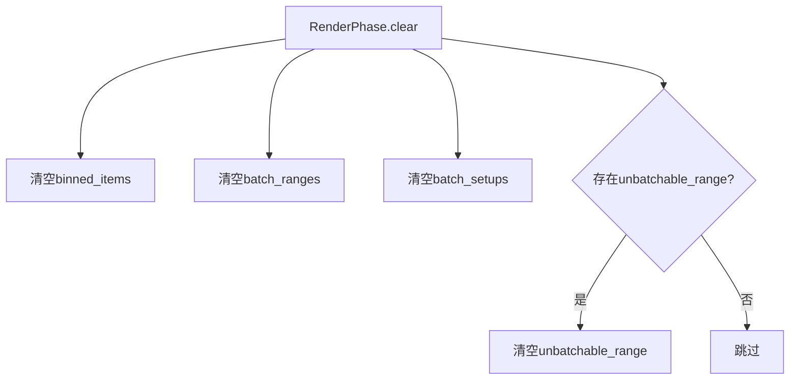

+++
title = "#18761 Fix unbatchable meshes"
date = "2025-04-09T00:00:00"
draft = false
template = "pull_request_page.html"
in_search_index = false

[extra]
current_language = "zh-cn"
available_languages = {"en" = { name = "English", url = "/pull_request/bevy/2025-04/pr-18761-en-20250409" }, "zh-cn" = { name = "中文", url = "/pull_request/bevy/2025-04/pr-18761-zh-cn-20250409" }}
labels = ["C-Bug", "A-Rendering"]
+++

# Fix unbatchable meshes

## Basic Information
- **Title**: Fix unbatchable meshes
- **PR Link**: https://github.com/bevyengine/bevy/pull/18761
- **Author**: tychedelia
- **Status**: MERGED
- **Labels**: C-Bug, A-Rendering, S-Ready-For-Final-Review
- **Created**: 2025-04-08T10:03:49Z
- **Merged**: 2025-04-09T15:57:33Z
- **Merged By**: superdump

## Description Translation
### 目标
修复 #18550 

由于无法批处理的网格（unbatchable meshes）的bin状态每帧未被清除，这些网格的缓冲区索引会从稀疏存储（sparse storage）降级为密集存储（dense storage），导致内存泄漏，并引发各种下游问题（特别是渲染时提供无效的实例范围）。

### 解决方案
在开始新帧时清除无法批处理网格的bin状态。

## The Story of This Pull Request

### 问题根源与上下文
在Bevy渲染系统中，无法批处理的网格（如使用不同材质的实例）通过`unbatchable_range`机制单独处理。每个渲染阶段（render phase）维护一个`BinnedPhaseItem`集合，其中包含稀疏和密集两种存储模式。当网格无法批处理时，其索引会被存入稀疏存储结构。

问题出现在帧结束时未能正确清理这些状态。随着时间推移，未清理的稀疏索引会逐渐转化为密集存储，导致：
1. 内存持续增长（未释放旧索引）
2. 后续帧可能使用过期的缓冲区索引
3. 渲染时传递无效的实例范围，引发不可预测的渲染错误

### 解决方案选择
核心解决思路直击问题本质——在每帧开始时重置状态。具体选择在`RenderPhase::clear`方法中添加清理逻辑，原因有二：
1. 这是渲染阶段的标准清理入口
2. 保证在每帧渲染开始前完成状态重置

### 具体实现解析
在`crates/bevy_render/src/render_phase/mod.rs`中新增清理逻辑：

```rust
// 修改前：BinnedPhaseItem 实现
impl<P: BinnedPhaseItem> RenderPhase<P> {
    pub fn clear(&mut self) {
        // 原有清理逻辑
        self.binned_items.clear();
        self.batch_ranges.clear();
        self.batch_setups.clear();
    }
}

// 修改后：
impl<P: BinnedPhaseItem> RenderPhase<P> {
    pub fn clear(&mut self) {
        self.binned_items.clear();
        self.batch_ranges.clear();
        self.batch_setups.clear();
        // 新增关键清理逻辑
        if let Some(unbatchable_range) = &mut self.unbatchable_range {
            unbatchable_range.clear();
        }
    }
}
```

关键改动点：
1. 新增对`unbatchable_range`的清理
2. 使用`if let`安全处理Option类型
3. 保持原有清理逻辑不变，确保兼容性

### 技术洞察
1. **内存管理策略**：Bevy使用稀疏/密集混合存储来优化实例批处理。未及时清理的稀疏索引会破坏这种优化机制，导致存储降级（sparse -> dense）
2. **生命周期管理**：渲染阶段的资源需要严格遵循帧生命周期，跨帧状态残留是典型的内存泄漏模式
3. **防御式编程**：通过Option类型包裹`unbatchable_range`，既支持按需分配，又避免空结构的内存开销

### 影响与改进
该修复带来三方面提升：
1. **内存稳定性**：防止每帧内存线性增长
2. **渲染正确性**：消除无效实例范围导致的渲染错误
3. **系统可维护性**：将清理逻辑集中在标准生命周期方法中

后续优化建议：
- 增加监控指标跟踪稀疏/密集存储比例
- 引入自动化测试验证跨帧状态隔离

## Visual Representation



## Key Files Changed

### `crates/bevy_render/src/render_phase/mod.rs`
**修改原因**：修复未清理的unbatchable_range导致的内存泄漏问题

**关键代码片段**：
```rust
// 新增代码：
if let Some(unbatchable_range) = &mut self.unbatchable_range {
    unbatchable_range.clear();
}
```

**关联性**：
- 确保每帧开始时重置所有渲染阶段状态
- 修复稀疏存储到密集存储的错误转换
- 维护实例批处理系统的完整性

## Further Reading
1. [Bevy渲染阶段文档](https://bevyengine.org/learn/book/rendering/render-phases/)
2. [ECS模式中的资源生命周期管理](https://github.com/bevyengine/bevy/discussions/1953)
3. [稀疏集存储模式详解](https://www.fluentcpp.com/2018/01/30/introduction-sparse-set/)