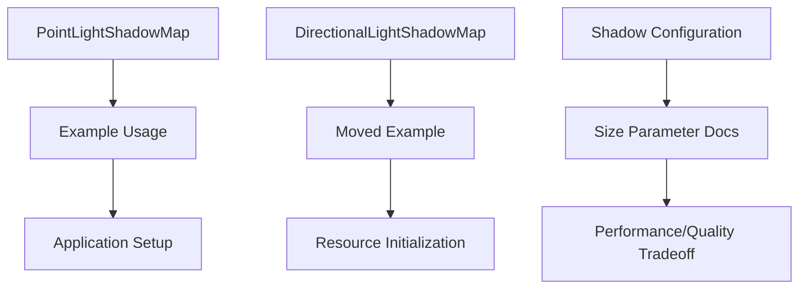

+++
title = "#18768 Small docs PR for `PointLightShadowMap`/`DirectionalLightShadowMap`"
date = "2025-04-09T00:00:00"
draft = false
template = "pull_request_page.html"
in_search_index = true

[taxonomies]
list_display = ["show"]

[extra]
current_language = "en"
available_languages = {"en" = { name = "English", url = "/pull_request/bevy/2025-04/pr-18768-en-20250409" }, "zh-cn" = { name = "中文", url = "/pull_request/bevy/2025-04/pr-18768-zh-cn-20250409" }}
labels = ["C-Docs", "A-Rendering"]
+++

# Title: Small docs PR for `PointLightShadowMap`/`DirectionalLightShadowMap`

## Basic Information
- **Title**: Small docs PR for `PointLightShadowMap`/`DirectionalLightShadowMap`
- **PR Link**: https://github.com/bevyengine/bevy/pull/18768
- **Author**: jf908
- **Status**: MERGED
- **Labels**: C-Docs, A-Rendering, S-Needs-Review
- **Created**: 2025-04-08T19:18:09Z
- **Merged**: 2025-04-09T22:43:18Z
- **Merged By**: superdump

## Description Translation
# Objective

- Improve the docs for `PointLightShadowMap` and `DirectionalLightShadowMap`

## Solution

- Add example for how to use `PointLightShadowMap` and move the `DirectionalLightShadowMap` example from `DirectionalLight`.
- Match `PointLight` and `DirectionalLight` docs about shadows.
- Describe what `size` means.

## The Story of This Pull Request

The PR addresses documentation gaps in Bevy's lighting system by improving clarity around shadow map configuration. While Bevy's shadow mapping functionality was operational, users needed better guidance on configuring shadow maps for different light types through the `PointLightShadowMap` and `DirectionalLightShadowMap` resources.

The core issue stemmed from two documentation shortcomings:
1. Missing examples for initializing `PointLightShadowMap`
2. Inconsistent documentation between similar components
3. Underspecified meaning of the `size` parameter

The solution focused on three key improvements:
1. Adding concrete usage examples directly in struct documentation
2. Relocating existing examples to more appropriate locations
3. Standardizing documentation phrasing across components

In `crates/bevy_pbr/src/light/mod.rs`, the author added a direct example for initializing point light shadow maps:

```rust
/// #[derive(Resource)]
/// pub struct PointLightShadowMap {
///     pub size: usize,
/// }
/// 
/// // Example usage:
/// app.insert_resource(PointLightShadowMap { size: 2048 });
```

This code addition demonstrates the exact initialization pattern users should follow, addressing a common point of confusion. The explicit `insert_resource` call shows how to configure shadow map resolution at the application level.

For directional lights, the PR moved an existing example from the `DirectionalLight` docs to the dedicated `DirectionalLightShadowMap` struct in `directional_light.rs`. This relocation ensures documentation lives closest to its relevant implementation, improving discoverability. The original example in `DirectionalLight` was reduced to a pointer reference:

```rust
// Before in directional_light.rs:
/// To configure the shadow map for a directional light, see the [`DirectionalLightShadowMap`] resource.

// After moving to mod.rs:
/// [`DirectionalLightShadowMap`]: crate::DirectionalLightShadowMap
```

The author standardized parameter documentation between components, adding this crucial clarification to both light types:

```rust
/// The size of the cube shadow map texture (width and height for directional lights)
///
/// A higher values will result in more detailed shadows at the cost of
/// computation time and memory usage.
```

This explanation helps users understand the quality/performance tradeoff inherent in shadow map resolution choices. The consistent wording between point and directional lights creates predictable documentation patterns.

## Visual Representation



## Key Files Changed

1. `crates/bevy_pbr/src/light/mod.rs` (+22/-0)
- Added comprehensive example for `PointLightShadowMap` initialization
- Standardized documentation structure across light types
- Key addition:
```rust
/// #[derive(Resource)]
/// pub struct PointLightShadowMap {
///     pub size: usize,
/// }
/// 
/// // Example usage:
/// app.insert_resource(PointLightShadowMap { size: 2048 });
```

2. `crates/bevy_pbr/src/light/directional_light.rs` (+1/-8)
- Moved example from `DirectionalLight` to dedicated shadow map resource
- Reduced redundant documentation while maintaining discoverability
- Key change:
```rust
// Before:
/// To configure the shadow map for a directional light, see the [`DirectionalLightShadowMap`] resource.

// After:
/// [`DirectionalLightShadowMap`]: crate::DirectionalLightShadowMap
```

3. `crates/bevy_pbr/src/light/point_light.rs` (+6/-0)
- Added detailed documentation about the `size` parameter
- Standardized performance/quality tradeoff explanation
- Key addition:
```rust
/// The size of the cube shadow map texture
///
/// A higher values will result in more detailed shadows at the cost of
/// computation time and memory usage.
```

## Further Reading
1. [Bevy Lighting Documentation](https://bevyengine.org/learn/book/features/pbr/#lights)
2. [Shadow Mapping Concepts](https://learnopengl.com/Advanced-Lighting/Shadows/Shadow-Mapping)
3. [Bevy Resource System](https://bevyengine.org/learn/book/programming/resourses/)