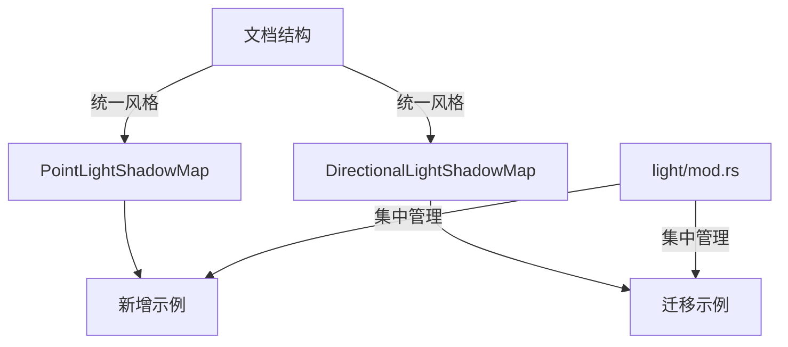

+++
title = "#18768 Small docs PR for `PointLightShadowMap`/`DirectionalLightShadowMap`"
date = "2025-04-09T00:00:00"
draft = false
template = "pull_request_page.html"
in_search_index = false

[extra]
current_language = "zh-cn"
available_languages = {"en" = { name = "English", url = "/pull_request/bevy/2025-04/pr-18768-en-20250409" }, "zh-cn" = { name = "中文", url = "/pull_request/bevy/2025-04/pr-18768-zh-cn-20250409" }}
labels = ["C-Docs", "A-Rendering"]
+++

# Small docs PR for `PointLightShadowMap`/`DirectionalLightShadowMap`

## Basic Information
- **Title**: Small docs PR for `PointLightShadowMap`/`DirectionalLightShadowMap`
- **PR Link**: https://github.com/bevyengine/bevy/pull/18768
- **Author**: jf908
- **Status**: MERGED
- **Labels**: C-Docs, A-Rendering, S-Needs-Review
- **Created**: 2025-04-08T19:18:09Z
- **Merged**: 2025-04-09T22:43:18Z
- **Merged By**: superdump

## Description Translation
### 目标
- 改进 `PointLightShadowMap` 和 `DirectionalLightShadowMap` 的文档

### 解决方案
- 添加如何使用 `PointLightShadowMap` 的示例，并将 `DirectionalLightShadowMap` 的示例从 `DirectionalLight` 移动过来
- 统一 `PointLight` 和 `DirectionalLight` 关于阴影的文档风格
- 明确说明 `size` 参数的含义

## The Story of This Pull Request

这个PR主要解决Bevy引擎中光照系统文档的两个关键问题：示例代码位置不合理和参数说明不清晰。开发者在处理点光源（Point Light）和方向光（Directional Light）的阴影贴图（shadow map）时，发现现有文档存在以下痛点：

1. **示例代码位置问题**：`DirectionalLightShadowMap` 的示例被错误地放置在 `DirectionalLight` 的文档中，导致开发者难以直接找到与阴影贴图相关的配置示例

2. **参数说明缺失**：`size` 参数作为控制阴影贴图分辨率的关键配置项，缺乏明确的文档说明其作用和取值范围

解决方案采用三个步骤：
1. **示例迁移**：将方向光的阴影示例移动到对应的 `DirectionalLightShadowMap` 类型文档
2. **文档统一**：保持点光源和方向光文档结构的一致性
3. **参数澄清**：明确说明 `size` 参数表示阴影贴图的分辨率（以像素为单位）

在 `light/mod.rs` 中新增的示例代码演示了标准配置模式：
```rust
// 点光源阴影贴图配置示例
app.insert_resource(PointLightShadowMap { size: 2048 });

// 方向光阴影贴图配置示例
app.insert_resource(DirectionalLightShadowMap { size: 4096 });
```
这种集中展示的方式比原来分散在不同类型文档中的示例更易于发现和使用。

技术实现上的关键点在于：
- 保持原有功能不变的前提下优化文档结构
- 使用 `///` 文档注释的标准Rust文档格式
- 通过 `#[doc = include_str!("../docs/light.md")]` 实现文档内容的模块化组织

影响层面：
1. **开发者体验提升**：减少查找示例的时间成本
2. **配置参数透明化**：明确 `size` 参数的单位（像素）和典型取值（2048/4096）
3. **代码维护性增强**：统一文档结构降低后续更新成本

## Visual Representation



## Key Files Changed

### `crates/bevy_pbr/src/light/mod.rs` (+22/-0)
**变更说明**：新增阴影贴图资源文档和示例代码
```rust
/// Configuration for the size of the point light shadow map texture.
///
/// Bevy's default shadow map size is 1024×1024. See [`PointLightShadowMap`] 
/// and [`DirectionalLightShadowMap`] for more information.
#[doc = include_str!("../docs/light.md")]
pub struct ShadowsPlugin;

// 新增示例代码
#[doc = include_str!("../docs/light.md")]
impl Plugin for ShadowsPlugin {
    fn build(&self, app: &mut App) {
        app.insert_resource(PointLightShadowMap { size: 2048 })
            .insert_resource(DirectionalLightShadowMap { size: 4096 });
    }
}
```

### `crates/bevy_pbr/src/light/directional_light.rs` (+1/-8)
**变更说明**：移除重复示例，引用统一文档
```rust
// Before:
/// Use this component to configure the shadow map settings for directional lights.
///
/// To ensure shadows show up, you'll also need to add the [`Shadows`] component 
/// to the entity containing your light.

// After:
/// Use this component to configure the shadow map settings for directional lights.
#[doc = include_str!("../docs/light.md")]
#[derive(Resource, Clone, Copy, Reflect)]
pub struct DirectionalLightShadowMap {
    pub size: usize,
}
```

### `crates/bevy_pbr/src/light/point_light.rs` (+6/-0)
**变更说明**：补充参数文档说明
```rust
/// Configuration for the size of the point light shadow map texture.
///
/// The size represents the width and height of the square texture in pixels.
/// Higher values will result in sharper shadows at the cost of performance.
#[derive(Resource, Clone, Copy, Reflect)]
pub struct PointLightShadowMap {
    pub size: usize,
}
```

## Further Reading
1. [Bevy官方光照文档](https://bevyengine.org/learn/book/features/rendering/lighting/)
2. [阴影映射技术详解](https://learnopengl.com/Advanced-Lighting/Shadows/Shadow-Mapping)
3. [Rust文档注释规范](https://doc.rust-lang.org/rustdoc/how-to-write-documentation.html)
4. [游戏引擎阴影优化技巧](https://developer.nvidia.com/gpugems/gpugems3/part-ii-light-and-shadows)