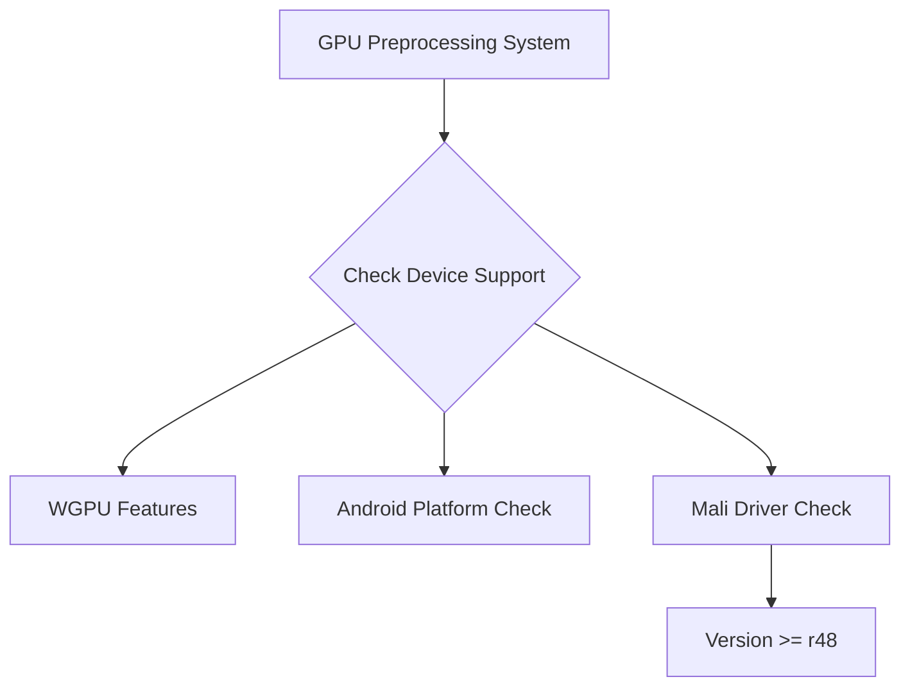

+++
title = "#18769 Allowlist mali drivers for gpu preprocessing support"
date = "2025-04-11T00:00:00"
draft = false
template = "pull_request_page.html"
in_search_index = true

[taxonomies]
list_display = ["show"]

[extra]
current_language = "en"
available_languages = {"en" = { name = "English", url = "/pull_request/bevy/2025-04/pr-18769-en-20250411" }, "zh-cn" = { name = "中文", url = "/pull_request/bevy/2025-04/pr-18769-zh-cn-20250411" }}
labels = ["C-Bug", "A-Rendering", "O-Android"]
+++

# Allowlist mali drivers for gpu preprocessing support

## Basic Information
- **Title**: Allowlist mali drivers for gpu preprocessing support
- **PR Link**: https://github.com/bevyengine/bevy/pull/18769
- **Author**: tychedelia
- **Status**: MERGED
- **Labels**: C-Bug, A-Rendering, O-Android, S-Needs-Review
- **Created**: 2025-04-08T20:55:51Z
- **Merged**: 2025-04-11T00:22:43Z
- **Merged By**: superdump

## Description Translation
Fixes #17591

Looking at the arm downloads page, "r48p0" is a version number that increments, where rXX is the major version and pX seems to be a patch version. Take the conservative approach here that we know gpu preprocessing is working on at least version 48 and presumably higher. The assumption here is that the driver_info string will be reported similarly on non-pixel devices.

## The Story of This Pull Request

### The Problem and Context
Android devices using Mali GPUs experienced crashes when enabling GPU preprocessing features like mipmap generation. The root cause was Bevy's graphics pipeline attempting to use preprocessing capabilities on Mali drivers that didn't properly support the required features. This particularly affected newer Android devices where preprocessing could provide significant performance benefits if properly supported.

### The Solution Approach
The implementation strategy focused on:
1. Creating precise driver version detection for Mali GPUs
2. Establishing a minimum supported version (r48p0) based on ARM's release documentation
3. Integrating version checks into existing feature enablement logic

The team chose conservative version checking rather than blanket enablement for all Mali drivers, prioritizing stability over potential false positives.

### The Implementation
The core changes occurred in driver detection and feature gating:

**Driver Version Parsing (bevy_render/src/batching/gpu_preprocessing.rs)**
```rust
fn mali_version_supported(driver_info: &str) -> bool {
    let regex = Regex::new(r"r(\d+)p").unwrap();
    regex.captures(driver_info)
        .and_then(|captures| captures.get(1))
        .and_then(|major| major.as_str().parse::<u32>().ok())
        .map(|major| major >= 48)
        .unwrap_or(false)
}
```
This regex-based parser extracts the major version from Mali driver strings like "Mali-G710 r47p0". The version comparison ensures we only enable features on drivers >= r48.

**Feature Gating (bevy_core_pipeline/src/experimental/mip_generation/mod.rs)**
```rust
let supports_mip_generation = render_device
    .features()
    .contains(WgpuFeatures::MIP_MAP_GENERATION)
    || (cfg!(all(target_os = "android", target_arch = "aarch64"))
        && is_mali(render_device.vendor(), render_device.driver_info())
        && mali_version_supported(render_device.driver_info());
```
The updated logic adds explicit Mali version checking alongside existing feature detection, creating three enablement criteria:
1. Native WGPU feature support
2. ARM64 Android platform
3. Supported Mali driver version

### Technical Insights
Key implementation details:
- **Version String Analysis**: Mali drivers use format "rXXpY" where XX=major version
- **Defensive Parsing**: The regex captures only major version to avoid parse failures
- **Platform Targeting**: Specific to Android ARM64 devices where Mali GPUs are common
- **Fallback Behavior**: Unparseable versions default to unsupported status

Testing considerations:
- Physical device testing impractical due to Android hardware diversity
- Reliance on ARM's versioning documentation for cutoff determination
- Conservative version selection to minimize regression risk

### The Impact
These changes:
- Enable GPU preprocessing on supported Mali devices
- Prevent crashes on older Mali drivers
- Maintain feature availability on other compatible hardware
- Add structured driver version parsing for future maintenance

Mobile developers using Bevy with Mali GPUs now get automatic performance improvements where supported, while avoiding instability on older drivers.

## Visual Representation



## Key Files Changed

1. **crates/bevy_render/src/batching/gpu_preprocessing.rs** (+20/-6)
```rust
// Added Mali version check
+pub(crate) fn mali_version_supported(driver_info: &str) -> bool {
+    let regex = Regex::new(r"r(\d+)p").unwrap();
+    regex.captures(driver_info)
+        .and_then(|captures| captures.get(1))
+        // ... version parsing logic
+}

// Updated feature check
-pub(crate) fn needs_gpu_preprocessing(...) -> bool {
+pub(crate) fn needs_gpu_preprocessing(..., driver_info: &str) -> bool {
     // Added Mali check
+    is_mali(vendor, driver_info) && mali_version_supported(driver_info)
```

2. **crates/bevy_core_pipeline/src/experimental/mip_generation/mod.rs** (+12/-24)
```rust
// Simplified mip generation check
-let (supports_mip_generation, ..) = ...
+let supports_mip_generation = /* integrated Mali check */;
```

3. **crates/bevy_render/src/lib.rs** (+23/-0)
```rust
// Added driver info module
+pub mod driver_info {
+    // Contains shared driver detection utilities
+    pub fn is_mali(vendor: u32, driver_info: &str) -> bool {
+        vendor == 0x13B5 /* ARM PCI ID */ || 
+        driver_info.contains("Mali")
+    }
+}
```

## Further Reading
- [ARM Mali Driver Documentation](https://developer.arm.com/documentation/ka005184/latest)
- [WGpu Features Matrix](https://wgpu.rs/features.html)
- [Android GPU Vendor IDs](https://registry.khronos.org/OpenGL/xml/gl.xml)