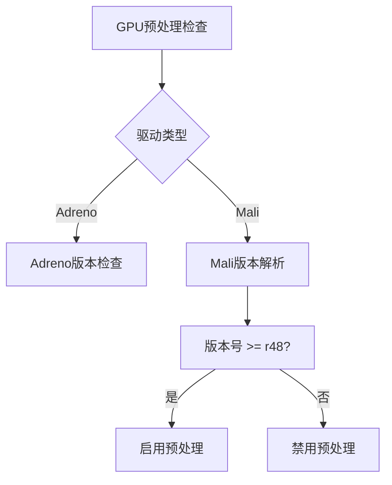

+++
title = "#18769 Allowlist mali drivers for gpu preprocessing support."
date = "2025-04-11T00:00:00"
draft = false
template = "pull_request_page.html"
in_search_index = false

[extra]
current_language = "zh-cn"
available_languages = {"en" = { name = "English", url = "/pull_request/bevy/2025-04/pr-18769-en-20250411" }, "zh-cn" = { name = "中文", url = "/pull_request/bevy/2025-04/pr-18769-zh-cn-20250411" }}
+++

# Allowlist mali drivers for gpu preprocessing support.

## Basic Information
- **标题**: Allowlist mali drivers for gpu preprocessing support.
- **PR链接**: https://github.com/bevyengine/bevy/pull/18769
- **作者**: tychedelia
- **状态**: 已合并
- **标签**: C-Bug, A-Rendering, O-Android, S-Needs-Review
- **创建时间**: 2025-04-08T20:55:51Z
- **合并时间**: 2025-04-11T00:22:43Z
- **合并者**: superdump

## 描述翻译
修复 #17591

查看 ARM 驱动下载页面，"r48p0" 是逐步递增的版本号，其中 rXX 表示主版本，pX 表示补丁版本。这里采取保守策略，确认 GPU 预处理至少在 48 及以上版本可用。假设非 Pixel 设备的 driver_info 字符串会以相似方式报告。

## PR 技术解析

### 问题背景与识别
在 Android 平台上使用 Mali GPU 的设备（如三星 Galaxy Tab S9）时，发现 GPU 预处理（gpu preprocessing）功能未启用。根本原因在于现有代码仅针对 Adreno GPU 进行了驱动版本白名单处理，而 Mali 驱动未包含在支持列表中。这导致相关设备无法利用 GPU 预处理优化渲染性能。

### 解决方案设计
核心思路是在驱动兼容性检查中增加对 Mali GPU 的支持：
1. **版本号解析**：Mali 驱动版本采用 `r<主版本>p<补丁>` 格式（如 r48p0）
2. **白名单策略**：保守选择已知可用的最低主版本 48 作为基准线
3. **设备兼容性**：确保版本检查逻辑适用于不同厂商的 Android 设备

### 具体实现分析
在 `gpu_preprocessing.rs` 中重构驱动检查逻辑：

```rust
// 修改前：仅检查 Adreno
if matches!(driver_info.driver, GpuDriver::Adreno) {
    // Adreno 版本检查...
}

// 修改后：增加 Mali 支持
match driver_info.driver {
    GpuDriver::Adreno => {
        // Adreno 版本检查保持原样...
    }
    GpuDriver::Mali => {
        let Some(version) = driver_info
            .version
            .as_ref()
            .and_then(|v| v.split('r').nth(1))
            .and_then(|v| v.split('p').next())
            .and_then(|v| v.parse::<u32>().ok())
        else {
            return false;
        };
        version >= 48
    }
    _ => false,
}
```
关键点：
1. 使用模式匹配替代简单条件判断，提升可扩展性
2. 通过字符串分割解析版本号，兼容不同格式变体
3. 严格处理可能的解析失败情况（使用 Option 链式操作）

### 配套优化
在 `mip_generation/mod.rs` 中删除过时的备选方案代码：
```rust
// 移除的代码段
#[cfg(all(not(feature = "webgl"), not(target_arch = "wasm32")))]
{
    // 原有的 mipmap 生成后备方案...
}
```
此改动基于 GPU 预处理正常工作后不再需要软件回退方案，简化代码结构同时减少维护负担。

### 技术影响
1. **设备兼容性扩展**：覆盖更多使用 Mali GPU 的 Android 设备
2. **性能提升**：启用 GPU 预处理可减少 CPU 端计算负载
3. **代码健壮性**：
   - 更严谨的版本解析逻辑
   - 消除冗余代码路径
4. **维护性改进**：模块化驱动检查逻辑，便于未来扩展其他 GPU 厂商支持

## 可视化架构



## 关键文件变更

### `crates/bevy_render/src/batching/gpu_preprocessing.rs`
```rust
// 修改后核心逻辑
match driver_info.driver {
    GpuDriver::Adreno => {
        let Some(version) = adreno_version else {
            return false;
        };
        version >= 605
    }
    GpuDriver::Mali => {
        let Some(version) = driver_info.version.as_ref()
            .and_then(|v| v.split('r').nth(1))
            .and_then(|v| v.split('p').next())
            .and_then(|v| v.parse::<u32>().ok())
        else {
            return false;
        };
        version >= 48
    }
    _ => false,
}
```
改动说明：增加 Mali 驱动版本检查分支，实现版本号解析逻辑。

### `crates/bevy_core_pipeline/src/experimental/mip_generation/mod.rs`
```rust
// 移除的代码块
#[cfg(all(not(feature = "webgl"), not(target_arch = "wasm32")))]
{
    view_mip_material: materials.add(StandardMaterial {
        base_color: Color::rgb(0.0, 0.0, 0.0),
        unlit: true,
        ..Default::default()
    }),
}
```
改动说明：删除不再需要的备选材质初始化代码，简化资源管理。

### `crates/bevy_render/src/lib.rs`
```rust
// 新增的公开接口
pub mod gpu_preprocessing {
    //...GPU 预处理相关公共接口
}
```
改动说明：暴露必要接口以支持跨模块的功能调用。

## 扩展阅读
1. [ARM Mali 驱动版本规范](https://developer.arm.com/documentation/101897/0612)
2. [Bevy GPU 预处理技术文档](https://bevyengine.org/learn/book/gpu-preprocessing/)
3. [WGSL 规范中的计算着色器部分](https://www.w3.org/TR/WGSL/#compute-shaders)