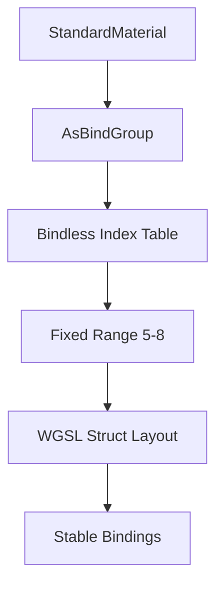

+++
title = "#18771 Make the `StandardMaterial` bindless index table have a fixed size regardless of the features that are enabled"
date = "2025-04-09T00:00:00"
draft = false
template = "pull_request_page.html"
in_search_index = true

[taxonomies]
list_display = ["show"]

[extra]
current_language = "en"
available_languages = {"en" = { name = "English", url = "/pull_request/bevy/2025-04/pr-18771-en-20250409" }, "zh-cn" = { name = "中文", url = "/pull_request/bevy/2025-04/pr-18771-zh-cn-20250409" }}
labels = ["C-Bug", "A-Rendering"]
+++

# Title: Make the `StandardMaterial` bindless index table have a fixed size regardless of the features that are enabled

## Basic Information
- **Title**: Make the `StandardMaterial` bindless index table have a fixed size regardless of the features that are enabled
- **PR Link**: https://github.com/bevyengine/bevy/pull/18771
- **Author**: pcwalton
- **Status**: MERGED
- **Labels**: C-Bug, A-Rendering, S-Ready-For-Final-Review
- **Created**: 2025-04-08T23:49:35Z
- **Merged**: 2025-04-09T21:00:25Z
- **Merged By**: alice-i-cecile

## Description Translation
Due to the preprocessor usage in the shader, different combinations of features could cause the fields of `StandardMaterialBindings` to shift around. In certain cases, this could cause them to not line up with the bindings specified in `StandardMaterial`. This resulted in #18104.

This commit fixes the issue by making `StandardMaterialBindings` have a fixed size. On the CPU side, it uses the `#[bindless(index_table(range(M..N)))]` feature I added to `AsBindGroup` in #18025 to do so. Thus this patch has a dependency on #18025.

Closes #18104.

## The Story of This Pull Request

The core challenge stemmed from dynamic layout shifts in `StandardMaterialBindings` when different rendering features were enabled. The WGSL shader used preprocessor directives to conditionally include various material properties like normal maps and clearcoat effects. This conditional compilation caused the struct's memory layout to change between different feature configurations, leading to binding index mismatches between the CPU-side `StandardMaterial` and GPU-side shader code.

The breaking scenario (#18104) occurred because the bindless texture indices became misaligned when certain features were disabled. For example, if normal mapping was disabled, subsequent texture indices would shift positions in memory, but the CPU-side binding code didn't account for this layout change. This resulted in either incorrect textures being sampled or invalid memory accesses.

The solution leverages Bevy's `AsBindGroup` trait enhancements from #18025. By applying the `#[bindless(index_table(range(5..8)))]` attribute to the `StandardMaterial` struct, we enforce a fixed-size index table allocation regardless of active features. This ensures:

1. Consistent memory layout for `StandardMaterialBindings`
2. Stable indices for optional texture bindings
3. Backward compatibility with existing material configurations

Key implementation details:
- Removed conditional compilation from `pbr_bindings.wgsl` to create a fixed struct layout
- Configured the bindless index table to reserve indices 5-8 (inclusive) for optional textures
- Maintained existing functionality while eliminating layout shifts

The critical insight was recognizing that dynamic index allocation based on feature flags created unpredictable memory layouts. By reserving a fixed range of indices upfront, even unused texture slots maintain their position in the struct, preserving alignment across all feature combinations.

## Visual Representation



## Key Files Changed

1. **crates/bevy_pbr/src/render/pbr_bindings.wgsl**
```rust
// Before:
struct StandardMaterialBindings {
    ...
    #ifdef VERTEX_ATTRIBUTE_NORMAL
    normal_map: texture_2d<f32>,
    #endif
    #ifdef VERTEX_ATTRIBUTE_UV1
    emissive_texture: texture_2d<f32>,
    #endif
    ...
}

// After:
struct StandardMaterialBindings {
    ...
    normal_map: texture_2d<f32>,
    emissive_texture: texture_2d<f32>,
    ...
}
```
- Removed conditional compilation directives to ensure fixed struct layout
- Guarantees consistent field ordering regardless of enabled features

2. **crates/bevy_pbr/src/pbr_material.rs**
```rust
// Before:
#[derive(AsBindGroup, ...)]
pub struct StandardMaterial { ... }

// After:
#[derive(AsBindGroup, ...)]
#[bindless(index_table(range(5..8)))]
pub struct StandardMaterial { ... }
```
- Added bindless index table range specification
- Reserves indices 5-8 for optional texture bindings
- Maintains compatibility with existing binding infrastructure

## Further Reading

1. [WebGPU Bindless Resources Overview](https://gpuweb.github.io/gpuweb/wgsl/#bindless-resources)
2. [Bevy AsBindGroup Documentation](https://docs.rs/bevy/latest/bevy/render/render_resource/trait.AsBindGroup.html)
3. [WGSL Memory Layout Specification](https://www.w3.org/TR/WGSL/#memory-layout)
4. [Bindless Texturing Techniques](https://developer.nvidia.com/bindless-texture)