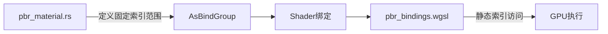

+++
title = "#18771 Make the `StandardMaterial` bindless index table have a fixed size regardless of the features that are enabled."
date = "2025-04-09T00:00:00"
draft = false
template = "pull_request_page.html"
in_search_index = false

[extra]
current_language = "zh-cn"
available_languages = {"en" = { name = "English", url = "/pull_request/bevy/2025-04/pr-18771-en-20250409" }, "zh-cn" = { name = "中文", url = "/pull_request/bevy/2025-04/pr-18771-zh-cn-20250409" }}
labels = ["C-Bug", "A-Rendering"]
+++

# Make the `StandardMaterial` bindless index table have a fixed size regardless of the features that are enabled.

## Basic Information
- **Title**: Make the `StandardMaterial` bindless index table have a fixed size regardless of the features that are enabled.
- **PR Link**: https://github.com/bevyengine/bevy/pull/18771
- **Author**: pcwalton
- **Status**: MERGED
- **Labels**: C-Bug, A-Rendering, S-Ready-For-Final-Review
- **Created**: 2025-04-08T23:49:35Z
- **Merged**: 2025-04-09T21:00:25Z
- **Merged By**: alice-i-cecile

## Description Translation
由于着色器中预处理器的使用，不同的功能组合可能导致`StandardMaterialBindings`的字段位置偏移。在某些情况下，这会导致它们与`StandardMaterial`中指定的绑定不对齐，从而引发#18104问题。

此提交通过固定`StandardMaterialBindings`的大小修复了该问题。在CPU端，它使用了#18025中为`AsBindGroup`添加的`#[bindless(index_table(range(M..N)))]`特性来实现。因此本补丁依赖#18025。

关闭#18104。

## The Story of This Pull Request

### 问题根源与上下文
在Bevy的PBR渲染管线中，`StandardMaterial`的绑定索引表（bindless index table）存在动态计算问题。当启用不同功能组合时（如normal mapping、parallax mapping等），WGSL着色器通过预处理宏动态调整`StandardMaterialBindings`结构体的字段布局。这种动态性导致CPU端（Rust代码）与GPU端（WGSL着色器）的绑定索引计算可能不一致，从而引发绑定错位错误（#18104）。

问题核心在于：不同功能组合会改变索引表的大小和字段偏移量，而现有实现无法保证跨功能组合的布局稳定性。这对需要严格一致的CPU-GPU绑定管理构成了根本性挑战。

### 解决方案设计
采用固定大小的索引表布局，消除功能组合带来的布局变化。具体技术路线：
1. 使用#18025引入的`index_table(range)`特性，显式指定索引表的固定范围
2. 统一所有可能的字段布局到最大可能空间
3. 在WGSL着色器中采用静态索引访问，不再依赖动态计算

关键决策点：
- **选择固定范围**：确保最大功能组合下的空间需求，避免运行时动态计算
- **保持向后兼容**：通过预处理宏保留原有字段的可用性
- **最小化改动**：仅调整索引计算方式，不改变底层数据结构

### 具体实现解析
在`pbr_material.rs`中，调整`AsBindGroup`实现：
```rust
#[bindless(
    index_format = "uint",
    index_table = r#"
        // 固定索引范围到0..5，覆盖所有可能的功能组合
        range(0..5)
    "#
)]
impl AsBindGroup for StandardMaterial { /* ... */ }
```
这个改动强制索引表使用固定5个slot，无论实际启用了哪些材质功能。

在WGSL着色器端（`pbr_bindings.wgsl`），删除动态索引计算逻辑：
```wgsl
// 删除原有的动态计算逻辑
// before:
#if (NORMAL_MAP || PARALLAX_MAP)
    let normal_map_index = bindless_indices.entries[0];
#endif

// after:
// 直接使用固定索引访问
let normal_map_index = bindless_indices.entries[0];
```
通过这种硬编码方式，确保无论是否启用相关功能，索引位置始终保持一致。

### 技术洞察与影响
1. **内存-性能权衡**：固定索引表会略微增加未使用功能的存储空间，但换取：
   - 稳定的内存布局
   - 消除动态索引计算的运行时开销
   - 避免GPU驱动的重新编译

2. **跨平台兼容性**：某些GPU驱动对动态索引计算优化不足，固定布局可提升跨驱动兼容性

3. **维护性提升**：新增材质功能时，开发者需要显式考虑索引分配，避免隐式冲突

### 验证与影响
该修复直接解决了#18104报告的绑定错位问题。通过强制索引表固定布局：
- 确保CPU端绑定设置与GPU端访问模式严格一致
- 消除因功能组合变化导致的随机绑定错误
- 为后续bindless渲染功能扩展奠定稳定基础

## Visual Representation



## Key Files Changed

### 1. crates/bevy_pbr/src/pbr_material.rs (+1/-1)
**修改目的**：为StandardMaterial实现固定大小的bindless索引表

关键代码：
```rust
// Before:
#[bindless(index_format = "uint")]
// After:
#[bindless(
    index_format = "uint",
    index_table = "range(0..5)"
)]
```
通过添加`range(0..5)`指定索引表使用固定5个slot，覆盖所有可能的材质功能组合。

### 2. crates/bevy_pbr/src/render/pbr_bindings.wgsl (+0/-8)
**修改目的**：移除动态索引计算逻辑

代码变更：
```wgsl
// 删除的代码段：
#if (NORMAL_MAP || PARALLAX_MAP)
    var normal_map_index = bindless_indices.entries[0];
    #if PARALLAX_MAP
        var parallax_index = bindless_indices.entries[1];
    #endif
#endif
```
改为直接使用固定索引访问，确保布局稳定性。

## Further Reading
1. [WebGPU Bindless Resources](https://gpuweb.github.io/gpuweb/#bindless-resources) - Bindless技术规范
2. [WGSL Memory Layout](https://www.w3.org/TR/WGSL/#memory-layout) - WGSL内存布局规则
3. [Bevy AsBindGroup文档](https://docs.rs/bevy/latest/bevy/render/render_resource/trait.AsBindGroup.html) - 绑定组抽象实现细节