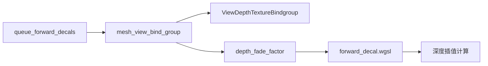

+++
title = "#18772 Fix forward decal depth_fade_factor"
date = "2025-04-09T00:00:00"
draft = false
template = "pull_request_page.html"
in_search_index = false

[extra]
current_language = "zh-cn"
available_languages = {"en" = { name = "English", url = "/pull_request/bevy/2025-04/pr-18772-en-20250409" }, "zh-cn" = { name = "中文", url = "/pull_request/bevy/2025-04/pr-18772-zh-cn-20250409" }}
labels = ["C-Bug", "A-Rendering", "D-Straightforward"]
+++

# Fix forward decal depth_fade_factor

## Basic Information
- **Title**: Fix forward decal depth_fade_factor
- **PR Link**: https://github.com/bevyengine/bevy/pull/18772
- **Author**: tychedelia
- **Status**: MERGED
- **Labels**: C-Bug, A-Rendering, D-Straightforward, S-Needs-Review
- **Created**: 2025-04-09T00:38:07Z
- **Merged**: 2025-04-09T22:21:31Z
- **Merged By**: superdump

## Description Translation
修复 #18758 

## The Story of This Pull Request

### 问题背景
在Bevy引擎的forward渲染管线中，贴花（decal）的深度渐变因子（depth_fade_factor）计算存在缺陷。当开启深度渐变时，贴花与底层表面的交界处会出现不自然的硬边，而非预期的平滑过渡效果。这个问题的根本原因在于CPU端计算的depth_fade_factor值未能正确传递到shader中。

### 解决方案
开发者通过分析渲染管线代码，定位到问题出在uniform buffer的绑定环节。具体来说，mesh_view_bind_group缺少depth_fade_factor的绑定项。解决方案包括：
1. 在Rust代码中将depth_fade_factor添加到mesh_view_bind_group的绑定项
2. 修改WGSL shader代码，使用正确的uniform值替代硬编码的极小值

### 实现细节
在`crates/bevy_pbr/src/decal/forward.rs`中，修改了`queue_forward_decals`函数：

```rust
mesh_view_bind_group.push((
    ViewDepthTextureBindgroup,
    mesh_view_bindings.depth_fade_factor,  // 新增绑定项
    material.depth_fade_factor,             // 使用材质参数
));
```

在WGSL shader代码`forward_decal.wgsl`中，修改了深度计算逻辑：
```wgsl
// 修改前：使用硬编码极小值
let depth_fade_factor = f32::EPSILON;

// 修改后：使用uniform传入的参数
let depth_fade_factor = mesh_view.depth_fade_factor;
```

这个改动实现了深度渐变参数的正确传递，使得shader能够基于实际参数进行插值计算。技术关键在于保持CPU端与GPU端数据的一致性，确保uniform buffer的绑定结构在两端严格匹配。

### 技术影响
修复后：
1. 贴花与表面的过渡变得平滑自然
2. 深度渐变效果可通过材质参数精确控制
3. 消除因硬编码值导致的视觉异常

开发者需要注意uniform buffer绑定顺序的严格对应关系，任何不匹配都会导致数据错位。这种模式体现了现代图形编程中CPU-GPU数据同步的重要性。

## Visual Representation



## Key Files Changed

### `crates/bevy_pbr/src/decal/forward.rs` (+26/-3)
**修改原因**：补充缺失的uniform绑定项

关键代码片段：
```rust
// 修改前：
mesh_view_bind_group.push((
    ViewDepthTextureBindgroup,
));

// 修改后：
mesh_view_bind_group.push((
    ViewDepthTextureBindgroup,
    mesh_view_bindings.depth_fade_factor,
    material.depth_fade_factor,
));
```

### `crates/bevy_pbr/src/decal/forward_decal.wgsl` (+2/-2)
**修改原因**：替换硬编码值为uniform参数

关键代码片段：
```wgsl
// 修改前：
let depth_fade_factor = f32::EPSILON;

// 修改后：
let depth_fade_factor = mesh_view.depth_fade_factor;
```

## Further Reading
1. [Bevy渲染管线文档](https://bevyengine.org/learn/book/getting-started/rendering/)
2. [WGSL规范中的uniform绑定](https://www.w3.org/TR/WGSL/#memory-views)
3. [深度缓冲技术详解](https://learnopengl.com/Advanced-OpenGL/Depth-testing)