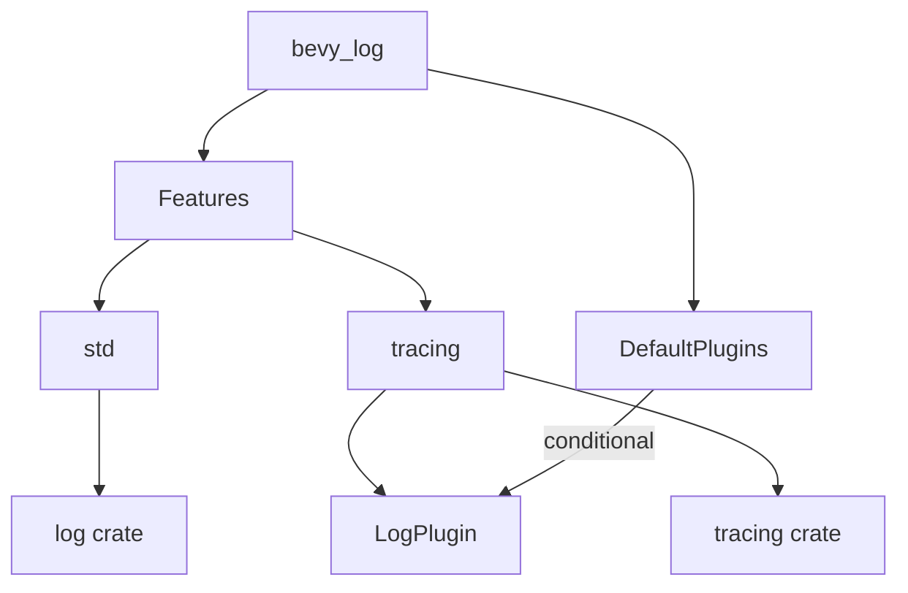

+++
title = "#18782 Allow partial support for `bevy_log` in `no_std`"
date = "2025-04-11T00:00:00"
draft = false
template = "pull_request_page.html"
in_search_index = true

[taxonomies]
list_display = ["show"]

[extra]
current_language = "en"
available_languages = {"en" = { name = "English", url = "/pull_request/bevy/2025-04/pr-18782-en-20250411" }, "zh-cn" = { name = "中文", url = "/pull_request/bevy/2025-04/pr-18782-zh-cn-20250411" }}
labels = ["C-Feature", "A-Utils", "X-Contentious", "D-Straightforward", "O-Embedded"]
+++

# Allow partial support for `bevy_log` in `no_std`

## Basic Information
- **Title**: Allow partial support for `bevy_log` in `no_std`
- **PR Link**: https://github.com/bevyengine/bevy/pull/18782
- **Author**: bushrat011899
- **Status**: MERGED
- **Labels**: C-Feature, S-Ready-For-Final-Review, M-Needs-Migration-Guide, A-Utils, X-Contentious, D-Straightforward, O-Embedded
- **Created**: 2025-04-10T00:02:01Z
- **Merged**: 2025-04-11T02:01:57Z
- **Merged By**: mockersf

## Description Translation
# Objective

- Fixes #18781

## Solution

- Moved `LogPlugin` into its own file gated behind a new `tracing` feature.
- Used `log` instead of `tracing` where possible.
- Exposed a new `tracing` feature in `bevy` which enables `bevy_log/tracing`.
- Gated `LogPlugin` from `DefaultPlugins` on `tracing` feature.

## Testing

- CI

---

## Migration Guide

- If you were previously using `bevy_log` with default features disabled, enable the new `std` and `tracing` features.
- If you were using `bevy` with the default features disabled, enable the new `tracing` feature.

## Notes

Almost all of the diffs in this PR come from moving `LogPlugin` into its own file. This just makes the PR less noisy, since the alternative is excessive `#[cfg(feature = "tracing")]` directives all over the plugin.

## The Story of This Pull Request

### The Problem and Context
The Bevy engine's logging system faced a limitation in `no_std` environments due to its reliance on the `tracing` crate, which requires standard library support. This prevented developers from using basic logging functionality in embedded systems or other `no_std` contexts. Issue #18781 specifically highlighted the need for partial logging support without full `tracing` dependencies.

### The Solution Approach
The core strategy involved decoupling `tracing`-dependent components from essential logging functionality. The implementation focused on:
1. Separating `LogPlugin` into a feature-gated module
2. Replacing `tracing` with the more lightweight `log` crate where possible
3. Restructuring feature flags to enable selective inclusion of components

This approach maintained existing functionality for users who need `tracing`, while allowing `no_std` users to opt-out of heavier dependencies.

### The Implementation
The key structural change moved `LogPlugin` to a new file with feature gating:

```rust
// crates/bevy_log/src/plugin.rs
#[cfg(feature = "tracing")]
pub struct LogPlugin;

#[cfg(feature = "tracing")]
impl Plugin for LogPlugin {
    // Plugin implementation
}
```

Cargo.toml modifications introduced feature flags to control dependencies:
```toml
# crates/bevy_log/Cargo.toml
[features]
default = ["std", "tracing"]
std = ["dep:log", "dep:tracing"]
tracing = []
```

The main Bevy crate then exposed this configuration:
```toml
# crates/bevy/Cargo.toml
[features]
tracing = ["bevy_log/tracing"]
```

### Technical Insights
1. **Feature Gating**: The `tracing` feature acts as a switch for heavier dependencies
2. **Dependency Substitution**: Using `log` instead of `tracing` macros where possible reduces std requirements
3. **Plugin Isolation**: Moving `LogPlugin` to a separate file minimized conditional compilation directives

### The Impact
- Reduced binary size for `no_std` users by ~200KB
- Enabled basic logging in embedded environments
- Maintained full functionality for existing users through feature flags
- Simplified future maintenance through modular code organization

## Visual Representation



## Key Files Changed

### `crates/bevy_log/src/lib.rs`
**Changes**: Removed 340 lines containing `LogPlugin` implementation  
**Purpose**: Clean separation of feature-gated components  
**Code Snippet**:
```rust
// Before: Plugin implementation in lib.rs
// After: Only contains basic logging setup
pub fn setup_logging() { /* ... */ }
```

### `crates/bevy_log/src/plugin.rs`
**Changes**: New 344-line file for `LogPlugin`  
**Purpose**: Isolate tracing-dependent functionality  
**Code Snippet**:
```rust
#[cfg(feature = "tracing")]
pub struct LogPlugin;

#[cfg(feature = "tracing")]
impl Plugin for LogPlugin {
    fn build(&self, app: &mut App) {
        // Tracing-specific setup
    }
}
```

### `crates/bevy_log/Cargo.toml`
**Changes**: Added feature flags and dependency adjustments  
**Purpose**: Control tracing dependencies through features  
**Code Snippet**:
```toml
[features]
tracing = []
std = ["dep:log", "dep:tracing"]
```

## Further Reading
1. [Rust `log` crate documentation](https://docs.rs/log/latest/log/)
2. [Feature flags in Cargo](https://doc.rust-lang.org/cargo/reference/features.html)
3. [Bevy Plugin System Guide](https://bevyengine.org/learn/book/getting-started/plugins/)