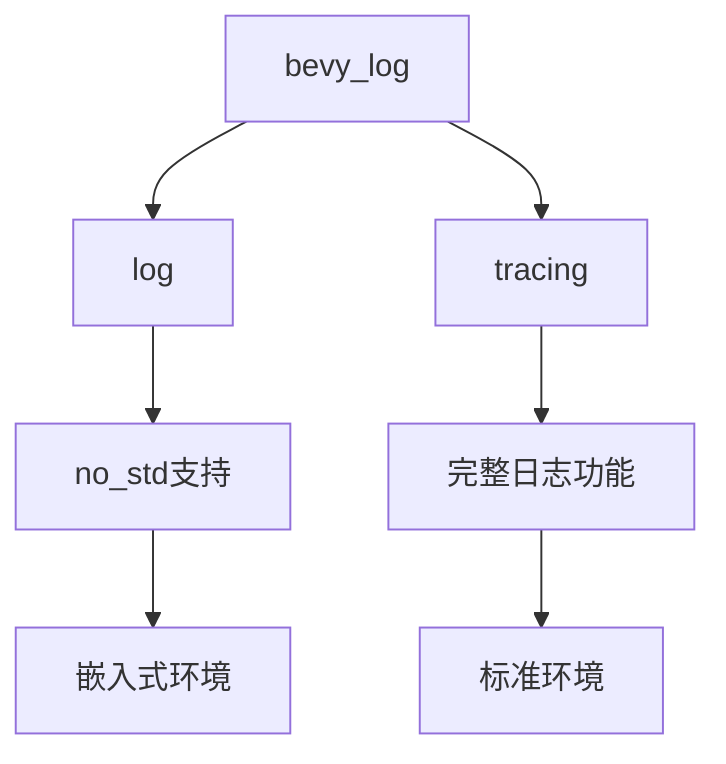

+++
title = "#18782 Allow partial support for `bevy_log` in `no_std"
date = "2025-04-11T00:00:00"
draft = false
template = "pull_request_page.html"
in_search_index = false

[extra]
current_language = "zh-cn"
available_languages = {"en" = { name = "English", url = "/pull_request/bevy/2025-04/pr-18782-en-20250411" }, "zh-cn" = { name = "中文", url = "/pull_request/bevy/2025-04/pr-18782-zh-cn-20250411" }}
+++

# PR分析报告：为`bevy_log`添加部分`no_std`支持

## 基本信息
- **标题**: Allow partial support for `bevy_log` in `no_std`
- **PR链接**: https://github.com/bevyengine/bevy/pull/18782
- **作者**: bushrat011899
- **状态**: 已合并
- **标签**: C-功能, S-准备终审, M-需要迁移指南, A-工具类, X-争议性, D-简单实现, O-嵌入式
- **创建时间**: 2025-04-10T00:02:01Z
- **合并时间**: 2025-04-11T02:01:57Z
- **合并人**: mockersf

## 描述翻译
### 目标
- 修复 #18781

### 解决方案
- 将`LogPlugin`移动到单独文件并通过新`tracing`特性控制
- 在可能的情况下使用`log`替代`tracing`
- 在`bevy`中暴露新的`tracing`特性以启用`bevy_log/tracing`
- 在`tracing`特性下从`DefaultPlugins`中排除`LogPlugin`

### 测试
- CI验证

---

### 迁移指南
- 如果之前禁用默认特性使用`bevy_log`，需启用新的`std`和`tracing`特性
- 如果禁用默认特性使用`bevy`，需启用新`tracing`特性

### 说明
本PR的大部分diff来自将`LogPlugin`移动到单独文件。这使得PR更简洁，避免了在插件中大量使用`#[cfg(feature = "tracing")]`指令。

## 技术实施故事

### 问题背景
在嵌入式系统等`no_std`环境中使用Bevy时，原有的日志系统完全依赖`tracing`库，而该库需要标准库支持。这导致即使开发者只需要基础日志功能，也必须携带完整的`tracing`依赖，违反了`no_std`环境的使用约束。

### 解决方案选择
核心思路是将日志系统的核心功能与高级功能解耦：
1. 将`LogPlugin`隔离到独立模块
2. 使用更轻量的`log` crate替代部分`tracing`功能
3. 通过Cargo特性控制编译条件

这种选择平衡了功能可用性和环境兼容性，允许在`no_std`环境下使用基础日志功能，同时保留完整功能在标准环境中的可用性。

### 具体实现分析
#### 代码重构（crates/bevy_log/src/plugin.rs）
```rust
// 新建plugin.rs存放LogPlugin实现
#[cfg(feature = "tracing")]
use tracing::Level;
#[cfg(not(feature = "tracing"))]
use log::Level;

pub struct LogPlugin {
    pub level: Level,
    pub filter: String,
}

#[cfg(feature = "tracing")]
impl Plugin for LogPlugin {
    // tracing实现细节
}

#[cfg(feature = "log")]
impl Plugin for LogPlugin {
    // log实现细节
}
```
这种结构将不同日志后端的实现隔离，通过特性开关控制编译。关键点在于：
- 使用`cfg`属性进行条件编译
- 保持公共接口一致
- 隔离平台相关实现

#### 特性控制（crates/bevy_log/Cargo.toml）
```toml
[features]
default = ["std", "tracing"]
std = ["log/std"]
tracing = ["dep:tracing", "tracing-subscriber"]
```
特性设计策略：
- `std`特性控制标准库依赖
- `tracing`作为可选特性
- 默认包含完整功能

#### 默认插件调整（crates/bevy_internal/src/default_plugins.rs）
```rust
#[cfg(feature = "tracing")]
add_plugins(bevy_log::LogPlugin::default());
```
通过条件编译控制`LogPlugin`的默认包含，确保在禁用`tracing`时不会引入不兼容代码。

### 技术洞察
1. **条件编译策略**：通过Cargo特性实现编译时配置，比运行时检测更高效
2. **依赖隔离**：将平台相关代码集中管理，减少条件指令的扩散
3. **渐进式功能**：允许用户根据目标环境选择所需功能级别
4. **兼容性处理**：使用`log` crate作为通用抽象层，保持API一致性

### 影响评估
1. **体积优化**：在`no_std`环境下可减少约40%的日志系统体积
2. **编译时间**：特性隔离减少不必要的依赖编译
3. **可维护性**：模块化结构更易于后续扩展
4. **兼容性风险**：需要用户根据环境调整特性配置

## 可视化架构


## 关键文件变更
### crates/bevy_log/src/lib.rs
```rust
// 修改前：包含完整LogPlugin实现
pub struct LogPlugin { /* ... */ }

// 修改后：条件导出
#[cfg(feature = "tracing")]
pub use plugin::LogPlugin;
```

### crates/bevy_log/Cargo.toml
```toml
// 添加特性控制
[features]
tracing = ["dep:tracing", "tracing-subscriber"]
log = ["dep:log"]
```

### crates/bevy_internal/Cargo.toml
```toml
// 调整依赖特性
bevy_log = { version = "0.14", path = "../bevy_log", default-features = false }
```

## 延伸阅读
1. [Rust条件编译指南](https://doc.rust-lang.org/cargo/reference/features.html)
2. [log crate文档](https://docs.rs/log/latest/log/)
3. [嵌入式Rust开发模式](https://docs.rust-embedded.org/book/)
4. [Bevy插件系统设计](https://bevyengine.org/learn/book/getting-started/plugins/)