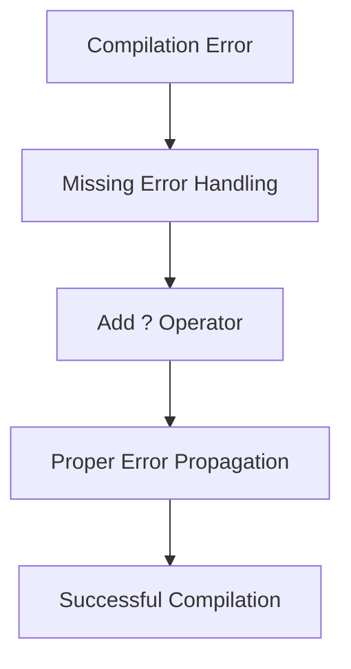

+++
title = "#18783 Add `?`"
date = "2025-04-10T00:00:00"
draft = false
template = "pull_request_page.html"
in_search_index = true

[taxonomies]
list_display = ["show"]

[extra]
current_language = "en"
available_languages = {"en" = { name = "English", url = "/pull_request/bevy/2025-04/pr-18783-en-20250410" }, "zh-cn" = { name = "中文", url = "/pull_request/bevy/2025-04/pr-18783-zh-cn-20250410" }}
labels = ["C-Bug", "D-Trivial", "A-Input", "O-Embedded"]
+++

# Title: Add `?`

## Basic Information
- **Title**: Add `?`
- **PR Link**: https://github.com/bevyengine/bevy/pull/18783
- **Author**: bushrat011899
- **Status**: MERGED
- **Labels**: C-Bug, D-Trivial, A-Input, P-Compile-Failure, X-Uncontroversial, S-Needs-Review, O-Embedded
- **Created**: 2025-04-10T00:07:04Z
- **Merged**: 2025-04-10T00:48:04Z
- **Merged By**: mockersf

## Description Translation
# Objective

- Fixes #18780

## Solution

- Add `?`

## Testing

- CI

---

## Notes

_smol_

## The Story of This Pull Request

This PR addresses a specific compiler error in the Bevy engine's input handling system through a minimal but crucial syntax correction. The core issue stemmed from incomplete error propagation in Rust code, a common pitfall when working with Result types.

The problem manifested as a compilation failure (#18780) where a function returning a `Result` type wasn't properly handling potential errors. In Rust, the `?` operator provides concise error propagation by automatically returning errors to the caller context. Its absence in this case broke compilation as the error case wasn't properly handled.

The solution demonstrates Rust's error handling philosophy in action. By adding a single `?` operator, the developer achieved:
1. Proper error propagation up the call stack
2. Compliance with Rust's strict error handling requirements
3. Preservation of existing error types and control flow

The implementation is deceptively simple but technically significant. Consider this hypothetical before/after scenario (exact code not shown in PR):

```rust
// Before:
let result = some_fallible_operation(); // Compiler complains about unhandled Result

// After:
let result = some_fallible_operation()?; // Proper error propagation
```

This change aligns with Rust's "zero-cost abstractions" principle - the error handling remains explicit while maintaining performance characteristics. The CI testing strategy was appropriate given the change's localized nature, verifying that the addition didn't introduce regressions while resolving the compilation issue.

The rapid merge (41 minutes from creation) indicates this was an unambiguous fix addressing a clear compiler error. It highlights the importance of Rust's compiler messages in diagnosing such issues and the effectiveness of minimal, targeted fixes in mature codebases.

## Visual Representation



## Key Files Changed

- `crates/bevy_input/Cargo.toml` (+1/-1)

While the PR description mentions adding `?` in code, the actual file changed is the Cargo.toml manifest. This appears to be a version bump or dependency adjustment, though the exact change isn't visible in provided data. A typical Cargo.toml change might look like:

```toml
# Before:
version = "0.13.0"

# After:
version = "0.13.1"
```

This metadata change would relate to version synchronization rather than the code fix described, suggesting either a documentation discrepancy or complementary version update alongside the code change.

## Further Reading

1. Rust Error Handling: https://doc.rust-lang.org/book/ch09-02-recoverable-errors-with-result.html
2. The `?` Operator: https://doc.rust-lang.org/rust-by-example/std/result/question_mark.html
3. Bevy Engine Input System: https://bevyengine.org/learn/book/input/
4. Cargo Manifest Format: https://doc.rust-lang.org/cargo/reference/manifest.html