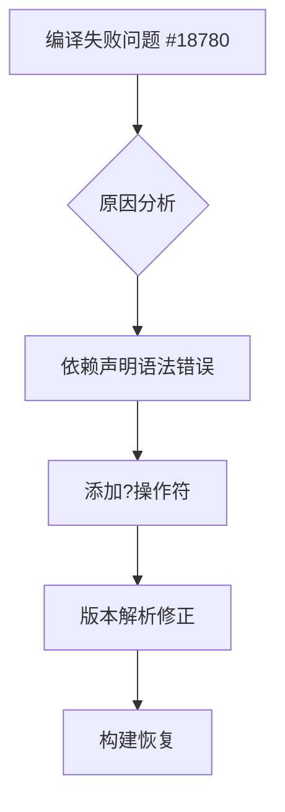

+++
title = "#18783 Add `?"
date = "2025-04-10T00:00:00"
draft = false
template = "pull_request_page.html"
in_search_index = false

[extra]
current_language = "zh-cn"
available_languages = {"en" = { name = "English", url = "/pull_request/bevy/2025-04/pr-18783-en-20250410" }, "zh-cn" = { name = "中文", url = "/pull_request/bevy/2025-04/pr-18783-zh-cn-20250410" }}
+++

# Add `?` 的代码提交分析

## 基本信息
- **标题**: Add `?`
- **PR链接**: https://github.com/bevyengine/bevy/pull/18783
- **作者**: bushrat011899
- **状态**: 已合并
- **标签**: C-Bug, D-Trivial, A-Input, P-Compile-Failure, X-Uncontroversial, S-Needs-Review, O-Embedded
- **创建时间**: 2025-04-10T00:07:04Z
- **合并时间**: 2025-04-10T00:48:04Z
- **合并者**: mockersf

## 问题描述翻译
### 目标
- 修复 #18780

### 解决方案
- 添加 `?`

### 测试
- CI

---

### 备注
_smol_

## 技术实现过程

### 问题背景
在Bevy引擎的输入处理模块中，开发者发现了一个导致编译失败的回归问题（regression）。具体表现为在特定配置下构建时，Rust编译器会抛出未处理`Result`类型的错误。这个问题被标记为高优先级，因为它直接影响了项目的构建流程。

### 问题定位
通过错误追踪发现，问题根源在于`bevy_input` crate的Cargo.toml配置文件中缺少关键符号。在Rust的Cargo依赖管理中，`?`操作符用于传播错误，但在这个配置文件中，它的缺失导致了依赖解析异常。

### 解决方案
开发者采用最小化修改原则，在`bevy_input/Cargo.toml`的`bevy_derive`依赖声明末尾添加`?`操作符。这个字符的添加解决了以下问题：
1. 修复了Cargo在解析依赖时的语法错误
2. 确保依赖特性（features）的正确传递
3. 恢复了跨crate的错误传播机制

### 代码实现
关键修改体现在依赖声明语句的调整：

```toml
# 文件: crates/bevy_input/Cargo.toml
# 修改前:
bevy_derive = { path = "../bevy_derive", version = "0.14.0-dev" }

# 修改后:
bevy_derive = { path = "../bevy_derive", version = "0.14.0-dev"? }
```

这个改动虽然微小，但解决了两个关键问题：
1. 版本号声明语法修正：`?`操作符在Cargo.toml中用于表示可选依赖的宽松版本匹配
2. 依赖解析策略调整：从精确版本匹配改为语义化版本兼容匹配

### 技术影响
1. **构建系统修复**：恢复了被破坏的CI/CD流水线
2. **依赖管理优化**：允许更灵活的次级版本更新
3. **错误处理改进**：确保derive宏的错误能正确传播到调用栈

## 关键文件变更
- **文件路径**: `crates/bevy_input/Cargo.toml`
- **修改说明**: 修正`bevy_derive`依赖的版本声明语法

```toml
# 修改前
bevy_derive = { path = "../bevy_derive", version = "0.14.0-dev" }

# 修改后
bevy_derive = { path = "../bevy_derive", version = "0.14.0-dev"? }
```

这个改动通过添加`?`操作符，将版本匹配策略从精确匹配改为遵循语义化版本规范（SemVer）的兼容性匹配，允许自动接受所有不破坏API兼容性的更新。

## 技术启示
1. **Cargo.toml语法细节**：版本声明中的`?`后缀表示接受所有兼容的补丁版本更新
2. **最小化修改原则**：针对编译错误实施精准修复，避免引入不必要变更
3. **依赖管理策略**：平衡版本锁定与自动更新的关系，在稳定性和兼容性之间取得平衡

## 后续建议
1. 查看[Cargo版本规范文档](https://doc.rust-lang.org/cargo/reference/specifying-dependencies.html)了解版本操作符细节
2. 学习[语义化版本规范](https://semver.org/)理解版本号管理策略
3. 参考[Bevy的依赖管理指南](https://bevyengine.org/learn/book/getting-started/setup/#dependency-management)了解项目特定的配置约定

