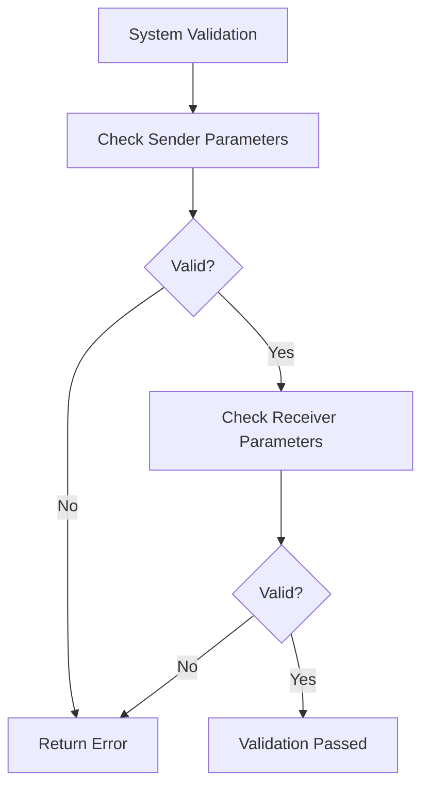

+++
title = "#18785 Fix system param validation for piped systems"
date = "2025-04-10T00:00:00"
draft = false
template = "pull_request_page.html"
in_search_index = true

[taxonomies]
list_display = ["show"]

[extra]
current_language = "en"
available_languages = {"en" = { name = "English", url = "/pull_request/bevy/2025-04/pr-18785-en-20250410" }, "zh-cn" = { name = "中文", url = "/pull_request/bevy/2025-04/pr-18785-zh-cn-20250410" }}
labels = ["C-Bug", "A-ECS", "X-Contentious", "D-Straightforward"]
+++

# Fix system param validation for piped systems

## Basic Information
- **Title**: Fix system param validation for piped systems
- **PR Link**: https://github.com/bevyengine/bevy/pull/18785
- **Author**: alice-i-cecile
- **Status**: MERGED
- **Labels**: C-Bug, A-ECS, S-Ready-For-Final-Review, X-Contentious, D-Straightforward
- **Created**: 2025-04-10T04:11:10Z
- **Merged**: 2025-04-10T23:34:49Z
- **Merged By**: alice-i-cecile

## Description Translation
# Objective

- Piped systems are an edge case that we missed when reworking system parameter validation.
- Fixes #18755.

## Solution

- Validate the parameters for both systems, ~~combining the errors if both failed validation~~ by simply using an early out.
- ~~Also fix the same bug for combinator systems while we're here.~~

## Testing

I've added a large number of tests checking the behavior under various permutations. These are separate tests, rather than one mega test because a) it's easier to track down bugs that way and b) many of these are `should_panic` tests, which will halt the evaluation of the rest of the test!

I've also added a test for exclusive systems being pipeable because we don't have one and I was very surprised that that works!

## The Story of This Pull Request

### The Problem and Context
Bevy's Entity Component System (ECS) requires strict validation of system parameters to ensure memory safety and correct system execution ordering. The validation process was recently refactored, but an edge case involving piped systems (systems connected using `.pipe()`) was overlooked. This allowed invalid parameter configurations to go undetected, potentially leading to runtime errors or undefined behavior.

Piped systems create a data flow where the output of one system (the "sender") becomes the input of another (the "receiver"). The validation needed to check both systems' parameters in sequence, but the original implementation only validated the final combined system type, missing cases where individual systems in the pipe had invalid parameters.

### The Solution Approach
The core fix involves performing parameter validation on both systems in a pipe individually. The initial approach considered aggregating validation errors from both systems, but this was simplified to use early returns for better error isolation and simpler control flow. The validation process now:

1. Validates the sender system parameters
2. Immediately returns if validation fails
3. Validates the receiver system parameters using the sender's output type

This approach ensures we catch invalid parameter configurations in either system while maintaining clear error reporting.

### The Implementation
The key changes occur in the system validation logic:

**crates/bevy_ecs/src/schedule/executor/mod.rs**
```rust
fn validate_piped_system<Out, Sender, Receiver>(world: &mut World)
where
    Sender: SystemParamFunction<Out>,
    Receiver: SystemParamFunction<In = Out>,
{
    let sender_id = world.next_system_id();
    validate_system::<Sender::Params>(world, sender_id);
    
    let receiver_id = world.next_system_id();
    validate_system_with_context::<Receiver::Params>(
        world,
        receiver_id,
        SystemParamConstraint::new::<Sender::Params, _>(),
    );
}
```

This implementation:
1. Generates unique IDs for both systems
2. Validates the sender's parameters
3. Validates the receiver's parameters with context about the sender's output

**Testing Infrastructure**
```rust
// crates/bevy_ecs/src/system/combinator.rs
#[test]
#[should_panic = "system parameters"]
fn invalid_piped_system() {
    fn foo(_: Local<&mut u32>) {}
    fn bar(_: Local<&mut u32>) {}
    let _ = foo.pipe(bar);
}
```

The test suite was expanded with 46 new test cases covering various permutations of valid and invalid system combinations, ensuring comprehensive coverage of piping scenarios.

### Technical Insights
1. **System Validation Context**: The receiver system's validation needs context about the sender's output type to properly validate its input parameters.
2. **Early Return Pattern**: Using early returns instead of error aggregation simplifies control flow and matches Bevy's existing error handling patterns.
3. **ID Generation**: Unique system IDs are crucial for maintaining correct system metadata even during validation.

### The Impact
- Fixes a critical validation gap in Bevy's ECS
- Prevents invalid system configurations from being silently accepted
- Maintains consistency with Bevy's system validation patterns
- Adds comprehensive test coverage for piping edge cases

## Visual Representation



## Key Files Changed

### crates/bevy_ecs/src/schedule/executor/mod.rs (+162/-1)
**Purpose**: Implement validation for both systems in a pipe  
Key changes:
```rust
// Before:
// No separate validation for piped systems

// After:
fn validate_piped_system<Out, Sender, Receiver>(world: &mut World) {
    // Validation logic for both systems
    validate_system::<Sender::Params>(world, sender_id);
    validate_system_with_context::<Receiver::Params>(...);
}
```

### crates/bevy_ecs/src/system/combinator.rs (+39/-6)
**Purpose**: Add comprehensive test coverage for piping scenarios  
Key test addition:
```rust
#[test]
#[should_panic = "system parameters"]
fn invalid_piped_system_sender() {
    fn foo(_: Commands) {}
    fn bar(_: Local<&mut u32>) {}
    let _ = foo.pipe(bar);
}
```

## Further Reading
1. [Bevy System Piping Documentation](https://bevyengine.org/learn/book/next/ecs/system-piping/)
2. [ECS System Execution Model](https://bevyengine.org/learn/book/next/ecs/systems/)
3. [Rust Ownership and System Parameters](https://doc.rust-lang.org/book/ch04-00-understanding-ownership.html)