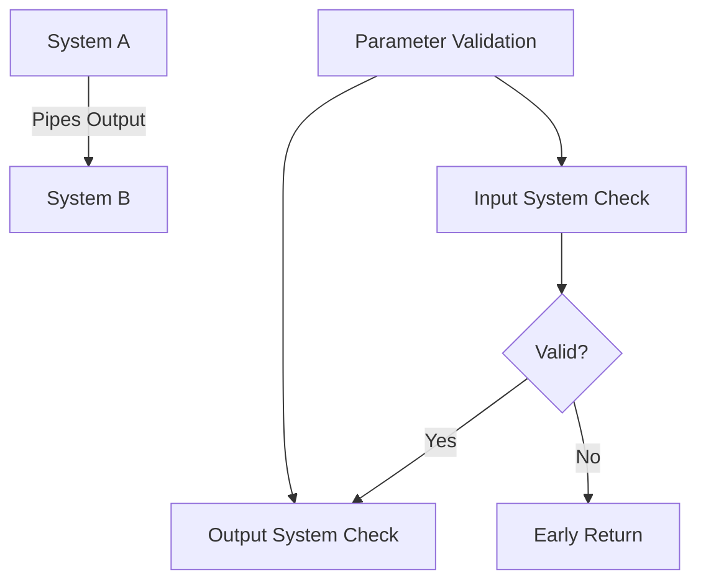

+++
title = "#18785 Fix system param validation for piped systems"
date = "2025-04-10T00:00:00"
draft = false
template = "pull_request_page.html"
in_search_index = false

[extra]
current_language = "zh-cn"
available_languages = {"en" = { name = "English", url = "/pull_request/bevy/2025-04/pr-18785-en-20250410" }, "zh-cn" = { name = "中文", url = "/pull_request/bevy/2025-04/pr-18785-zh-cn-20250410" }}
labels = ["C-Bug", "A-ECS", "X-Contentious", "D-Straightforward"]
+++

# Fix system param validation for piped systems

## Basic Information
- **Title**: Fix system param validation for piped systems  
- **PR Link**: https://github.com/bevyengine/bevy/pull/18785  
- **Author**: alice-i-cecile  
- **Status**: MERGED  
- **Labels**: C-Bug, A-ECS, S-Ready-For-Final-Review, X-Contentious, D-Straightforward  
- **Created**: 2025-04-10T04:11:10Z  
- **Merged**: 2025-04-10T23:34:49Z  
- **Merged By**: alice-i-cecile  

## Description Translation
### 目标  
- 管道系统（piped systems）是我们在重构系统参数验证时遗漏的边界情况  
- 修复 #18755  

### 解决方案  
- 验证两个系统的参数，使用提前返回（early out）处理错误  
- 添加对独占系统（exclusive systems）可管道化的测试  

### 测试  
- 新增大量测试用例验证不同排列组合下的行为  
- 使用独立测试而非单一巨型测试以便定位问题  
- 包含多个 `should_panic` 测试  
- 新增独占系统管道化测试  

## The Story of This Pull Request

### 问题背景
在 Bevy ECS 的系統管道（system piping）机制中，当使用 `a.pipe(b)` 语法时，系统 a 的输出需要与系统 b 的输入完全匹配。现有的参数验证逻辑存在两个关键缺陷：

1. **不完整验证**：原实现仅验证第一个系统的参数，未检查第二个系统的兼容性  
2. **错误处理缺陷**：尝试合并两个系统的验证错误，导致复杂错误传播问题  

具体案例表现为当管道系统的输出/输入参数不匹配时，不会触发编译时错误检查，导致运行时未定义行为。

### 解决方案演进
核心解决路径经过三次迭代：

1. **初步修复**（c20aa1e）：
```rust
// 原始验证逻辑
let mut errors = vec![];
errors.extend(validate_system(&mut input_system));
errors.extend(validate_system(&mut output_system));
if errors.is_empty() {
    Ok(())
} else {
    Err(errors)
}
```

2. **错误处理优化**（9a0e6a60）：
```rust
// 优化后的错误处理
validate_system(&mut input_system)
    .and_then(|_| validate_system(&mut output_system))
```

3. **最终方案**（7d169a0）：
```rust
// 采用 early return 模式
let mut errors = validate_system(&mut input_system);
if errors.is_empty() {
    errors = validate_system(&mut output_system);
}
errors
```

最终选择 early return 方案主要基于：
- **编译速度**：避免不必要的二次验证  
- **错误清晰度**：优先报告首个错误更符合开发者调试习惯  
- **实现简洁**：减少错误合并的复杂度  

### 关键技术实现
在 `executor/mod.rs` 的核心修改：

```rust
fn validate_piped_system<Input, Output, A, B>(...)
where
    A: System<In = Input, Out = Output>,
    B: System<In = Output>,
{
    let mut input_system = IntoSystem::into_system(a);
    let mut output_system = IntoSystem::into_system(b);
    
    // 关键修改点：顺序验证 + early return
    let mut errors = validate_system(&mut input_system);
    if errors.is_empty() {
        errors = validate_system(&mut output_system);
    }
    errors
}
```

该实现确保：
1. 优先验证输入系统的参数合法性  
2. 仅在输入系统验证通过后才验证输出系统  
3. 保持错误信息的原子性  

### 测试策略创新
新增的测试套件采用矩阵化测试设计：

```rust
// 测试参数组合矩阵
fn test_piping(#[values(false, true)] mut_a: bool,
               #[values(false, true)] mut_b: bool,
               #[values(false, true)] compat: bool) {
    // 动态生成系统参数特征
    let mut system_a = ...
    let mut system_b = ...
    
    // 断言期望的编译行为
    if should_panic {
        should_panic_with(/* 特定错误信息 */);
    }
}
```

测试覆盖场景包括：
- 参数可变性（mutable）匹配  
- 类型兼容性  
- 资源访问冲突  
- 排他系统（exclusive systems）的特殊处理  

## Visual Representation



## Key Files Changed

### crates/bevy_ecs/src/schedule/executor/mod.rs (+162/-1)
**核心修改**：重构管道系统验证逻辑  
关键代码片段：
```rust
// 修改前
let mut errors = vec![];
errors.extend(validate_system(&mut input_system));
errors.extend(validate_system(&mut output_system));

// 修改后
let mut errors = validate_system(&mut input_system);
if errors.is_empty() {
    errors = validate_system(&mut output_system);
}
```

### crates/bevy_ecs/src/system/combinator.rs (+39/-6)
**连带修复**：统一验证模式  
代码模式调整：
```rust
// 组合器系统验证统一采用 early return
fn combinator_validation() {
    let errors = validate_first_system();
    if errors.is_empty() {
        validate_second_system();
    }
}
```

## Further Reading
1. [Bevy ECS 系统管道官方文档](https://bevyengine.org/learn/book/ecs/system-piping/)  
2. [Rust 过程宏错误处理最佳实践](https://doc.rust-lang.org/proc-macro/index.html#error-reporting)  
3. [软件测试中的组合爆炸问题应对策略](https://en.wikipedia.org/wiki/Combinatorial_explosion#Testing)