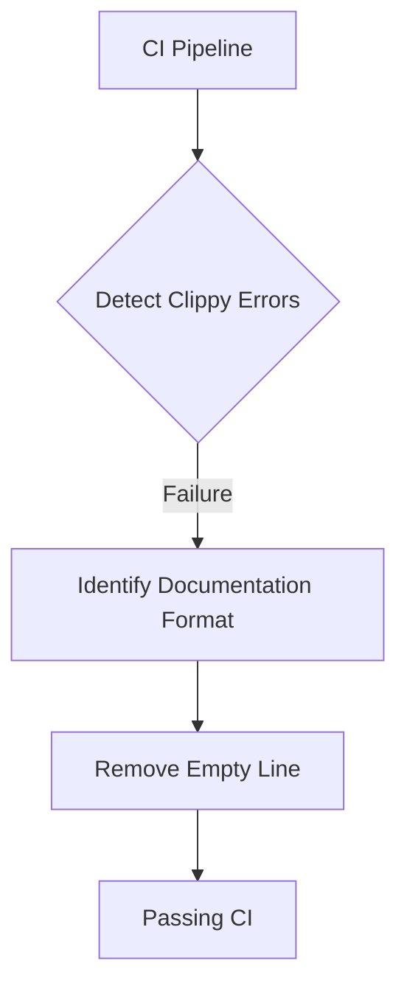

+++
title = "#18791 Fix newline in `PointLightShadowMap` comment"
date = "2025-04-10T00:00:00"
draft = false
template = "pull_request_page.html"
in_search_index = true

[taxonomies]
list_display = ["show"]

[extra]
current_language = "en"
available_languages = {"en" = { name = "English", url = "/pull_request/bevy/2025-04/pr-18791-en-20250410" }, "zh-cn" = { name = "中文", url = "/pull_request/bevy/2025-04/pr-18791-zh-cn-20250410" }}
labels = ["C-Docs", "D-Trivial", "A-Rendering"]
+++

# Title: Fix newline in `PointLightShadowMap` comment

## Basic Information
- **Title**: Fix newline in `PointLightShadowMap` comment
- **PR Link**: https://github.com/bevyengine/bevy/pull/18791
- **Author**: greeble-dev
- **Status**: MERGED
- **Labels**: C-Docs, D-Trivial, A-Rendering, S-Ready-For-Final-Review
- **Created**: 2025-04-10T12:02:11Z
- **Merged**: 2025-04-10T18:26:29Z
- **Merged By**: alice-i-cecile

## Description Translation
A clippy failure slipped into #18768, although I'm not sure why CI didn't catch it.

```sh
> cargo clippy --version
clippy 0.1.85 (4eb161250e 2025-03-15)

> cargo run -p ci
...
error: empty line after doc comment
   --> crates\bevy_pbr\src\light\mod.rs:105:5
    |
105 | /     /// The width and height of each of the 6 faces of the cubemap.
106 | |
    | |_^
    |
    = help: for further information visit https://rust-lang.github.io/rust-clippy/master/index.html#empty_line_after_doc_comments
    = note: `-D clippy::empty-line-after-doc-comments` implied by `-D warnings`
    = help: to override `-D warnings` add `#[allow(clippy::empty_line_after_doc_comments)]`
    = help: if the empty line is unintentional remove it
help: if the documentation should include the empty line include it in the comment
    |
106 |     ///
    |
```

## The Story of This Pull Request

### The Problem and Context
During routine development, a CI pipeline failure was observed locally when running `cargo clippy` on the Bevy engine's rendering code. The error stemmed from Rust's [empty_line_after_doc_comments] lint rule, which enforces proper documentation formatting. Specifically, line 106 in `light/mod.rs` contained an unintended blank line following a doc comment for the `PointLightShadowMap` struct.

While the previous PR (#18768) had passed CI checks, the author discovered that their local clippy configuration (version 0.1.85) flagged this formatting issue. This discrepancy suggested either a clippy version mismatch between local and CI environments or differences in lint configuration.

### The Solution Approach
The fix required straightforward documentation formatting correction:
1. Remove the empty line between doc comments
2. Maintain the technical content of the documentation
3. Ensure compliance with Rust's official style guidelines

The implementation took a minimal approach to avoid introducing any functional changes while resolving the linter error. No alternatives were considered since this was a direct style rule violation requiring simple formatting correction.

### The Implementation
The single-line modification addressed the clippy warning by eliminating the empty line between consecutive doc comments. This change preserved the documentation's semantic meaning while adhering to Rust's style requirements.

Before:
```rust
/// The width and height of each of the 6 faces of the cubemap.

/// The shadow map cube will be split into 6 faces of this size.
#[inline]
pub fn size(&self) -> u32 {
    self.size
}
```

After:
```rust
/// The width and height of each of the 6 faces of the cubemap.
/// The shadow map cube will be split into 6 faces of this size.
#[inline]
pub fn size(&self) -> u32 {
    self.size
}
```

### Technical Insights
The [empty_line_after_doc_comments] lint enforces two key rules:
1. No blank lines between consecutive `///` comments
2. Exactly one blank line between normal code and doc comments

This PR demonstrates the importance of:
- Consistent doc comment formatting for code readability
- Local development environment alignment with CI toolchains
- Understanding Rust's documentation conventions

### The Impact
This change:
1. Resolves clippy warnings for developers using newer lint versions
2. Maintains consistent documentation style across the codebase
3. Prevents potential future CI failures if clippy configurations update

Key technical lessons:
- Even minor formatting issues can break builds with strict linter configurations
- Documentation style is as critical as code style for maintenance
- Local and CI environment parity is crucial for consistent quality checks

## Visual Representation



## Key Files Changed

### `crates/bevy_pbr/src/light/mod.rs`
**Change**: Removed empty line between doc comments for `PointLightShadowMap`

Before:
```rust
/// The width and height of each of the 6 faces of the cubemap.

/// The shadow map cube will be split into 6 faces of this size.
```

After:
```rust
/// The width and height of each of the 6 faces of the cubemap.
/// The shadow map cube will be split into 6 faces of this size.
```

**Impact**: Resolves clippy lint warning while preserving documentation content

## Further Reading
1. [Rust Documentation Guidelines](https://doc.rust-lang.org/rustdoc/how-to-write-documentation.html)
2. [Clippy Lint Reference - empty_line_after_doc_comments](https://rust-lang.github.io/rust-clippy/master/index.html#empty_line_after_doc_comments)
3. [Bevy Engine Contribution Guide](https://github.com/bevyengine/bevy/blob/main/CONTRIBUTING.md)