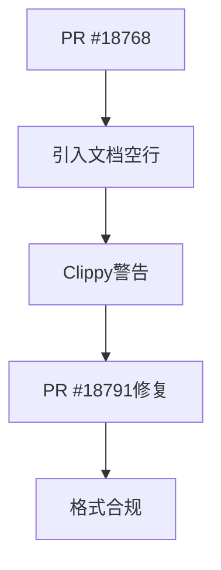

+++
title = "#18791 Fix newline in `PointLightShadowMap` comment"
date = "2025-04-10T00:00:00"
draft = false
template = "pull_request_page.html"
in_search_index = false

[extra]
current_language = "zh-cn"
available_languages = {"en" = { name = "English", url = "/pull_request/bevy/2025-04/pr-18791-en-20250410" }, "zh-cn" = { name = "中文", url = "/pull_request/bevy/2025-04/pr-18791-zh-cn-20250410" }}
labels = ["C-Docs", "D-Trivial", "A-Rendering"]
+++

# Fix newline in `PointLightShadowMap` comment

## Basic Information
- **Title**: Fix newline in `PointLightShadowMap` comment
- **PR Link**: https://github.com/bevyengine/bevy/pull/18791
- **Author**: greeble-dev
- **Status**: MERGED
- **Labels**: C-Docs, D-Trivial, A-Rendering, S-Ready-For-Final-Review
- **Created**: 2025-04-10T12:02:11Z
- **Merged**: 2025-04-10T18:26:29Z
- **Merged By**: alice-i-cecile

## Description Translation
在合并 #18768 时意外引入了 Clippy 错误，尽管尚不清楚为何 CI 没有捕获到该问题。

```sh
> cargo clippy --version
clippy 0.1.85 (4eb161250e 2025-03-15)

> cargo run -p ci
...
error: empty line after doc comment
   --> crates\bevy_pbr\src\light\mod.rs:105:5
    |
105 | /     /// The width and height of each of the 6 faces of the cubemap.
106 | |
    | |_^
    |
    = help: for further information visit https://rust-lang.github.io/rust-clippy/master/index.html#empty_line_after_doc_comments
    = note: `-D clippy::empty-line-after-doc-comments` implied by `-D warnings`
    = help: to override `-D warnings` add `#[allow(clippy::empty_line_after_doc_comments)]`
    = help: if the empty line is unintentional remove it
help: if the documentation should include the empty line include it in the comment
    |
106 |     ///
    |
```

## The Story of This Pull Request

该问题的核心在于违反 Rust 文档注释格式规范。在 #18768 的合并过程中，开发者无意间在 `PointLightShadowMap` 结构体的文档注释中插入了一个空行，这触发了 Clippy 的 `empty_line_after_doc_comments` 规则。虽然主 PR 已经通过 CI 检查，但实际本地运行 `cargo clippy` 时会报错。

问题根源在于 Rust 的文档注释规范要求注释块内的空行必须使用 `///` 前缀。原始代码中的空行没有这个前缀，导致 Clippy 将其识别为格式错误。这种格式错误虽然不影响编译，但会破坏代码风格的一致性，特别是在严格遵循 Clippy 警告的项目中可能导致构建失败。

修复方案直接明了：删除文档注释块中的多余空行。该修改无需任何架构调整或复杂逻辑变更，属于典型的文档格式修正。值得注意的是，这个案例暴露了 CI 流水线中 Clippy 检查可能存在配置差异，需要后续验证 CI 环境的 Clippy 规则执行情况。

从工程实践角度看，这个 PR 展示了几个重要经验：
1. 文档注释格式规范在实际开发中的重要性
2. 本地环境与 CI 环境静态检查一致性的必要性
3. 即使微小改动也需要完整的本地检查流程

## Visual Representation



## Key Files Changed

### `crates/bevy_pbr/src/light/mod.rs`
**修改内容**：删除文档注释块中的多余空行

**代码对比**：
```rust
// 修改前
105 |     /// The width and height of each of the 6 faces of the cubemap.
106 |     
107 |     pub size: u32,

// 修改后
105 |     /// The width and height of each of the 6 faces of the cubemap.
106 |     pub size: u32,
```

**影响分析**：该修改直接解决 Clippy 警告，确保文档注释符合 Rust 格式规范。修改仅影响注释结构，不涉及任何功能逻辑变更。

## Further Reading
1. [Rust Clippy 文档注释规则](https://rust-lang.github.io/rust-clippy/master/index.html#empty_line_after_doc_comments)
2. [Rust 文档注释规范](https://doc.rust-lang.org/rustdoc/how-to-write-documentation.html)
3. [Bevy 贡献指南](https://github.com/bevyengine/bevy/blob/main/CONTRIBUTING.md#code-format)