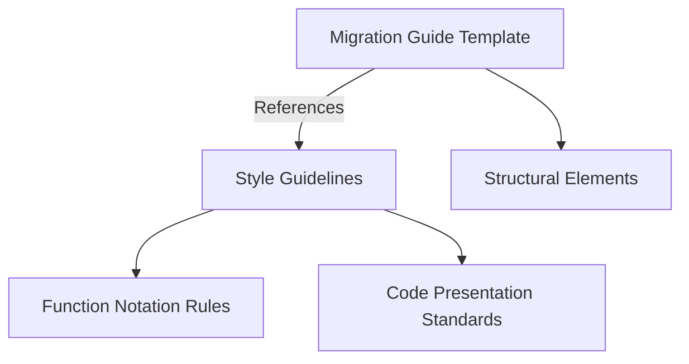

+++
title = "#18794 Make some changes to the migration guide recommendations"
date = "2025-04-10T00:00:00"
draft = false
template = "pull_request_page.html"
in_search_index = true

[taxonomies]
list_display = ["show"]

[extra]
current_language = "en"
available_languages = {"en" = { name = "English", url = "/pull_request/bevy/2025-04/pr-18794-en-20250410" }, "zh-cn" = { name = "中文", url = "/pull_request/bevy/2025-04/pr-18794-zh-cn-20250410" }}
labels = ["C-Docs", "A-Cross-Cutting", "D-Straightforward"]
+++

# Make some changes to the migration guide recommendations

## Basic Information
- **Title**: Make some changes to the migration guide recommendations  
- **PR Link**: https://github.com/bevyengine/bevy/pull/18794  
- **Author**: BD103  
- **Status**: MERGED  
- **Labels**: C-Docs, S-Ready-For-Final-Review, A-Cross-Cutting, D-Straightforward  
- **Created**: 2025-04-10T15:54:37Z  
- **Merged**: 2025-04-10T19:46:10Z  
- **Merged By**: alice-i-cecile  

## Description Translation
The original description is in English and preserved as-is:

# Objective

- I've worked on the migration guide in the past, so I've written down some of the conventions and styles I've used.

## Solution

Please read through the descriptions of each commit, which justify the change! In summary:

- Remove headings from migration guide template by moving style guide to `migration_guides.md`
- Use parentheses to signal method and function names (`my_func()` instead of `my_func`)
- Change the guidelines on using bullet points so they're not used for every single migration guide.
- Remove suggestion to use diff blocks, as they don't syntax-highlight Rust code.

## The Story of This Pull Request

The PR addresses documentation consistency challenges in Bevy's migration guides. While working on previous migration guides, the author identified several opportunities to improve contributor guidelines and template structure.

The core problem stemmed from three documentation pain points:
1. Overly prescriptive template headers that mixed structural guidance with style rules
2. Inconsistent formatting of function/method references
3. Suboptimal code presentation through unhighlighted diff blocks

The solution restructures documentation guidance while maintaining backward compatibility. Key decisions included:
1. Separating style rules from template structure
2. Establishing clear function notation conventions
3. Optimizing code presentation for readability

In `migration_guides.md`, the author added explicit style guidelines:
```markdown
<!-- Added section -->
## Style Guide

- Use parentheses when referring to functions: `my_func()` instead of `my_func`
- Prefer code blocks over diff blocks for Rust examples
- Use bullet points only when listing multiple distinct items
```

The template file (`migration_guides_template.md`) was simplified by removing redundant headers and inline styling instructions. This separation allows contributors to focus on content structure while maintaining centralized style rules.

Before changes:
```markdown
<!-- In template -->
## Migration Guide
### (Style) Code Examples
- Use `diff` blocks for code changes
```

After changes:
```markdown
<!-- Simplified template -->
//! [Migration Guide Title]
//! 
//! [Short description]
```

The function notation change (`my_func` → `my_func()`) improves readability by visually distinguishing function calls from other code elements. This aligns with common technical writing practices in Rust documentation.

Removing diff blocks addresses syntax highlighting limitations while maintaining code clarity. Regular code blocks now enable proper Rust highlighting:
````markdown
```rust
// Before:
fn old_system() 

// After:
fn new_system(query: Query<&Transform>) 
```
````

## Visual Representation



## Key Files Changed

1. **release-content/migration_guides.md** (+45/-0)  
   Added centralized style guidelines and documentation standards. Key addition:
   ```markdown
   ## Style Guide
   
   - Signal function/method names with parentheses: `entity.insert()` 
   - Use bullet points only for listing multiple distinct items
   - Prefer regular code blocks over diff blocks
   ```

2. **release-content/migration_guides_template.md** (+2/-39)  
   Simplified template structure by removing inline style rules:
   ```markdown
   # Before:
   ## (Style) Headings
   - Use second-level headings for main sections
   
   # After:
   //! [Migration Guide Title]
   //! [Concise description]
   ```

## Further Reading

- Rust API Documentation Guidelines: https://rust-lang.github.io/api-guidelines/naming.html
- Technical Writing Style Guides: https://developers.google.com/style
- Markdown Syntax Reference: https://www.markdownguide.org/basic-syntax/