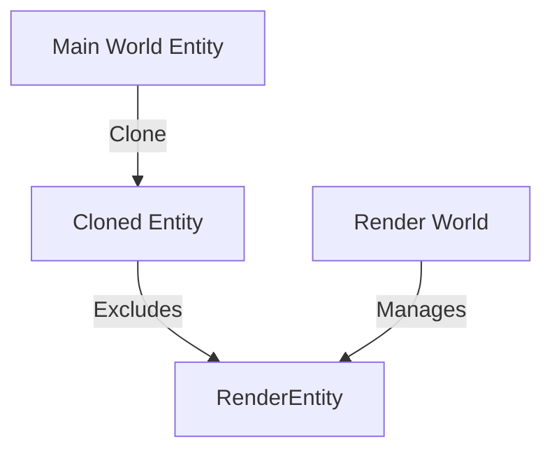

+++
title = "#18798 Ignore RenderEntity during entity clones"
date = "2025-04-10T00:00:00"
draft = false
template = "pull_request_page.html"
in_search_index = true

[taxonomies]
list_display = ["show"]

[extra]
current_language = "en"
available_languages = {"en" = { name = "English", url = "/pull_request/bevy/2025-04/pr-18798-en-20250410" }, "zh-cn" = { name = "中文", url = "/pull_request/bevy/2025-04/pr-18798-zh-cn-20250410" }}
labels = ["C-Bug", "A-Rendering", "A-ECS"]
+++

# Title: Ignore RenderEntity during entity clones

## Basic Information
- **Title**: Ignore RenderEntity during entity clones  
- **PR Link**: https://github.com/bevyengine/bevy/pull/18798  
- **Author**: cart  
- **Status**: MERGED  
- **Labels**: C-Bug, A-Rendering, A-ECS, S-Ready-For-Final-Review  
- **Created**: 2025-04-10T20:25:40Z  
- **Merged**: 2025-04-10T21:06:50Z  
- **Merged By**: alice-i-cecile  

## Description Translation
# Objective

Fixes #18795

## Solution

Ignore RenderEntity during entity clones

## The Story of This Pull Request

### The Problem and Context
In Bevy's Entity Component System (ECS), entity cloning operations were inadvertently copying `RenderEntity` components. This component contains critical rendering-specific metadata that should be uniquely managed by the render world. When cloned entities retained these components, it led to synchronization issues between the main world and render world, potentially causing rendering artifacts or system conflicts.

### The Solution Approach
The fix required modifying Bevy's entity cloning logic to explicitly exclude `RenderEntity` components. This aligns with established patterns for handling render-specific components that require special lifecycle management. The solution leverages Bevy's existing component filtering mechanisms to prevent accidental duplication of render-critical data.

### The Implementation
The core change occurs in `sync_world.rs` where we extend the list of ignored components during entity cloning operations:

```rust
// crates/bevy_render/src/sync_world.rs

fn ignore_components() -> Vec<ComponentId> {
    let mut ignore = Vec::new();
    // ... existing components
    ignore.push(world.component_id::<RenderEntity>().unwrap()); // New addition
    ignore
}
```

This modification ensures that when entities are cloned through `EntityMut::clone`, the `RenderEntity` component is automatically excluded from the duplication process. The render world maintains responsibility for creating and managing these components through its normal synchronization processes.

### Technical Insights
Key technical considerations:
1. **ECS Lifecycle Management**: RenderEntity components represent GPU-side resources that require explicit cleanup
2. **World Synchronization**: The render world maintains a parallel entity structure that must stay in sync with the main world
3. **Clone Semantics**: Entity clones should represent logical duplicates without inheriting render-specific technical identifiers

By excluding `RenderEntity` from cloning, we preserve the render world's ability to manage these components through its existing entity management systems, preventing duplicate component IDs and ensuring proper resource cleanup.

### The Impact
This fix:
- Prevents potential rendering artifacts caused by duplicate RenderEntity components
- Maintains clean separation between main world and render world responsibilities
- Aligns entity cloning behavior with other special-component handling patterns in Bevy
- Reduces risk of subtle bugs when working with cloned entities in rendering contexts

## Visual Representation



## Key Files Changed

**crates/bevy_render/src/sync_world.rs** (+12/-1)  
The critical modification adds `RenderEntity` to the list of ignored components during entity cloning operations. Before this change, the component wasn't filtered out, leading to potential duplication issues.

Before:
```rust
fn ignore_components() -> Vec<ComponentId> {
    let mut ignore = Vec::new();
    // Existing components filtered...
    // Missing RenderEntity exclusion
    ignore
}
```

After:
```rust
fn ignore_components() -> Vec<ComponentId> {
    let mut ignore = Vec::new();
    // Existing components...
    ignore.push(world.component_id::<RenderEntity>().unwrap());
    ignore
}
```

This change directly addresses the root cause by ensuring cloned entities don't inherit render-specific identifiers that should be uniquely managed by the render world.

## Further Reading

1. Bevy ECS Documentation: [Entity Component System](https://bevyengine.org/learn/book/ecs/)
2. Render World Architecture: [Bevy Render Pipeline Overview](https://bevyengine.org/learn/book/rendering/pipelines/)
3. Component Filtering: [Bevy Component Documentation](https://docs.rs/bevy_ecs/latest/bevy_ecs/component/trait.Component.html)