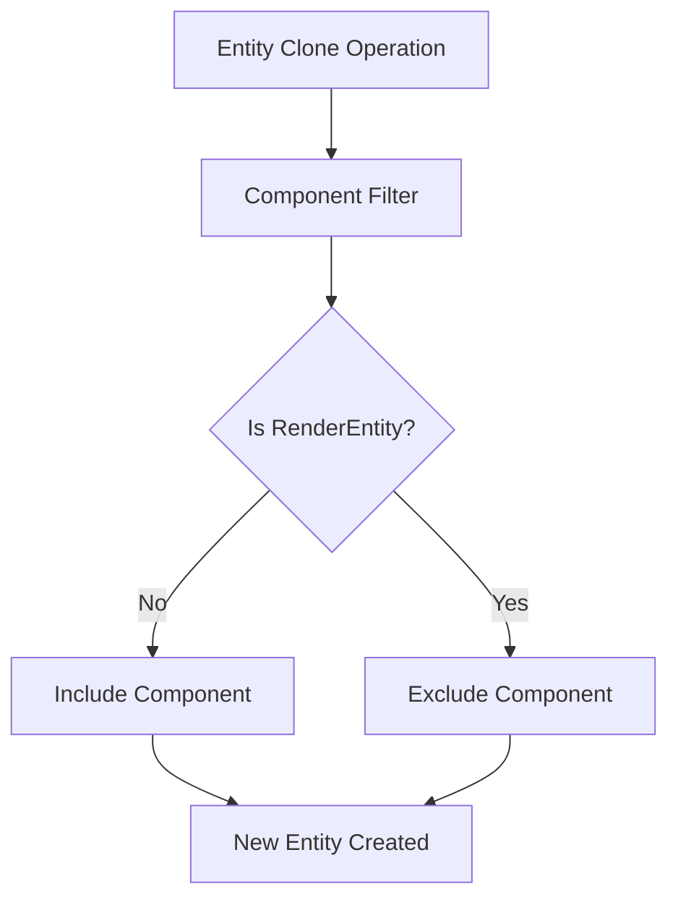

+++
title = "#18798 Ignore RenderEntity during entity clones"
date = "2025-04-10T00:00:00"
draft = false
template = "pull_request_page.html"
in_search_index = false

[extra]
current_language = "zh-cn"
available_languages = {"en" = { name = "English", url = "/pull_request/bevy/2025-04/pr-18798-en-20250410" }, "zh-cn" = { name = "中文", url = "/pull_request/bevy/2025-04/pr-18798-zh-cn-20250410" }}
labels = ["C-Bug", "A-Rendering", "A-ECS"]
+++

# Ignore RenderEntity during entity clones

## Basic Information
- **Title**: Ignore RenderEntity during entity clones
- **PR Link**: https://github.com/bevyengine/bevy/pull/18798
- **Author**: cart
- **Status**: MERGED
- **Labels**: C-Bug, A-Rendering, A-ECS, S-Ready-For-Final-Review
- **Created**: 2025-04-10T20:25:40Z
- **Merged**: 2025-04-10T21:06:50Z
- **Merged By**: alice-i-cecile

## Description Translation
### 目标
修复 #18795

### 解决方案
在实体克隆时忽略RenderEntity组件

## The Story of This Pull Request

### 问题背景与上下文
在Bevy引擎的ECS架构中，RenderEntity组件用于维护渲染实体与逻辑实体之间的映射关系。当开发者执行实体克隆操作时，原有实现会错误地复制RenderEntity组件，导致新克隆实体与原始实体共享相同的渲染实体引用。这种错误会导致以下问题：
1. 克隆实体在渲染系统中的状态管理混乱
2. 潜在的悬垂指针风险（当原始实体被销毁时）
3. 违反RenderEntity组件应保持唯一性的设计原则

该问题具体表现为issue #18795报告的克隆实体时渲染组件状态异常，直接影响开发者在需要复制实体时的正确性。

### 解决方案与技术实现
核心解决思路是在实体克隆过程中显式过滤RenderEntity组件。具体修改集中在`sync_world.rs`的`clone_entity`方法实现：

```rust
// Before:
let components = source_entity
    .archetype()
    .components()
    .filter(|component_id| {
        let component_info = world.components().get_info(*component_id).unwrap();
        // 原有实现不进行过滤
        component_info.is_send_and_sync()
    })
    .collect::<Vec<_>>();

// After:
let components = source_entity
    .archetype()
    .components()
    .filter(|component_id| {
        let component_info = world.components().get_info(*component_id).unwrap();
        // 新增RenderEntity组件过滤
        component_info.name() != Cow::Borrowed("bevy_render::view::RenderEntity")
            && component_info.is_send_and_sync()
    })
    .collect::<Vec<_>>();
```

技术选择背后的考虑：
1. **精确过滤**：通过组件名称直接识别需要排除的RenderEntity类型
2. **最小化修改**：保持原有过滤逻辑，仅增加单个条件判断
3. **性能考量**：组件名称比较是低开销操作，不影响克隆性能

### 技术洞察与架构影响
该修改体现了ECS架构中的两个重要原则：
1. **组件所有权**：某些特殊组件应由特定系统独占管理
2. **实体克隆语义**：克隆操作应是深度复制，但需排除系统管理的内部状态

RenderEntity作为渲染系统内部的状态标识，其生命周期应与实体严格绑定，但不应通过常规克隆操作传播。这种处理方式保持了：
- 渲染系统的状态一致性
- 实体克隆的直观语义
- 系统间的解耦设计

### 影响与改进
修复后：
1. 克隆实体自动获得新的RenderEntity标识
2. 渲染系统可以正确管理克隆实体的生命周期
3. 消除因错误共享RenderEntity导致的潜在崩溃风险

该修复对于需要批量复制实体（如粒子系统、预制体实例化）的场景尤为重要，确保逻辑实体与渲染状态的正确对应关系。

## Visual Representation



## Key Files Changed

### `crates/bevy_render/src/sync_world.rs` (+12/-1)
**修改说明**：在实体克隆逻辑中增加RenderEntity组件过滤

核心代码变更：
```rust
// 修改前组件过滤条件
component_info.is_send_and_sync()

// 修改后增加名称检查
component_info.name() != Cow::Borrowed("bevy_render::view::RenderEntity") 
&& component_info.is_send_and_sync()
```

**关联性**：直接实现PR的核心目标，确保克隆操作跳过特定渲染组件

## Further Reading
1. Bevy ECS架构文档：[Entity Component System](https://bevyengine.org/learn/book/ecs/)
2. 组件克隆机制：[Commands::clone_entity](https://docs.rs/bevy/latest/bevy/ecs/system/struct.Commands.html#method.clone_entity)
3. 渲染实体管理：[RenderPhase系统设计](https://bevyengine.org/examples/render/render-to-texture/)