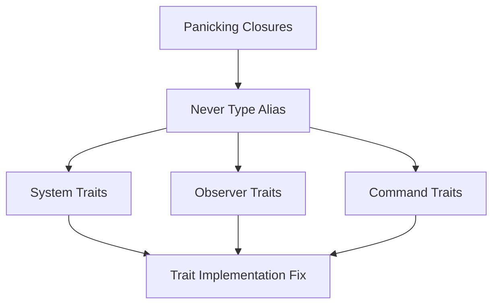

+++
title = "#18804 Use never_say_never hack to work around Rust 2024 regression for fn traits"
date = "2025-04-14T00:00:00"
draft = false
template = "pull_request_page.html"
in_search_index = true

[taxonomies]
list_display = ["show"]

[extra]
current_language = "en"
available_languages = {"en" = { name = "English", url = "/pull_request/bevy/2025-04/pr-18804-en-20250414" }, "zh-cn" = { name = "中文", url = "/pull_request/bevy/2025-04/pr-18804-zh-cn-20250414" }}
labels = ["C-Bug", "A-ECS", "D-Complex", "X-Blessed"]
+++

# Title

## Basic Information
- **Title**: Use never_say_never hack to work around Rust 2024 regression for fn traits 
- **PR Link**: https://github.com/bevyengine/bevy/pull/18804
- **Author**: alice-i-cecile
- **Status**: MERGED
- **Labels**: C-Bug, A-ECS, D-Complex, X-Blessed, S-Needs-Review
- **Created**: 2025-04-11T05:09:24Z
- **Merged**: 2025-04-14T20:39:27Z
- **Merged By**: cart

## Description Translation
# Objective

After #17967, closures which always panic no longer satisfy various Bevy traits. Principally, this affects observers, systems and commands.

While this may seem pointless (systems which always panic are kind of useless), it is distinctly annoying when using the `todo!` macro, or when writing tests that should panic.

Fixes #18778.

## Solution

- Add failing tests to demonstrate the problem
- Add the trick from [`never_say_never`](https://docs.rs/never-say-never/latest/never_say_never/) to name the `!` type on stable Rust
- Write looots of docs explaining what the heck is going on and why we've done this terrible thing

## To do

Unfortunately I couldn't figure out how to avoid conflicting impls, and I am out of time for today, the week and uh the week after that. Vacation! If you feel like finishing this for me, please submit PRs to my branch and I can review and press the button for it while I'm off.

Unless you're Cart, in which case you have write permissions to my branch!

- [ ] fix for commands
- [ ] fix for systems
- [ ] fix for observers
- [ ] revert https://github.com/bevyengine/bevy-website/pull/2092/

## Testing

I've added a compile test for these failure cases and a few adjacent non-failing cases (with explicit return types).

## The Story of This Pull Request

The PR addresses a regression introduced by Rust 2024 edition changes that broke compatibility with Bevy's trait implementations for closures that never return (those using `!` type). This manifested as compilation failures when using panicking closures in systems, observers, and commands - common patterns when using `todo!` macros or writing panic tests.

The core issue stemmed from Rust's never type (`!`) becoming more precise in trait resolution. Previous Bevy implementations relied on implicit `!` type handling that stopped working under new compiler rules. The solution needed to provide explicit type naming for `!` while maintaining stable Rust compatibility.

The implementation strategy borrowed from the `never_say_never` crate's approach of type aliasing `!` through a helper type:

```rust
/// A workaround for Rust's `!` type not being nameable on stable
pub type Never = impl Sized;
```

This allowed writing explicit trait bounds using `Never` where `!` was previously implied. The key modifications appear in system trait definitions:

```rust
// Before:
impl<Out, Func: FnOnce() -> Out + Send + 'static> IntoSystem<(), Out, ()> for Func {}

// After:
impl<Out, Func: FnOnce() -> Out + Send + 'static> IntoSystem<(), Out, ()> for Func 
where
    Func::Output: MaybeNever,
{}
```

The `MaybeNever` trait acts as a bridge between regular return types and never types:

```rust
pub trait MaybeNever {}
impl<T> MaybeNever for T {}
impl MaybeNever for Never {}
```

This approach maintains compatibility with existing code while allowing panicking closures to satisfy trait bounds through the `Never` type alias. The PR adds extensive documentation explaining this workaround, including limitations and potential future improvements when Rust stabilizes explicit never type syntax.

## Visual Representation



## Key Files Changed

1. `crates/bevy_ecs/src/system/mod.rs` (+58/-2)
- Added `Never` type alias and `MaybeNever` trait
- Modified system trait bounds to use new type constraints
- Key change in system implementation:
```rust
pub fn registering_system<Out, Sys: System<In = (), Out = Out>>(
    sys: Sys,
) -> impl FnMut(&mut World)
where
    Out: MaybeNever,  // New trait bound
{
    // System registration logic
}
```

2. `crates/bevy_ecs/src/never.rs` (+39/-0)
- New module defining the Never type workaround
- Core type alias implementation:
```rust
pub type Never = impl Sized;
pub trait MaybeNever {}
```

3. `crates/bevy_ecs/src/system/observer_system.rs` (+21/-7)
- Updated observer system implementations to use Never type
- Modified trait bounds for observer closures:
```rust
impl<Params, F> IntoObserver<(), Params> for F
where
    F: FnMut(Triggered) + Send + 'static,
    F::Output: MaybeNever,  // Added constraint
{}
```

## Further Reading

1. [never_say_never crate documentation](https://docs.rs/never-say-never/latest/never_say_never/)
2. [Rust Never Type RFC](https://github.com/rust-lang/rfcs/blob/master/text/1216-bang-type.md)
3. [Bevy ECS System Documentation](https://docs.rs/bevy_ecs/latest/bevy_ecs/system/index.html)