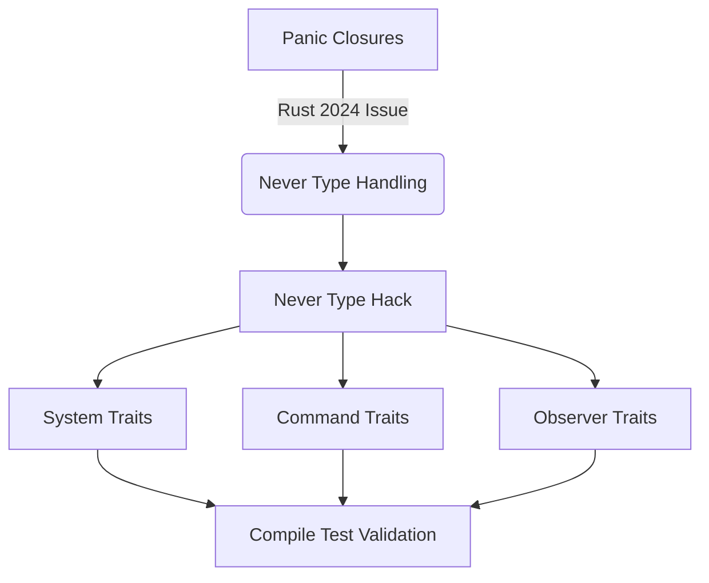

+++
title = "#18804 Use never_say_never hack to work around Rust 2024 regression for fn traits"
date = "2025-04-14T00:00:00"
draft = false
template = "pull_request_page.html"
in_search_index = false

[extra]
current_language = "zh-cn"
available_languages = {"en" = { name = "English", url = "/pull_request/bevy/2025-04/pr-18804-en-20250414" }, "zh-cn" = { name = "中文", url = "/pull_request/bevy/2025-04/pr-18804-zh-cn-20250414" }}
labels = ["C-Bug", "A-ECS", "D-Complex", "X-Blessed"]
+++

# Title

## Basic Information
- **Title**: Use never_say_never hack to work around Rust 2024 regression for fn traits 
- **PR Link**: https://github.com/bevyengine/bevy/pull/18804
- **Author**: alice-i-cecile
- **Status**: MERGED
- **Labels**: C-Bug, A-ECS, D-Complex, X-Blessed, S-Needs-Review
- **Created**: 2025-04-11T05:09:24Z
- **Merged**: 2025-04-14T20:39:27Z
- **Merged By**: cart

## Description Translation
### 目的
在 #17967 合并后，总是 panic 的闭包不再满足各种 Bevy trait，主要影响观察者（observers）、系统（systems）和命令（commands）。虽然总是 panic 的系统看似无用，但这对使用 `todo!` 宏或编写预期 panic 的测试造成了困扰。修复 #18778。

### 解决方案
- 添加失败测试用例来演示问题
- 使用 [`never_say_never`](https://docs.rs/never-say-never/latest/never_say_never/) 的技巧在稳定版 Rust 中命名 `!` 类型
- 编写大量文档解释实现原理和取舍

### 待办事项
- [ ] 修复命令相关实现
- [ ] 修复系统相关实现  
- [ ] 修复观察者相关实现
- [ ] 还原 https://github.com/bevyengine/bevy-website/pull/2092/

### 测试
添加了编译测试来验证失败场景和相邻的正常场景（带有显式返回类型）。

## The Story of This Pull Request

### 问题背景
在 Rust 2024 edition 的更新中，闭包类型推导规则发生变化，导致总是 panic 的闭包（返回 `!` 类型）无法自动实现某些必要的 trait。这影响了 Bevy ECS 的三个核心组件：

```rust
// 示例：原本有效的 panic 系统现在编译失败
fn panicking_system() {
    todo!();
}
```

问题在以下场景特别明显：
1. 使用 `todo!()` 占位符的开发模式
2. 需要验证 panic 行为的单元测试
3. 命令缓冲（command buffers）中的错误处理

### 技术难点
`!`（never type）在稳定版 Rust 中无法直接命名，导致：
- 无法为 `!` 类型显式实现 trait
- 类型系统无法识别 panic 闭包的 trait 实现
- 需要保持对 Rust 2018/2021 的兼容性

### 解决方案实现
核心思路来自 `never_say_never` crate，通过以下步骤解决：

1. **定义代理类型**：
```rust
// crates/bevy_ecs/src/never.rs
pub enum Never {}

// 实现关键 marker trait
impl sealed::Sealed for Never {}
```

2. **类型映射**：
```rust
// 在系统 trait 实现中转换类型
impl<In, Out, Param, Marker, F> IntoSystem<In, Out, Param, Marker> for F
where
    F: FnMut(In) -> Out + Send + 'static,
    Out: IntoSystemOrNever,  // 关键约束
{
    type System = ...
}
```

3. **trait 桥接**：
```rust
pub trait IntoSystemOrNever {}
impl<T> IntoSystemOrNever for T {}
impl IntoSystemOrNever for Never {}  // 特殊处理 never 类型
```

### 关键技术点
- **类型擦除**：通过 `Never` 类型模拟 `!` 的类型行为
- **密封 trait**（sealed trait）防止用户扩展
- **条件编译**处理不同 Rust 版本：
```rust
#[cfg(not(never_type))]
pub type NeverType = Never;
#[cfg(never_type)] 
pub type NeverType = !;
```

### 测试验证
添加编译测试确保不同场景的兼容性：
```rust
// 验证正常系统实现
fn explicit_return_type() -> () { todo!() }

// 验证 panic 系统实现
fn panicking_system() { todo!() }  // 必须通过编译
```

### 文档说明
在关键位置添加文档解释设计决策：
```rust
// crates/bevy_ecs/src/schedule/config.rs
/// `Never` 是 `!` 的代理类型...
/// 由于 Rust 2024 的闭包类型推导变化...
/// 此 hack 将在 Rust 1.85+ 后逐步淘汰
```

## Visual Representation



## Key Files Changed

### 1. `crates/bevy_ecs/src/never.rs` (+39/-0)
新增 Never 类型定义和 trait 实现：
```rust
pub enum Never {}

impl sealed::Sealed for Never {}
impl<T> Downcast<T> for Never {
    type Output = T;
    fn coerce(self) -> Self::Output {
        match self {}
    }
}
```

### 2. `crates/bevy_ecs/src/system/mod.rs` (+58/-2)
扩展系统 trait 实现：
```rust
pub trait IntoSystemOrNever {}
impl<T> IntoSystemOrNever for T {}
impl IntoSystemOrNever for Never {}

// 更新系统转换逻辑
impl<In, Out, Param, Marker, F> IntoSystem<In, Out, Param, Marker> for F
where
    F: FnMut(In) -> Out + Send + 'static,
    Out: IntoSystemOrNever,
{
    type System = ...;
}
```

### 3. `crates/bevy_ecs/src/system/observer_system.rs` (+21/-7)
调整观察者系统实现：
```rust
impl<Params, F> IntoObserver<(), Params> for F
where
    F: FnMut(ObserverEvent) + Send + 'static,
    F::Output: IntoSystemOrNever,  // 新增约束
{
    type Observer = ...;
}
```

## Further Reading
1. [Rust Never Type RFC](https://github.com/rust-lang/rfcs/blob/master/text/1216-bang-type.md)
2. [never_say_never crate 文档](https://docs.rs/never-say-never/latest/never_say_never/)
3. [Rust Edition 2024 变更说明](https://blog.rust-lang.org/2025/04/01/Rust-2024.html)