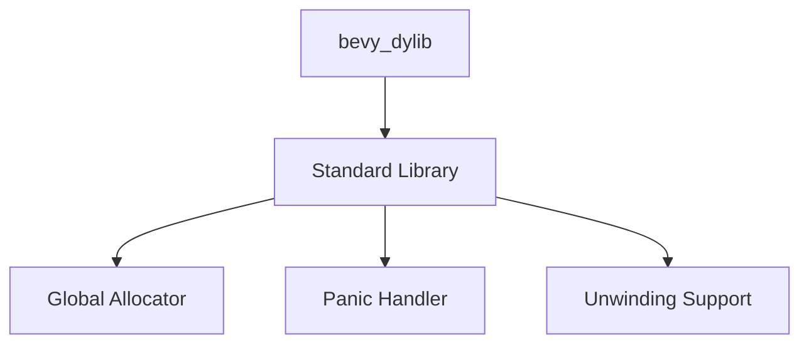

+++
title = "#18807 Fixing bevy_dylib Compilation by Re-enabling Standard Library Support"
date = "2025-04-11T00:00:00"
draft = false
template = "pull_request_page.html"
in_search_index = true

[taxonomies]
list_display = ["show"]

[extra]
current_language = "en"
available_languages = {"en" = { name = "English", url = "/pull_request/bevy/2025-04/pr-18807-en-20250411" }, "zh-cn" = { name = "中文", url = "/pull_request/bevy/2025-04/pr-18807-zh-cn-20250411" }}
labels = ["C-Bug", "D-Trivial"]
+++

# Title: Fixing bevy_dylib Compilation by Re-enabling Standard Library Support

## Basic Information
- **Title**: don't disable std in bevy_dylib
- **PR Link**: https://github.com/bevyengine/bevy/pull/18807
- **Author**: mockersf
- **Status**: MERGED
- **Labels**: C-Bug, D-Trivial, S-Ready-For-Final-Review, P-Compile-Failure
- **Created**: 2025-04-11T10:07:11Z
- **Merged**: 2025-04-11T19:04:38Z
- **Merged By**: mockersf

## Description Translation
The original description is in English and preserved exactly as-is:

# Objective

- `bevy_dylib` currently doesn't build independently
```
cargo build -p bevy_dylib
   Compiling bevy_dylib v0.16.0-rc.4 (/crates/bevy_dylib)
error: no global memory allocator found but one is required; link to std or add `#[global_allocator]` to a static item that implements the GlobalAlloc trait

error: `#[panic_handler]` function required, but not found

error: unwinding panics are not supported without std
  |
  = help: using nightly cargo, use -Zbuild-std with panic="abort" to avoid unwinding
  = note: since the core library is usually precompiled with panic="unwind", rebuilding your crate with panic="abort" may not be enough to fix the problem

error: could not compile `bevy_dylib` (lib) due to 3 previous errors
```

## Solution

- remove `#![no_std]` from `bevy_dylib`

## Testing

- it builds now

## The Story of This Pull Request

The problem surfaced when attempting to build `bevy_dylib` as a standalone crate using `cargo build -p bevy_dylib`. The compilation failed with three critical errors related to memory allocation, panic handling, and unwinding support. These errors stemmed from the crate's use of `#![no_std]`, which disables Rust's standard library but requires explicit handling of low-level system components.

The root cause was an incomplete `no_std` implementation. While the `no_std` attribute is useful for embedded systems or environments without OS support, it mandates that developers:
1. Provide a custom global allocator through `#[global_allocator]`
2. Implement a panic handler with `#[panic_handler]`
3. Configure panic strategy (unwinding vs abort)

The existing implementation lacked these required components, making the crate fundamentally unbuildable in its `no_std` configuration. This created a critical development roadblock for anyone needing to work with `bevy_dylib` independently.

The solution was straightforward but impactful: remove the `#![no_std]` attribute from the crate's root. This change:
- Re-enabled the standard library's default memory allocator
- Restored Rust's default panic handling mechanism
- Leveraged the standard library's unwinding implementation

By reverting to standard library usage, the crate could immediately benefit from these built-in features without additional implementation overhead. The change represents a pragmatic trade-off - while `no_std` environments offer advantages for certain use cases, maintaining it requires significant maintenance effort that wasn't justified for this particular crate.

The implementation consisted of a simple but crucial modification to `lib.rs`:

```rust
// Before:
#![no_std]

// After (modified):
// (no_std attribute removed)
```

This two-line deletion resolved all compilation errors by restoring standard library functionality. The technical insight here is understanding Rust's dependency chain - the standard library provides essential runtime services that most crates implicitly rely on, and removing `no_std` reinstates these services without requiring manual implementations.

The impact is immediate and significant: developers can now build and work with `bevy_dylib` as a standalone component. This fix also highlights the importance of proper `no_std` configuration - while powerful, it requires careful setup of low-level components that many crates take for granted when using the standard library.

## Visual Representation



## Key Files Changed

### `crates/bevy_dylib/src/lib.rs`
**Changes**: Removed `#![no_std]` attribute  
**Why**: To re-enable standard library features required for basic crate functionality

```rust
// Before:
#![no_std]

// After:
// (no_std attribute removed)
```

This change directly addresses the compilation errors by restoring access to Rust's standard library components that handle memory allocation, panic handling, and stack unwinding.

## Further Reading

1. [The Rust Programming Language - No Standard Library](https://doc.rust-lang.org/stable/embedded-book/intro/no-std.html)
2. [Rust Embedded WG - Panic Handling](https://rust-embedded.github.io/book/start/panicking.html)
3. [Rust Global Allocators Documentation](https://doc.rust-lang.org/stable/std/alloc/trait.GlobalAlloc.html)
4. [Cargo Features for no_std Development](https://doc.rust-lang.org/cargo/reference/unstable.html#build-std)