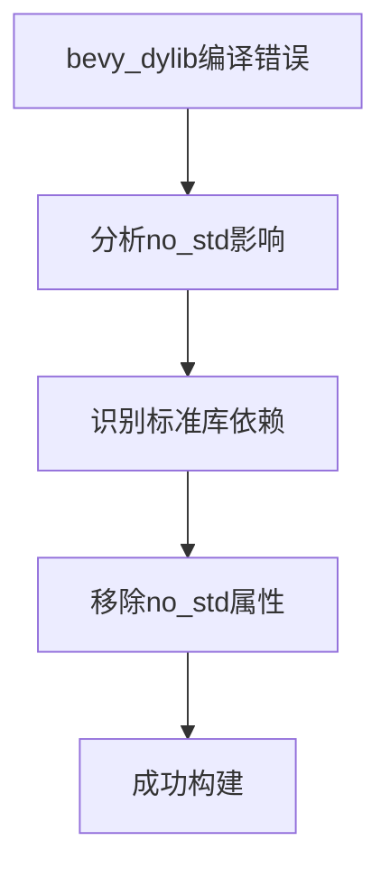

+++
title = "#18807 don't disable std in bevy_dylib"
date = "2025-04-11T00:00:00"
draft = false
template = "pull_request_page.html"
in_search_index = false

[extra]
current_language = "zh-cn"
available_languages = {"en" = { name = "English", url = "/pull_request/bevy/2025-04/pr-18807-en-20250411" }, "zh-cn" = { name = "中文", url = "/pull_request/bevy/2025-04/pr-18807-zh-cn-20250411" }}
labels = ["C-Bug", "D-Trivial"]
+++

# Title

## Basic Information
- **Title**: don't disable std in bevy_dylib
- **PR Link**: https://github.com/bevyengine/bevy/pull/18807
- **Author**: mockersf
- **Status**: MERGED
- **Labels**: C-Bug, D-Trivial, S-Ready-For-Final-Review, P-Compile-Failure
- **Created**: 2025-04-11T10:07:11Z
- **Merged**: 2025-04-11T19:04:38Z
- **Merged By**: mockersf

## Description Translation
# 目标

- 当前`bevy_dylib`无法独立构建
```
cargo build -p bevy_dylib
   Compiling bevy_dylib v0.16.0-rc.4 (/crates/bevy_dylib)
error: no global memory allocator found but one is required; link to std or add `#[global_allocator]` to a static item that implements the GlobalAlloc trait

error: `#[panic_handler]` function required, but not found

error: unwinding panics are not supported without std
  |
  = help: using nightly cargo, use -Zbuild-std with panic="abort" to avoid unwinding
  = note: since the core library is usually precompiled with panic="unwind", rebuilding your crate with panic="abort" may not be enough to fix the problem

error: could not compile `bevy_dylib` (lib) due to 3 previous errors
```

## 解决方案

- 移除`bevy_dylib`中的`#![no_std]`

## 测试

- 现在可以成功构建

## The Story of This Pull Request

### 问题根源与背景
在Rust的no_std模式下构建动态库时，开发人员遇到了三个关键编译错误：
1. 缺少全局内存分配器（global memory allocator）
2. 未找到panic处理函数（panic_handler）
3. 不支持无标准库的unwinding panic

这些问题源于`bevy_dylib`模块中错误地启用了`#![no_std]`属性。在Rust生态中，`no_std`模式通常用于嵌入式系统或需要完全控制内存管理的场景，但会失去标准库提供的核心功能支持。

### 技术决策与解决方案
通过分析错误信息，可以明确问题的根源：
- 标准库提供了默认的内存分配器实现
- Rust的panic处理机制依赖标准库的基础设施
- Unwinding机制需要标准库支持

解决方案直接而高效：移除`lib.rs`文件中的`#![no_std]`属性。这个简单的改动恢复了标准库的引入，使动态库可以正常使用Rust的标准内存管理、panic处理等基础设施。

### 实现细节与代码变更
关键修改位于`crates/bevy_dylib/src/lib.rs`：

```rust
// Before:
#![no_std]
#![warn(missing_docs)]

// After:
#![warn(missing_docs)]
```

移除了`no_std`属性声明。这个改动：
1. 允许编译器自动引入标准库
2. 恢复默认内存分配器
3. 启用标准panic处理机制
4. 保持原有的文档警告配置不变

### 技术启示与影响
这个修复展示了Rust标准库的重要作用：
1. **内存管理**：标准库提供默认的全局分配器，避免手动实现`GlobalAlloc` trait的需求
2. **错误处理**：标准库内置panic处理机制，保证程序崩溃时的行为可控
3. **生态系统兼容**：大多数Rust库依赖标准库的基础设施

对于需要构建动态库的场景，除非有明确的资源限制或特殊需求，保持标准库支持通常是更合理的选择。该PR通过最小的改动解决了编译问题，同时保持了代码的简洁性。

## Visual Representation



## Key Files Changed

### `crates/bevy_dylib/src/lib.rs`
**修改内容**：
- 移除`#![no_std]`属性声明

**代码对比**：
```rust
// 修改前：
#![no_std]
#![warn(missing_docs)]

// 修改后：
#![warn(missing_docs)]
```

**关联性**：
- 直接解决编译错误的核心修改
- 恢复标准库支持的最小必要改动
- 保持其他代码警告配置不变

## Further Reading

1. Rust官方文档 - `no_std`模式：
   https://doc.rust-lang.org/embedded-book/intro/no-std.html

2. Rust Panic处理机制详解：
   https://blog.logrocket.com/understanding-rust-panics/

3. 全局内存分配器实现指南：
   https://os.phil-opp.com/heap-allocation/#implementing-the-allocator

4. Bevy引擎动态链接文档：
   https://bevyengine.org/learn/book/getting-started/setup/#dynamic-linking