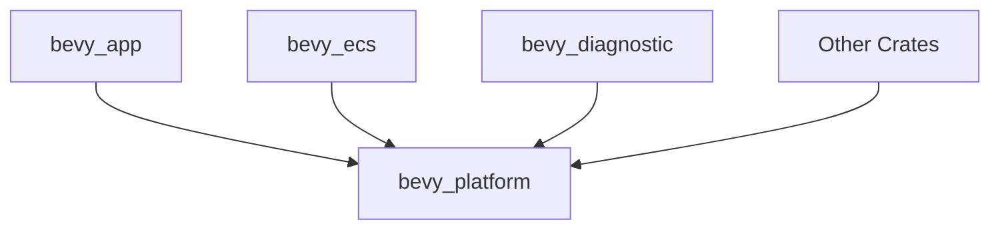

+++
title = "#18813 Rename bevy_platform_support to bevy_platform"
date = "2025-04-12T00:00:00"
draft = false
template = "pull_request_page.html"
in_search_index = true

[taxonomies]
list_display = ["show"]

[extra]
current_language = "en"
available_languages = {"en" = { name = "English", url = "/pull_request/bevy/2025-04/pr-18813-en-20250412" }, "zh-cn" = { name = "中文", url = "/pull_request/bevy/2025-04/pr-18813-zh-cn-20250412" }}
labels = ["A-Utils", "X-Blessed", "D-Straightforward"]
+++

# Rename bevy_platform_support to bevy_platform

## Basic Information
- **Title**: Rename bevy_platform_support to bevy_platform  
- **PR Link**: https://github.com/bevyengine/bevy/pull/18813  
- **Author**: cart  
- **Status**: MERGED  
- **Labels**: A-Utils, X-Blessed, D-Straightforward, S-Needs-Review  
- **Created**: 2025-04-11T19:10:33Z  
- **Merged**: 2025-04-11T23:34:07Z  
- **Merged By**: cart  

## Description Translation
# Objective  

The goal of `bevy_platform_support` is to provide a set of platform agnostic APIs, alongside platform-specific functionality. This is a high traffic crate (providing things like HashMap and Instant). Especially in light of https://github.com/bevyengine/bevy/discussions/18799, it deserves a friendlier / shorter name.  

Given that it hasn't had a full release yet, getting this change in before Bevy 0.16 makes sense.  

## Solution  

- Rename `bevy_platform_support` to `bevy_platform`.  

## The Story of This Pull Request  

### The Problem and Context  
The `bevy_platform_support` crate served as a foundational utility layer in Bevy's architecture, offering platform-agnostic abstractions while handling platform-specific implementations. However, its verbose name conflicted with Rust's crate naming conventions favoring brevity. With upcoming Bevy 0.16 approaching and no prior full releases of the crate, this presented an optimal window to address naming concerns before establishing a public API footprint.

### The Solution Approach  
The core technical decision centered on naming simplification through a find-and-replace operation across the codebase. The primary engineering consideration involved ensuring comprehensive updates to:
1. Cargo.toml dependency declarations
2. Rust module imports
3. Documentation references
4. CI/CD configuration
5. Internal code references

The rename preserved existing functionality while improving developer ergonomics through reduced verbosity in common import patterns like `use bevy_platform::Instant` vs the original longer form.

### The Implementation  
The changeset demonstrates systematic application of the rename through 100+ file modifications. Key patterns include:

**Cargo.toml Dependency Updates**
```toml
# Before in bevy_internal/Cargo.toml
bevy_platform_support = { path = "../bevy_platform_support", version = "0.16.0-dev" }

# After
bevy_platform = { path = "../bevy_platform", version = "0.16.0-dev" }
```

**Rust Module Imports**
```rust
// Before in bevy_ecs/src/component.rs
use bevy_platform_support::HashMap;

// After
use bevy_platform::HashMap;
```

The implementation maintained strict compatibility by:
1. Preserving all existing API surface
2. Updating directory names in the crate structure
3. Validating through CI that all dependent crates compiled with the new name

### Technical Insights  
The change leveraged Rust's module system flexibility, where crate names don't need to match directory structures as long as Cargo.toml configurations are correct. This allowed renaming the crate while maintaining git history through directory renaming operations.

A critical implementation detail was ensuring the `HashMap` re-export (originally from `bevy_platform_support::utils::HashMap`) remained available through the new shorter path. This required verifying that all internal re-exports were properly maintained during the rename.

### The Impact  
1. **Ergonomics Improvement**: Reduced cognitive load through shorter, more memorable crate name
2. **Consistency**: Aligned with Rust community preferences for concise crate names
3. **Preventative Maintenance**: Avoided future breaking changes by completing the rename before first stable release
4. **Documentation Clarity**: All subsequent API docs will reference the cleaner name

The changes affected multiple layers of the Bevy engine but required no architectural modifications, demonstrating how strategic naming decisions can improve maintainability without altering functionality.

## Visual Representation  



## Key Files Changed  

1. **crates/bevy_internal/Cargo.toml**  
   Updated dependency from `bevy_platform_support` to `bevy_platform`  
   ```toml
   # Before:
   bevy_platform_support = { path = "../bevy_platform_support", version = "0.16.0-dev" }
   
   # After: 
   bevy_platform = { path = "../bevy_platform", version = "0.16.0-dev" }
   ```

2. **crates/bevy_ecs/src/component.rs**  
   Updated HashMap import source  
   ```rust
   // Before:
   use bevy_platform_support::HashMap;
   
   // After:
   use bevy_platform::HashMap;
   ```

3. **crates/bevy_platform_support → crates/bevy_platform**  
   Directory rename operation preserving git history  
   ```bash
   git mv crates/bevy_platform_support crates/bevy_platform
   ```

## Further Reading  
- Rust Cargo Reference: [Specifying Dependencies](https://doc.rust-lang.org/cargo/reference/specifying-dependencies.html)  
- Bevy Engine RFC Process: [RFC-0004: Crate Naming Conventions](https://github.com/bevyengine/rfcs/blob/main/rfcs/0004-crate-naming-conventions.md)  
- Rust API Guidelines: [Naming](https://rust-lang.github.io/api-guidelines/naming.html)