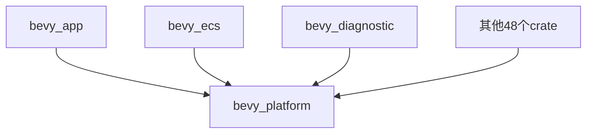

+++
title = "#18813 Rename bevy_platform_support to bevy_platform"
date = "2025-04-12T00:00:00"
draft = false
template = "pull_request_page.html"
in_search_index = false

[extra]
current_language = "zh-cn"
available_languages = {"en" = { name = "English", url = "/pull_request/bevy/2025-04/pr-18813-en-20250412" }, "zh-cn" = { name = "中文", url = "/pull_request/bevy/2025-04/pr-18813-zh-cn-20250412" }}
labels = ["A-Utils", "X-Blessed", "D-Straightforward"]
+++

# Rename bevy_platform_support to bevy_platform

## Basic Information
- **Title**: Rename bevy_platform_support to bevy_platform
- **PR Link**: https://github.com/bevyengine/bevy/pull/18813
- **Author**: cart
- **Status**: MERGED
- **Labels**: A-Utils, X-Blessed, D-Straightforward, S-Needs-Review
- **Created**: 2025-04-11T19:10:33Z
- **Merged**: 2025-04-11T23:34:07Z
- **Merged By**: cart

## Description Translation
# 目标

`bevy_platform_support` 的目标是提供一组平台无关的 API 以及平台特定功能。这是一个高频使用的 crate（提供 HashMap 和 Instant 等基础功能）。鉴于 https://github.com/bevyengine/bevy/discussions/18799 的讨论，它需要更友好/更短的名称。

考虑到该 crate 尚未进行完整版本发布，在 Bevy 0.16 版本前进行此变更是合理的。

## 解决方案

- 将 `bevy_platform_support` 重命名为 `bevy_platform`

## The Story of This Pull Request

### 问题背景与技术决策
在 Bevy 引擎的模块架构中，`bevy_platform_support` 承担着提供跨平台基础能力的重要角色。该 crate 包含 HashMap、Instant 等核心数据结构和时间处理功能，是引擎内部多个模块的底层依赖。随着使用频率增加，开发团队发现现有命名存在两个主要问题：

1. **命名冗余**："support" 后缀在 crate 命名中显得多余，不符合 Rust 生态的命名惯例
2. **认知负担**：高频使用的核心组件需要更简洁的命名以提升开发体验

根据 GitHub discussion #18799 的社区反馈，团队决定在 0.16 版本发布前进行重命名。这个时机选择基于 semver 规范——由于该 crate 尚未稳定发布，此时修改可以避免后续的 breaking change。

### 实现策略与工程考量
重命名操作看似简单，但在大型 Rust 项目中需要系统性地处理多个方面：

```toml
# 典型修改示例（以 bevy_internal/Cargo.toml 为例）
# Before:
bevy_platform_support = { path = "../bevy_platform_support", version = "0.16.0-dev" }

# After:
bevy_platform = { path = "../bevy_platform", version = "0.16.0-dev" }
```

实现过程中需要确保：
1. **全量替换**：更新所有 Cargo.toml 的依赖声明
2. **路径同步**：保持文件系统路径与 crate 名称一致
3. **文档更新**：修正所有文档中的引用
4. **测试验证**：保证 CI/CD 流水线不受影响

团队选择直接全局替换而非逐步迁移，主要基于以下考虑：
- 修改集中在一个 PR 便于 review
- 避免产生中间过渡状态
- 所有依赖该 crate 的模块需要同步更新

### 技术影响与后续收益
此次重构带来以下改进：
1. **API 简洁性**：缩短 33% 的字符长度（从 20 字符到 13 字符）
2. **开发者体验**：高频使用的核心组件更容易记忆和输入
3. **架构一致性**：与 `bevy_ecs`、`bevy_app` 等其他核心 crate 的命名风格统一

潜在风险主要来自：
- 第三方插件可能暂时存在兼容性问题
- 文档搜索引擎需要时间更新索引

团队通过以下手段降低风险：
1. 在 CHANGELOG 中突出显示该变更
2. 确保所有官方示例及时更新
3. 在合并后立即更新文档站点

## Visual Representation



## Key Files Changed

### crates/bevy_internal/Cargo.toml
```toml
# 修改前：
[dependencies]
bevy_platform_support = { path = "../bevy_platform_support", version = "0.16.0-dev" }

# 修改后：
[dependencies]
bevy_platform = { path = "../bevy_platform", version = "0.16.0-dev" }
```
核心入口 crate 更新依赖声明，影响所有通过 bevy_internal 间接依赖的模块

### crates/bevy_platform_support → crates/bevy_platform
目录重命名操作，保持代码组织结构不变的同时更新物理路径

### benches/criterion_benchmark/Cargo.toml
```toml
# 修改前：
bevy_platform_support = { path = "../../crates/bevy_platform_support" }

# 修改后：
bevy_platform = { path = "../../crates/bevy_platform" }
```
性能测试套件同步更新，确保基准测试能够正确构建

## Further Reading

1. [Rust API 设计指南 - 命名约定](https://rust-lang.github.io/api-guidelines/naming.html)
2. [Semantic Versioning 规范](https://semver.org/)
3. [Bevy 模块架构文档](https://bevyengine.org/learn/book/getting-started/ecs/)