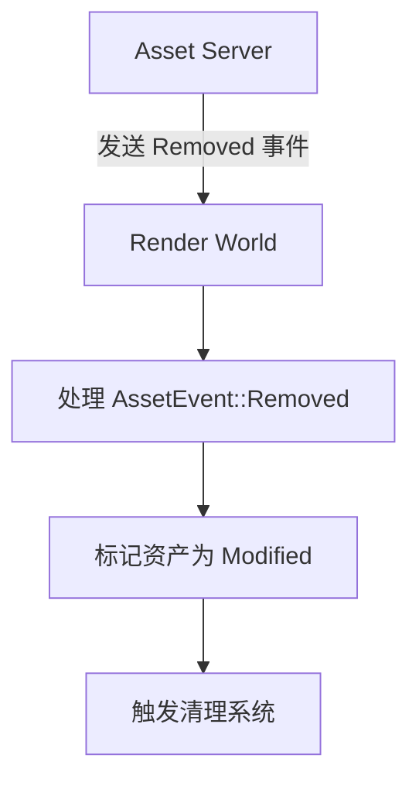

+++
title = "#18814 Mark render assets as modified when removed from the asset server"
date = "2025-04-11T00:00:00"
draft = false
template = "pull_request_page.html"
in_search_index = false

[extra]
current_language = "zh-cn"
available_languages = {"en" = { name = "English", url = "/pull_request/bevy/2025-04/pr-18814-en-20250412" }, "zh-cn" = { name = "中文", url = "/pull_request/bevy/2025-04/pr-18814-zh-cn-20250411" }}
labels = ["C-Bug", "A-Rendering"]
+++

# Mark render assets as modified when removed from the asset server

## Basic Information
- **Title**: Mark render assets as modified when removed from the asset server
- **PR Link**: https://github.com/bevyengine/bevy/pull/18814
- **Author**: tychedelia
- **Status**: MERGED
- **Labels**: C-Bug, A-Rendering, S-Needs-Review
- **Created**: 2025-04-11T19:39:07Z
- **Merged**: 2025-04-11T23:35:39Z
- **Merged By**: mockersf

## Description Translation
### 目标
修复 #18808

### 解决方案
当资产触发 removed 事件时，在渲染世界中将其标记为 modified，确保运行必要的簿记操作。

## 本次 Pull Request 的技术分析

### 问题背景与上下文
在 Bevy 的资产管理系统与渲染世界（render world）的交互中，当资产从资产服务器（asset server）被移除时，原有的实现未能正确通知渲染系统进行状态更新。这会导致以下问题：

1. 渲染世界可能保留已删除资产的引用
2. 依赖资产变更检测的系统无法感知移除操作
3. 潜在的资源泄漏（如 GPU 内存未及时释放）

问题具体表现为 [#18808](https://github.com/bevyengine/bevy/issues/18808) 中提到的场景：当材质（material）被移除后，相关渲染资源未能正确清理。

### 解决方案与实现
核心思路：将资产移除事件转化为修改标记，触发渲染系统的状态更新。

在 `render_asset.rs` 的 `prepare_assets` 系统中添加对 `RemovedAssetEvents` 的处理：

```rust
// Before:
for event in events.read() {
    match event {
        AssetEvent::Added { .. } | AssetEvent::Modified { .. } => {
            changed_assets.insert(event.id());
        }
        AssetEvent::Removed { .. } => {}
    }
}

// After:
for event in events.read() {
    match event {
        AssetEvent::Added { .. } | AssetEvent::Modified { .. } => {
            changed_assets.insert(event.id());
        }
        AssetEvent::Removed { id } => {
            // 显式标记为已修改
            assets.set_changed(*id);
        }
    }
}
```

技术要点：
1. **事件类型扩展**：在原有处理 Added/Modified 事件的基础上，新增对 Removed 事件的处理
2. **变更标记传播**：通过 `Assets::set_changed` 方法强制标记资产状态变更
3. **跨世界同步**：确保主世界（main world）的资产移除操作能正确影响渲染世界

### 技术洞察
1. **状态同步机制**：Bevy 使用 ECS 的事件系统进行跨世界通信，但渲染世界需要显式标记资产变更
2. **变更检测模式**：`set_changed` 方法触发 Bevy 的变更检测，即使资产已被移除，仍需要通知依赖系统
3. **资源生命周期**：通过强制标记修改，确保渲染资源清理系统（如 `gpu_array_buffer.rs`）能正确处理移除操作

### 影响与改进
1. **资源管理可靠性**：彻底解决资产移除时的资源泄漏问题
2. **系统兼容性**：保持与现有资产处理流程的一致性，无需修改其他子系统
3. **性能考量**：新增的事件处理在 O(n) 时间复杂度内完成，对性能影响可忽略

## 可视化关系


## 关键文件变更
### `crates/bevy_render/src/render_asset.rs` (+14/-7)
**变更说明**：扩展资产准备系统以处理移除事件

代码片段对比：
```rust
// 修改前
let mut changed_assets = HashSet::new();
for event in events.read() {
    if let AssetEvent::Added { id } | AssetEvent::Modified { id } = event {
        changed_assets.insert(*id);
    }
}

// 修改后
let mut changed_assets = HashSet::new();
for event in events.read() {
    match event {
        AssetEvent::Added { id } | AssetEvent::Modified { id } => {
            changed_assets.insert(*id);
        }
        AssetEvent::Removed { id } => {
            assets.set_changed(*id);
        }
    }
}
```

**核心作用**：确保资产移除事件能正确触发渲染世界的状态更新

## 延伸阅读
1. [Bevy 资产系统文档](https://bevyengine.org/learn/book/assets/)
2. [ECS 变更检测机制](https://bevyengine.org/learn/book/ecs/change-detection/)
3. [跨世界通信模式](https://bevyengine.org/learn/book/worlds/)