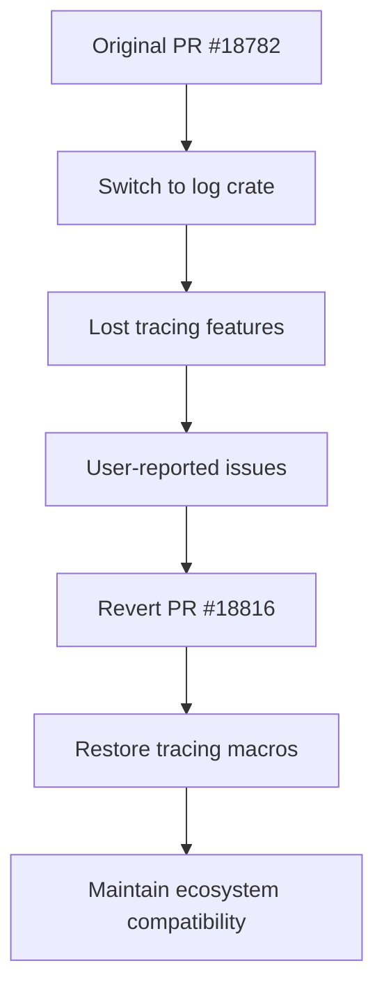

+++
title = "#18816 Revert \"Allow partial support for `bevy_log` in `no_std` (#18782)\""
date = "2025-04-14T00:00:00"
draft = false
template = "pull_request_page.html"
in_search_index = true

[taxonomies]
list_display = ["show"]

[extra]
current_language = "en"
available_languages = {"en" = { name = "English", url = "/pull_request/bevy/2025-04/pr-18816-en-20250414" }, "zh-cn" = { name = "中文", url = "/pull_request/bevy/2025-04/pr-18816-zh-cn-20250414" }}
labels = ["C-Bug"]
+++

# Revert "Allow partial support for `bevy_log` in `no_std` (#18782)"

## Basic Information
- **Title**: Revert "Allow partial support for `bevy_log` in `no_std` (#18782)"
- **PR Link**: https://github.com/bevyengine/bevy/pull/18816
- **Author**: cart
- **Status**: MERGED
- **Labels**: C-Bug
- **Created**: 2025-04-11T23:19:35Z
- **Merged**: 2025-04-14T21:36:06Z
- **Merged By**: mockersf

## Description Translation
This reverts commit ac52cca033b351cc966cd3d40eb99ffbefbdb104.

Fixes #18815

# Objective

#18782 resulted in using `log` macros instead of `tracing` macros (in the interest of providing no_std support, specifically no_atomic support). That tradeoff isn't worth it, especially given that tracing is likely to get no_atomic support.

## Solution

Revert #18782

## The Story of This Pull Request

The PR addresses a regression introduced by #18782, which attempted to provide partial `no_std` support for Bevy's logging system by switching from `tracing` to `log` macros. While the original change aimed to support environments without atomic operations (no_atomic), it inadvertently removed critical functionality that Bevy systems expect from `tracing`.

The core issue stemmed from differing macro behaviors between `tracing` and `log`. Bevy's internal systems and third-party plugins often rely on `tracing`-specific features like structured logging and richer context propagation. The switch to `log` broke these expectations, as seen in #18815 where essential logging functionality became unavailable.

The revert decision weighed two factors:
1. The immediate need to maintain ecosystem compatibility
2. The likelihood of `tracing` gaining native `no_atomic` support

By reverting to `tracing`, the Bevy team prioritizes current functionality while banking on `tracing`'s roadmap to address the underlying `no_std` limitations. This approach avoids maintaining a forked logging implementation while waiting for upstream improvements.

Key technical considerations:
- `tracing` provides richer metadata and instrumentation
- Many Bevy systems assume `tracing`'s span-based logging
- `log` lacks native support for structured logging
- Atomic operations are only required for certain features in `tracing`

The implementation was a straightforward revert of the original PR's changes, primarily affecting:
1. Macro usage throughout the codebase
2. Dependency declarations in Cargo.toml files
3. Conditional compilation flags for `no_std` environments

```rust
// Before revert (using log macros)
use log::info;

// After revert (using tracing macros)
use tracing::info;
```

This change restores expected logging behavior while the community explores alternative approaches to `no_std` support that preserve `tracing` functionality.

## Visual Representation



## Key Files Changed

1. `crates/bevy_log/src/lib.rs` (+340/-22)
- Restored original `tracing`-based implementation
- Removed `log`-specific conditional logic
```rust
// Before:
#[cfg(feature = "log")]
fn some_logging_function() {
    log::info!("Message");
}

// After:
pub fn some_logging_function() {
    tracing::info!("Message");
}
```

2. `crates/bevy_log/src/plugin.rs` (+0/-344)
- Removed plugin implementation that depended on `log`
- Restored default logging initialization through `tracing`

3. `crates/bevy_log/Cargo.toml` (+13/-29)
- Reverted dependencies from `log` back to `tracing`
```toml
# Before:
[dependencies]
log = { version = "0.4", optional = true }

# After:
[dependencies]
tracing = { version = "0.1", features = ["std"] }
```

4. `crates/bevy_internal/Cargo.toml` (+6/-17)
- Restored `tracing-subscriber` dependency
- Removed conditional `log` features

5. `crates/bevy_gltf/Cargo.toml` (+0/-18)
- Removed unnecessary `log` dependency

## Further Reading

1. [tracing vs log crate comparison](https://docs.rs/tracing/latest/tracing/#log-compatibility)
2. [Rust no_std considerations](https://rust-embedded.github.io/book/intro/no-std.html)
3. [Atomic operations in Rust](https://doc.rust-lang.org/core/sync/atomic/)
4. [Original PR #18782](https://github.com/bevyengine/bevy/pull/18782)
5. [Issue #18815](https://github.com/bevyengine/bevy/issues/18815)