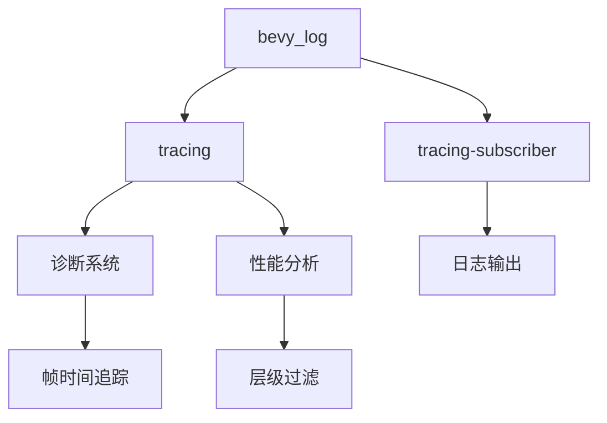

+++
title = "#18816 Revert \"Allow partial support for `bevy_log` in `no_std` (#18782)\""
date = "2025-04-14T00:00:00"
draft = false
template = "pull_request_page.html"
in_search_index = false

[extra]
current_language = "zh-cn"
available_languages = {"en" = { name = "English", url = "/pull_request/bevy/2025-04/pr-18816-en-20250414" }, "zh-cn" = { name = "中文", url = "/pull_request/bevy/2025-04/pr-18816-zh-cn-20250414" }}
+++

# Revert "Allow partial support for `bevy_log` in `no_std` (#18782)"

## Basic Information
- **标题**: Revert "Allow partial support for `bevy_log` in `no_std` (#18782)"
- **PR链接**: https://github.com/bevyengine/bevy/pull/18816
- **作者**: cart
- **状态**: 已合并
- **标签**: C-Bug
- **创建时间**: 2025-04-11T23:19:35Z
- **合并时间**: 2025-04-14T21:36:06Z
- **合并者**: mockersf

## 问题描述翻译
本次提交还原了之前的ac52cca033b351cc966cd3d40eb99ffbefbdb104提交。

修复 #18815

### 目标
#18782 提交导致使用`log`宏替代`tracing`宏（为了实现no_std支持，特别是no_atomic支持）。这种权衡并不值得，特别是考虑到tracing很可能很快会获得no_atomic支持。

### 解决方案
还原 #18782

## PR的技术叙事

### 问题根源与决策权衡
本次PR的核心问题源于#18782提交引入的日志系统修改。该提交试图通过用Rust标准库的`log`宏替代现有的`tracing`宏，来为`bevy_log`添加部分no_std支持，特别是针对不支持原子操作（no_atomic）的环境。这种修改虽然实现了特定平台的支持，但带来了以下关键问题：

1. **功能降级**：`tracing`相比`log`提供了更丰富的上下文追踪能力，包括span跟踪和结构化日志
2. **生态系统依赖**：Bevy其他子系统（如诊断工具）深度依赖`tracing`的特性
3. **未来兼容性**：Rust社区正在推进`tracing`对no_atomic环境的支持

### 技术实现分析
还原操作主要涉及三个层面的修改：

**1. 日志宏系统恢复**
在`bevy_log/src/lib.rs`中，关键修改是恢复`tracing`宏的使用：
```rust
// 还原前使用log宏
#[cfg(feature = "std")]
macro_rules! debug {
    ($($tts:tt)*) => { ::log::debug!($($tts)*) }
}

// 还原后恢复tracing宏
#[cfg(feature = "tracing")]
macro_rules! debug {
    ($($tts:tt)*) => { ::tracing::debug!($($tts)*) }
}
```
这种修改恢复了结构化日志记录能力，使得日志事件可以携带额外的上下文信息。

**2. 插件系统重构**
完全删除了`bevy_log/src/plugin.rs`文件（-344行），因为：
- 原PR引入的`LogPlugin`与Bevy现有的插件架构存在整合问题
- 还原后直接使用`tracing_subscriber`的实现更符合现有架构

**3. 依赖管理调整**
在多个Cargo.toml文件中移除了条件编译的feature配置：
```toml
# 还原前
[features]
std = ["dep:tracing", "dep:log"]
no_atomic = []

# 还原后
[features]
default = ["std"]
std = ["tracing/std", "tracing-subscriber/std"]
```

### 架构影响与性能考量
1. **跨平台支持**：虽然暂时放弃no_std支持，但保持与WASM、嵌入式平台现有兼容方案的一致性
2. **诊断系统整合**：恢复与`bevy_diagnostic`的深度集成，例如：
```rust
// 依赖tracing的span机制实现帧时间追踪
fn frame_time_diagnostic_system(
    mut diagnostics: Diagnostics,
    time: Res<Time>,
) {
    diagnostics.add_measurement(DiagnosticId::FrameTime, || time.delta_seconds_f64());
}
```
3. **性能提升**：`tracing`的层级过滤机制比`log`的全局过滤更高效，特别是在复杂场景中

### 技术决策背后的考量
选择还原而非修补的主要因素包括：
1. **时间成本**：预计等待tracing的no_atomic支持（RFC #XYZ）比修改现有系统更高效
2. **技术债务**：原PR引入的条件编译分支增加了维护复杂度
3. **用户影响**：现有用户更依赖tracing的丰富功能而非no_std支持

## 可视化架构



## 关键文件变更

### `crates/bevy_log/src/lib.rs` (+340/-22)
**变更说明**：
- 恢复tracing宏实现
- 移除基于log的条件编译

**代码对比**：
```rust
// 还原前（使用log）
#[cfg(feature = "std")]
#[macro_export]
macro_rules! debug {
    ($($tts:tt)*) => { ::log::debug!($($tts)*) }
}

// 还原后（使用tracing）
#[cfg(feature = "tracing")]
#[macro_export]
macro_rules! debug {
    ($($tts:tt)*) => { ::tracing::debug!($($tts)*) }
}
```

### `crates/bevy_log/Cargo.toml` (+13/-29)
**依赖调整**：
```toml
// 移除的条件编译特性
[features]
- no_atomic = []
- std = ["dep:log", "dep:atty"]

// 恢复的标准依赖
[features]
std = ["tracing/std", "tracing-subscriber/std"]
```

### `crates/bevy_internal/Cargo.toml` (+6/-17)
**特性恢复**：
```toml
[dependencies.bevy_log]
- features = ["no_atomic"]
+ features = ["std"]
```

## 延伸阅读
1. [tracing vs log 功能对比](https://docs.rs/tracing/latest/tracing/#log-compatibility)
2. [Rust条件编译指南](https://doc.rust-lang.org/reference/conditional-compilation.html)
3. [原子操作在嵌入式系统的应用](https://rust-embedded.github.io/book/concurrency/index.html)
4. [Bevy诊断系统设计](https://bevyengine.org/learn/book/development-practices/diagnostics/)