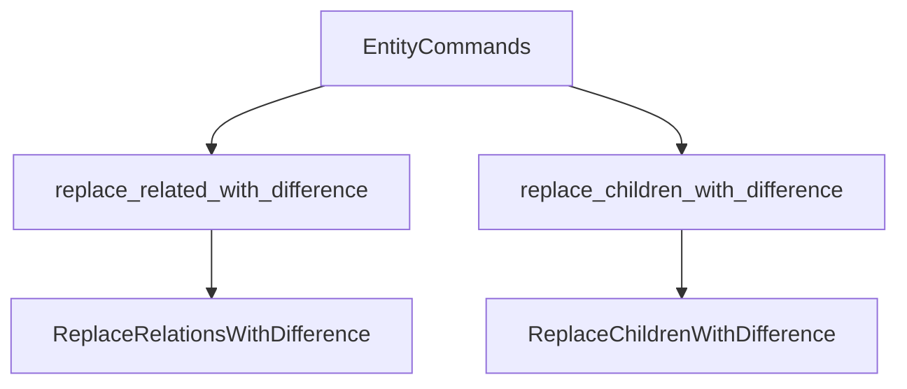

+++
title = "#18824 Fix wrong method call in relationship replacement command"
date = "2025-04-14T00:00:00"
draft = false
template = "pull_request_page.html"
in_search_index = true

[taxonomies]
list_display = ["show"]

[extra]
current_language = "en"
available_languages = {"en" = { name = "English", url = "/pull_request/bevy/2025-04/pr-18824-en-20250414" }, "zh-cn" = { name = "中文", url = "/pull_request/bevy/2025-04/pr-18824-zh-cn-20250414" }}
labels = ["C-Bug", "A-ECS"]
+++

# Title: Fix wrong method call in relationship replacement command

## Basic Information
- **Title**: Fix wrong method call in relationship replacement command
- **PR Link**: https://github.com/bevyengine/bevy/pull/18824
- **Author**: JaySpruce
- **Status**: MERGED
- **Labels**: C-Bug, A-ECS, S-Needs-Review
- **Created**: 2025-04-12T19:28:30Z
- **Merged**: 2025-04-14T20:39:27Z
- **Merged By**: cart

## Description Translation
Fixes a small mix-up from #18058, which added bulk relationship replacement methods.

`EntityCommands::replace_related_with_difference` calls `EntityWorldMut::replace_children_with_difference` instead of `EntityWorldMut::replace_related_with_difference`, which means it always operates on the `ChildOf` relationship instead of the `R: Relationship` generic it's provided.

`EntityCommands::replace_children_with_difference` takes an `R: Relationship` generic that it shouldn't, but it accidentally works correctly on `main` because it calls the above method.

## The Story of This Pull Request

### The Problem and Context
The Bevy ECS system contains relationship management APIs that allow bulk operations on entity relationships. PR #18058 introduced new methods for bulk relationship replacement but contained two critical method call errors:

1. **Incorrect Relationship Targeting**: The `EntityCommands::replace_related_with_difference` method was mistakenly calling `replace_children_with_difference` instead of `replace_related_with_difference`, forcing all generic relationship operations to use the `ChildOf` relationship regardless of the specified `R: Relationship` type parameter.

2. **Erroneous Generic Parameter**: The `EntityCommands::replace_children_with_difference` method incorrectly accepted a generic `R: Relationship` parameter when it should have been specifically handling `ChildOf` relationships.

These errors created a situation where:
- Generic relationship operations silently operated on the wrong relationship type
- The child relationship method's API contract was technically violated but functionally preserved through incorrect implementation

### The Solution Approach
The fix required surgical corrections to method calls and type parameters:

1. **Method Call Correction**: Update `replace_related_with_difference` to call the corresponding `replace_related` method instead of the child-specific variant.

2. **Generic Parameter Removal**: Remove the unnecessary `R: Relationship` generic from `replace_children_with_difference` to properly specialize it for `ChildOf` relationships.

### The Implementation
The critical changes occurred in two files:

**crates/bevy_ecs/src/relationship/related_methods.rs**
```rust
// Before:
pub fn replace_related_with_difference<R: Relationship>(&mut self, others: impl IntoIterator<Item = Entity>) {
    // Calls child-specific method regardless of R
    self.commands.add(ReplaceChildrenWithDifference {
        parent: self.parent,
        children: others.into_iter().collect(),
    });
}

// After:
pub fn replace_related_with_difference<R: Relationship>(&mut self, others: impl IntoIterator<Item = Entity>) {
    // Correctly calls generic relationship method
    self.commands.add(ReplaceRelationsWithDifference::<R> {
        entity: self.parent,
        relations: others.into_iter().collect(),
    });
}
```

**crates/bevy_ecs/src/hierarchy.rs**
```rust
// Before:
pub fn replace_children_with_difference<R: Relationship>(
    &mut self,
    entities: impl IntoIterator<Item = Entity>,
) {

// After:
pub fn replace_children_with_difference(
    &mut self,
    entities: impl IntoIterator<Item = Entity>,
) {
```

### Technical Insights
The fix demonstrates three key ECS concepts:

1. **Relationship Polymorphism**: Bevy's relationship system uses Rust's generics to create type-safe relationship interfaces. The original error violated this by hardcoding `ChildOf` handling in a generic method.

2. **Command Pattern**: The correction maintains Bevy's command-based architecture where entity mutations are deferred through commands like `ReplaceRelationsWithDifference`.

3. **API Contract Preservation**: The child method's generic parameter removal actually strengthens type safety by ensuring it can only operate on `ChildOf` relationships, while the generic relationship method now properly respects its type parameter.

### The Impact
These changes:
- Restore correct behavior for generic relationship operations
- Strengthen type safety in the hierarchy API
- Prevent subtle bugs where developers might have unintentionally modified parent-child relationships
- Maintain backward compatibility through corrected implementation rather than API changes

The fix required minimal code changes (7 lines total) but had significant implications for data integrity in relationship management. This highlights the importance of rigorous testing for generic APIs and the value of Rust's type system in catching interface mismatches.

## Visual Representation



## Key Files Changed

**crates/bevy_ecs/src/relationship/related_methods.rs**
1. Fixed method dispatch in generic relationship replacement
```rust
// Before: Incorrect child method call
self.commands.add(ReplaceChildrenWithDifference { ... })

// After: Correct generic relationship method
self.commands.add(ReplaceRelationsWithDifference::<R> { ... })
```

**crates/bevy_ecs/src/hierarchy.rs**
1. Removed erroneous generic parameter from child method
```rust
// Before: Unnecessary generic
pub fn replace_children_with_difference<R: Relationship>

// After: Specialized to ChildOf
pub fn replace_children_with_difference
```

## Further Reading
1. [Bevy ECS Relationships Documentation](https://bevyengine.org/learn/book/ecs/#relationships)
2. [Rust Generics and Type Parameters](https://doc.rust-lang.org/book/ch10-01-syntax.html)
3. [Command Pattern in Game Engines](https://gameprogrammingpatterns.com/command.html)