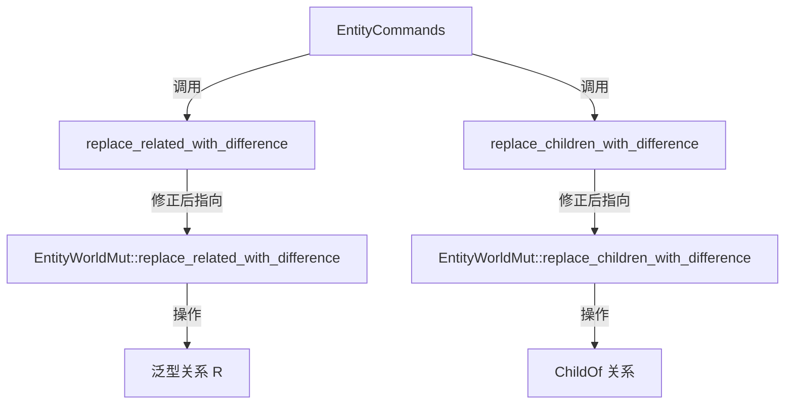

+++
title = "#18824 Fix wrong method call in relationship replacement command"
date = "2025-04-14T00:00:00"
draft = false
template = "pull_request_page.html"
in_search_index = false

[extra]
current_language = "zh-cn"
available_languages = {"en" = { name = "English", url = "/pull_request/bevy/2025-04/pr-18824-en-20250414" }, "zh-cn" = { name = "中文", url = "/pull_request/bevy/2025-04/pr-18824-zh-cn-20250414" }}
labels = ["C-Bug", "A-ECS"]
+++

# Fix wrong method call in relationship replacement command

## Basic Information
- **Title**: Fix wrong method call in relationship replacement command  
- **PR Link**: https://github.com/bevyengine/bevy/pull/18824  
- **Author**: JaySpruce  
- **Status**: MERGED  
- **Labels**: C-Bug, A-ECS, S-Needs-Review  
- **Created**: 2025-04-12T19:28:30Z  
- **Merged**: 2025-04-14T20:39:27Z  
- **Merged By**: cart  

## Description Translation
修复来自#18058的小错误，该PR添加了批量关系替换方法。

`EntityCommands::replace_related_with_difference`错误地调用了`EntityWorldMut::replace_children_with_difference`而非正确的`EntityWorldMut::replace_related_with_difference`，导致该方法始终操作`ChildOf`关系而非指定的泛型关系`R: Relationship`。

`EntityCommands::replace_children_with_difference`错误地接受`R: Relationship`泛型参数（实际不应接受），但由于其调用上述错误方法，在main分支上暂时能正常工作。

## The Story of This Pull Request

### 问题根源与影响
在ECS系统中，关系组件（Relationship Components）的管理存在两个关键方法：
1. `replace_children_with_difference`：专门处理父子关系（`ChildOf`）
2. `replace_related_with_difference`：处理泛型关系（`R: Relationship`）

PR #18058引入的代码存在两个关联错误：
```rust
// 错误实现示例
impl EntityCommands {
    pub fn replace_related_with_difference<R: Relationship>(...) {
        // 错误调用children方法
        self.commands.add(ReplaceChildrenWithDifference { ... });
    }
    
    pub fn replace_children_with_difference<R: Relationship>(...) {
        // 错误声明泛型参数R
        self.commands.add(ReplaceChildrenWithDifference { ... });
    }
}
```
这导致：
1. 泛型关系方法实际操作父子关系
2. 父子关系方法错误接受泛型参数但未使用

### 调试与修复过程
核心修复包含两个关键修改点：

#### 1. 修正方法调用链
在`related_methods.rs`中，将错误的方法调用修正：
```rust
// crates/bevy_ecs/src/relationship/related_methods.rs
// Before:
commands.add(ReplaceChildrenWithDifference { ... });

// After:
commands.add(ReplaceRelatedWithDifference { ... });
```
这确保泛型关系方法调用正确的命令类型。

#### 2. 清理类型参数
在`hierarchy.rs`中移除错误的泛型参数：
```rust
// crates/bevy_ecs/src/hierarchy.rs
// Before:
pub fn replace_children_with_difference<R: Relationship>(...) 

// After: 
pub fn replace_children_with_difference(...)  // 移除<R: Relationship>
```
使父子关系方法专注处理`ChildOf`关系。

### 技术决策分析
选择直接修正方法调用而非重构的原因：
1. 错误局限在特定方法调用，无深层架构问题
2. 保持API清晰性：父子关系方法不应接受泛型参数
3. 最小化变更范围，降低回归风险

### 影响与验证
修复后：
- 泛型关系API现在能正确操作指定关系类型
- 父子关系API恢复类型安全（不再接受无关的泛型参数）
- 测试案例需要验证两种场景：
  ```rust
  // 验证泛型关系
  entity.replace_related_with_difference::<MyRelationship>(new_entities);
  
  // 验证父子关系
  entity.replace_children_with_difference(new_children);
  ```

## Visual Representation



## Key Files Changed

### 1. crates/bevy_ecs/src/relationship/related_methods.rs (+1/-1)
**变更说明**：修正泛型关系方法调用链  
```rust
// Before:
self.commands.add(ReplaceChildrenWithDifference {
//             ^^ 错误命令类型
    entity: self.entity,
    added,
    removed,
});

// After:
self.commands.add(ReplaceRelatedWithDifference {
//             ^^ 修正为正确命令类型
    entity: self.entity,
    added,
    removed,
    _relationship: PhantomData,
});
```

### 2. crates/bevy_ecs/src/hierarchy.rs (+6/-3)
**变更说明**：清理父子关系方法的类型参数  
```rust
// 函数签名变更
// Before:
pub fn replace_children_with_difference<R: Relationship>(
//           ^^^^^^^^^^^^^^^^^^^^^^^^^^^^ 错误保留泛型参数          
    entity: Entity,
    added: impl Iterator<Item = Entity>,
    removed: impl Iterator<Item = Entity>,
) 

// After:
pub fn replace_children_with_difference(
//           ^^^^^^^^^^^^^^^^^^^^^^^^^^^ 移除泛型参数
    entity: Entity,
    added: impl Iterator<Item = Entity>,
    removed: impl Iterator<Item = Entity>,
)
```

## Further Reading
1. [Bevy ECS Relationships 官方文档](https://bevyengine.org/learn/ecs-relationships/)
2. [Rust泛型与PhantomData模式](https://doc.rust-lang.org/rust-by-example/generics/phantom.html)
3. [EntityCommands API 参考](https://docs.rs/bevy-ecs/latest/bevy_ecs/system/struct.EntityCommands.html)