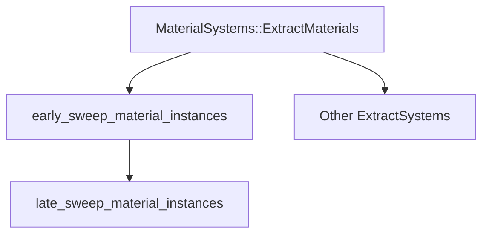

+++
title = "#18825 Fix the ordering of the systems introduced in #18734"
date = "2025-04-14T00:00:00"
draft = false
template = "pull_request_page.html"
in_search_index = true

[taxonomies]
list_display = ["show"]

[extra]
current_language = "en"
available_languages = {"en" = { name = "English", url = "/pull_request/bevy/2025-04/pr-18825-en-20250414" }, "zh-cn" = { name = "中文", url = "/pull_request/bevy/2025-04/pr-18825-zh-cn-20250414" }}
labels = ["C-Bug", "A-Rendering"]
+++

# Fix the ordering of the systems introduced in #18734

## Basic Information
- **Title**: Fix the ordering of the systems introduced in #18734
- **PR Link**: https://github.com/bevyengine/bevy/pull/18825
- **Author**: pcwalton
- **Status**: MERGED
- **Labels**: C-Bug, A-Rendering, S-Ready-For-Final-Review
- **Created**: 2025-04-12T22:27:32Z
- **Merged**: 2025-04-14T21:39:55Z
- **Merged By**: mockersf

## Description Translation
There's still a race resulting in blank materials whenever a material of type A is added on the same frame that a material of type B is removed. PR #18734 improved the situation, but ultimately didn't fix the race because of two issues:

1. The `late_sweep_material_instances` system was never scheduled. This PR fixes the problem by scheduling that system.

2. `early_sweep_material_instances` needs to be called after *every* material type has been extracted, not just when the material of *that* type has been extracted. The `chain()` added during the review process in PR #18734 broke this logic. This PR reverts that and fixes the ordering by introducing a new `SystemSet` that contains all material extraction systems.

I also took the opportunity to switch a manual reference to `AssetId::<StandardMaterial>::invalid()` to the new `DUMMY_MESH_MATERIAL` constant for clarity.

Because this is a bug that can affect any application that switches material types in a single frame, I think this should be uplifted to Bevy 0.16.

## The Story of This Pull Request

The PR addresses a persistent race condition in Bevy's material handling system that could result in blank materials when adding and removing different material types within the same frame. While PR #18734 made initial improvements, two critical issues remained:

**1. Missing System Scheduling**  
The `late_sweep_material_instances` system was properly defined but never added to the schedule. This left a gap in the cleanup process for material instances. The fix required explicitly adding this system to the render schedule:

```rust
// In MaterialPlugin implementation
app.add_systems(ExtractSchedule, late_sweep_material_instances);
```

**2. Incorrect System Ordering**  
The previous implementation used `chain()` to sequence material extraction and cleanup systems, but this created dependencies between unrelated material types. The key insight was that `early_sweep_material_instances` must run after *all* material types complete extraction, not just their own type.

The solution introduced a `MaterialSystems` system set to group all material extraction systems:

```rust
#[derive(SystemSet, Debug, Clone, PartialEq, Eq, Hash)]
pub enum MaterialSystems {
    ExtractMaterials,
}

// Configured ordering:
app.configure_sets(ExtractSchedule, (
    MaterialSystems::ExtractMaterials,
).before(early_sweep_material_instances));
```

This architectural change ensures proper sequencing:
1. All material extraction systems complete (grouped in `MaterialSystems`)
2. `early_sweep_material_instances` runs once after all extractions
3. `late_sweep_material_instances` handles final cleanup

**Code Quality Improvement**  
The PR also replaced manual invalid asset ID references with a named constant, improving code clarity:

```rust
// Before:
mesh.material = AssetId::<StandardMaterial>::invalid();

// After:
mesh.material = DUMMY_MESH_MATERIAL;
```

This change reduces error-prone repetition and makes special-case handling more explicit.

**Impact**  
By addressing both the missing system and flawed ordering logic, this PR eliminates race conditions that could occur when:
1. Adding Material A and removing Material B in the same frame
2. Processing multiple material types concurrently
3. Handling rapid material changes between frames

The system set approach provides a maintainable foundation for future material system extensions while maintaining strict execution ordering requirements.

## Visual Representation



## Key Files Changed

### `crates/bevy_pbr/src/lib.rs`
**Changes**: Added system set and scheduling logic  
Before:
```rust
app.add_systems(ExtractSchedule, (
    extract_materials::<M>
        .before(early_sweep_material_instances::<M>),
));
```

After:
```rust
app.configure_sets(ExtractSchedule, (
    MaterialSystems::ExtractMaterials,
).before(early_sweep_material_instances));
app.add_systems(ExtractSchedule, (
    extract_materials::<M>.in_set(MaterialSystems::ExtractMaterials),
));
app.add_systems(ExtractSchedule, late_sweep_material_instances);
```

### `crates/bevy_pbr/src/material.rs`
**Changes**: Constant usage and system ordering  
Key modification:
```rust
// Replaced multiple instances of
AssetId::<StandardMaterial>::invalid()
// With
DUMMY_MESH_MATERIAL
```

### `crates/bevy_pbr/src/render/mesh.rs`
**Changes**: Removed chained system ordering  
Before:
```rust
self.early_sweep_material_instances
    .chain()
    .after(extract_materials::<M>)
```

After:
```rust
self.early_sweep_material_instances
```

## Further Reading
1. [Bevy System Scheduling Documentation](https://bevyengine.org/learn/book/features/ecs/schedules/)
2. [System Ordering and Dependencies Guide](https://bevy-cheatbook.github.io/programming/systems.html)
3. [ECS Best Practices](https://github.com/bevyengine/bevy/discussions/3975)