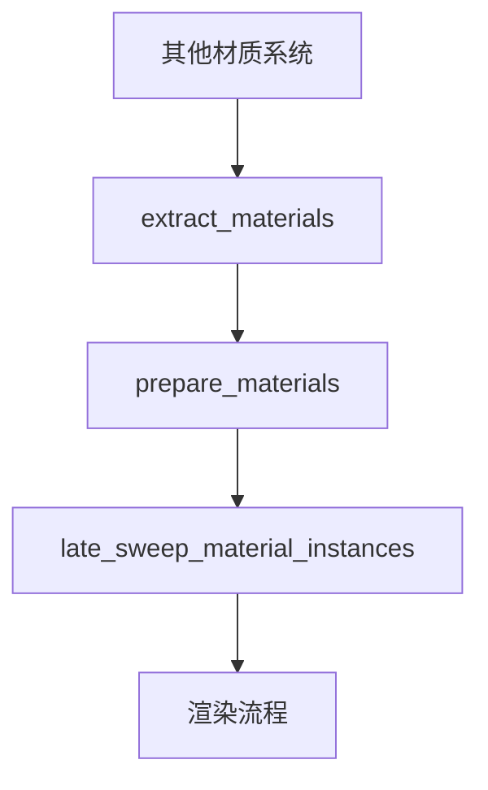

+++
title = "#18825 Fix the ordering of the systems introduced in #18734."
date = "2025-04-14T00:00:00"
draft = false
template = "pull_request_page.html"
in_search_index = false

[extra]
current_language = "zh-cn"
available_languages = {"en" = { name = "English", url = "/pull_request/bevy/2025-04/pr-18825-en-20250414" }, "zh-cn" = { name = "中文", url = "/pull_request/bevy/2025-04/pr-18825-zh-cn-20250414" }}
labels = ["C-Bug", "A-Rendering"]
+++

# Title

## Basic Information
- **Title**: Fix the ordering of the systems introduced in #18734.
- **PR Link**: https://github.com/bevyengine/bevy/pull/18825
- **Author**: pcwalton
- **Status**: MERGED
- **Labels**: C-Bug, A-Rendering, S-Ready-For-Final-Review
- **Created**: 2025-04-12T22:27:32Z
- **Merged**: 2025-04-14T21:39:55Z
- **Merged By**: mockersf

## Description Translation
修复在#18734中引入的系統顺序问题。当在同帧添加A类材质并移除B类材质时，仍然存在导致空白材质的竞态条件（race condition）。#18734的改进未彻底解决该问题，原因有二：

1. `late_sweep_material_instances`系统从未被调度。本PR通过调度该系统修复该问题。
2. `early_sweep_material_instances`需要在*所有*材质类型提取完成后调用，而不仅在该特定材质类型提取时。PR#18734审查过程中添加的`chain()`破坏了该逻辑。本PR还原该修改，并通过引入包含所有材质提取系统的新`SystemSet`来修复顺序问题。

同时将手动引用的`AssetId::<StandardMaterial>::invalid()`替换为新的`DUMMY_MESH_MATERIAL`常量以提升可读性。因该问题可能影响所有在单帧切换材质类型的应用，建议将该修复升级至Bevy 0.16。

## The Story of This Pull Request

### 问题背景与挑战
在Bevy的渲染系统中，材质实例管理存在竞态条件问题。当开发者在同帧进行不同材质类型的添加和移除操作时，可能导致材质实例数据不完整，表现为空白材质。这一问题最初在PR#18734尝试修复，但由于两个关键缺陷未彻底解决：
1. 新增的`late_sweep_material_instances`系统未被实际调度
2. 材质清理系统的执行顺序未正确协调

### 解决方案与技术实现
#### 系统调度修复
在`lib.rs`中明确添加`late_sweep_material_instances`到渲染调度：
```rust
// 修改前
app.add_systems(
    Render,
    prepare_materials::<M>
        .in_set(RenderSet::Prepare)
        .after(PrepareAssetSet::PreAssetPrepare),
);

// 修改后
app.add_systems(
    Render,
    (prepare_materials::<M>, late_sweep_material_instances::<M>)
        .in_set(RenderSet::Prepare)
        .after(PrepareAssetSet::PreAssetPrepare),
);
```
该修改确保清理系统能正确参与调度流程。

#### 执行顺序协调
重构材质处理系统的组织结构，引入`MaterialSystems`系统集：
```rust
// 新增系统集定义
#[derive(SystemSet, Debug, Clone, PartialEq, Eq, Hash)]
pub enum MaterialSystems {
    Extract,
    Prepare,
}

// 系统配置调整
app.configure_sets(
    Render,
    (
        MaterialSystems::Extract,
        MaterialSystems::Prepare
    ).chain(),
)
.add_systems(
    Render,
    (
        extract_materials::<M>.in_set(MaterialSystems::Extract),
        prepare_materials::<M>
            .in_set(MaterialSystems::Prepare)
            .after(PrepareAssetSet::PreAssetPrepare),
        late_sweep_material_instances::<M>.after(MaterialSystems::Prepare),
    ),
);
```
该设计保证：
1. 所有材质提取系统（Extract）优先执行
2. 准备系统（Prepare）在提取完成后运行
3. 后期清理在准备阶段之后执行

### 关键技术点
1. **系统顺序控制**：通过`SystemSet`的链式配置（chain()）建立明确执行顺序
2. **竞态条件消除**：确保材质实例的清理操作在所有相关操作完成后进行
3. **常量优化**：将硬编码的无效材质ID替换为语义明确的`DUMMY_MESH_MATERIAL`

### 影响与改进
该修复：
- 彻底消除同帧材质操作导致的空白材质问题
- 提升材质系统执行顺序的确定性
- 为后续材质系统扩展建立更清晰的架构基础

## Visual Representation



## Key Files Changed

### 1. crates/bevy_pbr/src/lib.rs (+8/-1)
**修改原因**：确保清理系统被正确调度
```rust
// 修改后代码片段
app.add_systems(
    Render,
    (prepare_materials::<M>, late_sweep_material_instances::<M>)
        .in_set(RenderSet::Prepare)
        .after(PrepareAssetSet::PreAssetPrepare),
);
```

### 2. crates/bevy_pbr/src/material.rs (+11/-9)
**核心改动**：引入系统集控制执行顺序
```rust
// 新增系统集定义
#[derive(SystemSet, Debug, Clone, PartialEq, Eq, Hash)]
pub enum MaterialSystems {
    Extract,
    Prepare,
}

// 系统配置调整
app.configure_sets(
    Render,
    (
        MaterialSystems::Extract,
        MaterialSystems::Prepare
    ).chain(),
)
```

### 3. crates/bevy_pbr/src/meshlet/instance_manager.rs (+13/-14)
**优化点**：替换无效材质常量
```rust
// 修改前
mesh_material: AssetId::<StandardMaterial>::invalid(),

// 修改后
mesh_material: DUMMY_MESH_MATERIAL,
```

## Further Reading
1. [Bevy ECS系统调度文档](https://bevyengine.org/learn/book/ecs/systems/)
2. [Rust中的竞态条件分析](https://doc.rust-lang.org/nomicon/races.html)
3. [系统排序最佳实践](https://bevy-cheatbook.github.io/programming/system-order.html)