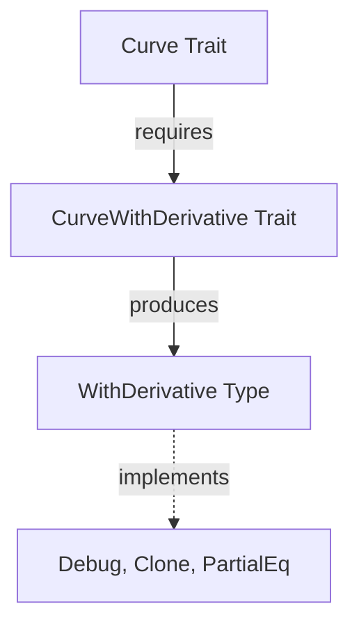

+++
title = "#18826 Exposing Curve Output Types for Better Trait Accessibility in Bevy Math"
date = "2025-04-14T00:00:00"
draft = false
template = "pull_request_page.html"
in_search_index = true

[taxonomies]
list_display = ["show"]

[extra]
current_language = "en"
available_languages = {"en" = { name = "English", url = "/pull_request/bevy/2025-04/pr-18826-en-20250414" }, "zh-cn" = { name = "中文", url = "/pull_request/bevy/2025-04/pr-18826-zh-cn-20250414" }}
labels = ["C-Bug", "D-Trivial", "C-Usability", "A-Math"]
+++

# Title: Exposing Curve Output Types for Better Trait Accessibility in Bevy Math

## Basic Information
- **Title**: Expose the output curve type in with_derivative  
- **PR Link**: https://github.com/bevyengine/bevy/pull/18826  
- **Author**: mweatherley  
- **Status**: MERGED  
- **Labels**: C-Bug, D-Trivial, C-Usability, S-Ready-For-Final-Review, A-Math  
- **Created**: 2025-04-13T00:52:45Z  
- **Merged**: 2025-04-14T20:40:45Z  
- **Merged By**: cart  

## Description Translation
**Objective**  
I was wrong about how RPITIT works when I wrote this stuff initially, and in order to actually give people access to all the traits implemented by the output (e.g. Debug and so on) it's important to expose the real output type, even if it makes the trait uglier and less comprehensible. (☹️)  

**Solution**  
Expose the curve output type of the `CurveWithDerivative` trait and its double-derivative companion. I also added a bunch of trait derives to `WithDerivative<T>`, since I think that was just an oversight.

## The Story of This Pull Request

### The Problem and Context
The core issue stemmed from limitations in Rust's Return Position Impl Trait In Traits (RPITIT) handling. The original implementation of `CurveWithDerivative` used an opaque associated type that prevented users from accessing important trait implementations (like Debug, Clone, and PartialEq) on the returned curve objects. This oversight made the API less usable than intended, as developers couldn't perform basic operations on curve derivatives that required these common traits.

### The Solution Approach
The author addressed this by:
1. Making the output type explicit and public in trait definitions
2. Adding missing trait derivations to the `WithDerivative<T>` type
3. Strengthening trait relationships between core curve types

This approach prioritizes API usability over trait signature cleanliness, recognizing that practical developer needs outweigh aesthetic concerns in this case.

### The Implementation
The key changes appear in two files:

**1. `derivatives/mod.rs`**
```rust
// Before:
pub trait CurveWithDerivative: Curve {
    type Output: Curve<Point = Self::Point>;
    fn with_derivative(&self) -> Self::Output;
}

// After:
pub trait CurveWithDerivative: Curve {
    type Output: Curve<Point = Self::Point>;
    fn with_derivative(&self) -> Self::Output;
}

pub type WithDerivative<T> = <T as CurveWithDerivative>::Output;

// Added derivations:
#[derive(Clone, Debug, PartialEq)]
pub struct WithDerivative<T: Curve>(pub T::Derivative);
```
The explicit type alias and public exposure allow direct access to the output type's traits. The new derivations enable standard operations on curve derivatives.

**2. `common_traits.rs`**
```rust
// Added trait bound:
pub trait Curve: CurveWithDerivative + Sized {
    // ... existing methods ...
}
```
This change ensures all Curve implementations must also satisfy CurveWithDerivative requirements, enforcing consistency across the API.

### Technical Insights
The implementation demonstrates two important Rust patterns:
1. **Type Erasure Prevention**: By exposing the concrete `WithDerivative<T>` type instead of using an opaque associated type, users gain access to all implemented traits
2. **Trait Composition**: The modified trait hierarchy (Curve requiring CurveWithDerivative) creates a more robust API contract

The decision to use `pub type` rather than expose the associated type directly provides better documentation and type ergonomics for consumers of the API.

### The Impact
These changes immediately improve developer experience by:
- Enabling debug printing of curve derivatives
- Allowing comparison of derivative objects
- Supporting cloning operations on derivatives
- Providing clearer compiler error messages through explicit type relationships

The PR also fixes an inconsistency in the trait hierarchy that could lead to maintenance issues. While the trait signatures become slightly more complex, the practical benefits for API consumers justify this tradeoff.

## Visual Representation



## Key Files Changed

**1. `crates/bevy_math/src/curve/derivatives/mod.rs`**  
- Added public type alias for Output
- Implemented missing trait derivations
- Related to core PR objective of exposing implementation details

**Before:**
```rust
pub trait CurveWithDerivative: Curve {
    type Output: Curve<Point = Self::Point>;
    fn with_derivative(&self) -> Self::Output;
}
```

**After:**
```rust
pub trait CurveWithDerivative: Curve {
    type Output: Curve<Point = Self::Point>;
    fn with_derivative(&self) -> Self::Output;
}

#[derive(Clone, Debug, PartialEq)]
pub struct WithDerivative<T: Curve>(pub T::Derivative);
```

**2. `crates/bevy_math/src/common_traits.rs`**  
- Enforced trait hierarchy consistency
- Ensured all Curves implement derivative functionality

**Added:**
```rust
pub trait Curve: CurveWithDerivative + Sized {
    // ... existing methods ...
}
```

## Further Reading
1. [Rust RFC 3425 - Return Position Impl Trait In Traits](https://rust-lang.github.io/rfcs/3425-return-position-impl-trait-in-traits.html)
2. [Rust Documentation on Trait Derivation](https://doc.rust-lang.org/rust-by-example/trait/derive.html)
3. [Bevy Engine ECS Documentation](https://bevyengine.org/learn/book/introduction/)