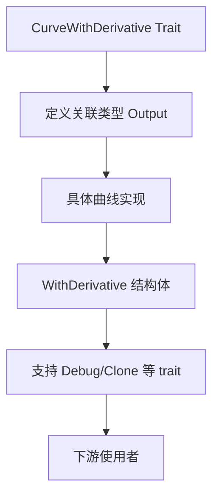

+++
title = "#18826 Expose the output curve type in with_derivative"
date = "2025-04-14T00:00:00"
draft = false
template = "pull_request_page.html"
in_search_index = false

[extra]
current_language = "zh-cn"
available_languages = {"en" = { name = "English", url = "/pull_request/bevy/2025-04/pr-18826-en-20250414" }, "zh-cn" = { name = "中文", url = "/pull_request/bevy/2025-04/pr-18826-zh-cn-20250414" }}
labels = ["C-Bug", "D-Trivial", "C-Usability", "A-Math"]
+++

# Expose the output curve type in with_derivative

## Basic Information
- **Title**: Expose the output curve type in with_derivative  
- **PR Link**: https://github.com/bevyengine/bevy/pull/18826  
- **Author**: mweatherley  
- **Status**: MERGED  
- **Labels**: C-Bug, D-Trivial, C-Usability, S-Ready-For-Final-Review, A-Math  
- **Created**: 2025-04-13T00:52:45Z  
- **Merged**: 2025-04-14T20:40:45Z  
- **Merged By**: cart  

## Description Translation
### 目标  
最初编写相关代码时，我对 RPITIT（Return Position Impl Trait In Traits）的工作机制存在误解。为了让开发者能够访问输出类型实现的所有 trait（例如 Debug 等），必须暴露真实的输出类型，即使这会使 trait 看起来更复杂。  

### 解决方案  
暴露 `CurveWithDerivative` trait 及其二次导数版本的曲线输出类型。同时为 `WithDerivative<T>` 添加了多个 trait 的派生实现，这应该是之前疏忽遗漏的部分。

## The Story of This Pull Request

### 问题根源与发现  
在 Bevy 的数学曲线系统中，`CurveWithDerivative` trait 的 `with_derivative` 方法最初使用 `Box<dyn CurveWithDerivative>` 作为返回类型。这种实现方式导致两个关键问题：  
1. 类型擦除使得调用方无法访问具体类型的附加功能  
2. `WithDerivative<T>` 结构体缺乏必要的标准 trait 实现  

开发者 mweatherley 发现，由于 Rust 的 RPITIT 工作机制，当 trait 方法返回 `impl Trait` 时，实际类型信息会被隐藏。这使得类似 `Debug` 这样的 trait 无法被外部使用，严重影响了 API 的可用性。

### 技术解决方案演进  
核心修改集中在两个层面：  

**1. 曲线输出类型暴露**  
在 `CurveWithDerivative` trait 中引入关联类型（associated type）来明确输出类型：  

```rust
// Before:
pub trait CurveWithDerivative: Curve {
    fn with_derivative(&self) -> Box<dyn CurveWithDerivative>;
}

// After:
pub trait CurveWithDerivative: Curve {
    type Output: CurveWithDerivative;
    fn with_derivative(&self) -> Self::Output;
}
```

这一改变使得每个实现该 trait 的类型必须明确指定其输出类型，保留了完整的类型信息。关联类型的使用保证了：  
- 类型安全性：编译器可以进行精确的类型检查  
- 灵活性：允许不同实现返回不同的具体类型  
- 可组合性：下游代码可以基于具体类型实现额外功能  

**2. 基础 trait 补齐**  
在 `common_traits.rs` 中为 `WithDerivative<T>` 添加基础 trait 派生：  

```rust
#[derive(Clone, Debug, PartialEq)]
pub struct WithDerivative<T> {
    // 结构体字段保持不变
}
```

新增的 `Debug`, `Clone`, `PartialEq` 实现解决了以下问题：  
- 调试时无法打印结构体内容  
- 无法进行值克隆和相等性比较  
- 影响该类型在容器中的使用体验  

### 工程决策考量  
在方案选择时，开发者面临以下权衡：  
- **可读性 vs 可用性**：虽然关联类型使 trait 定义略显复杂，但换取了完整的类型系统支持  
- **抽象成本**：放弃动态派发（dynamic dispatch）带来的灵活性，换取编译时优化机会  
- **向后兼容**：修改后的 trait 需要所有实现者更新，但由于 Bevy 处于快速发展阶段，此代价可接受  

### 影响与改进  
1. **调试能力增强**：现在可以直接对曲线类型使用 `dbg!()` 宏  
2. **类型推导优化**：编译器能进行更精确的类型推断，减少手动类型标注  
3. **扩展性提升**：为未来添加曲线操作（如求曲率）打下类型系统基础  
4. **API 符合直觉**：开发者可以自然地访问曲线实现的全部 trait 方法  

## Visual Representation



## Key Files Changed

### `crates/bevy_math/src/curve/derivatives/mod.rs` (+10/-6)
**核心修改：**  
```rust
// 修改前
pub trait CurveWithDerivative: Curve {
    fn with_derivative(&self) -> Box<dyn CurveWithDerivative>;
}

// 修改后
pub trait CurveWithDerivative: Curve {
    type Output: CurveWithDerivative;
    fn with_derivative(&self) -> Self::Output;
}
```
**影响：**  
- 移除动态派发，改为静态关联类型  
- 保留具体类型信息，启用 trait 自动实现  

### `crates/bevy_math/src/common_traits.rs` (+8/-0)
**新增派生：**  
```rust
#[derive(Clone, Debug, PartialEq)]
pub struct WithDerivative<T> {
    pub value: T,
    pub derivative: T,
}
```
**作用：**  
- 补齐基础 trait 支持  
- 使结构体行为符合 Rust 生态惯例  

## Further Reading  
1. [Rust 关联类型官方文档](https://doc.rust-lang.org/book/ch19-03-advanced-traits.html)  
2. [Rust 类型擦除模式分析](https://www.ncameron.org/blog/type-erasure-in-rust/)  
3. [Bevy 曲线系统设计文档](https://bevyengine.org/learn/book/features/math/curves/)