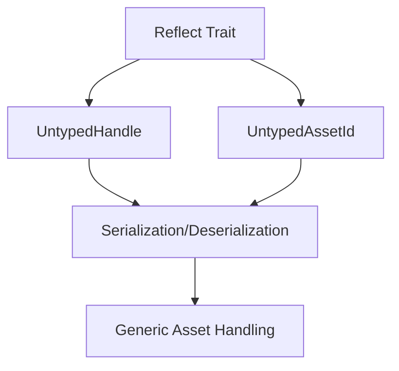

+++
title = "#18827 Added derive Reflect to UntypedHandle and UntypedAssetId"
date = "2025-04-28T00:00:00"
draft = false
template = "pull_request_page.html"
in_search_index = true

[taxonomies]
list_display = ["show"]

[extra]
current_language = "en"
available_languages = {"en" = { name = "English", url = "/pull_request/bevy/2025-04/pr-18827-en-20250428" }, "zh-cn" = { name = "中文", url = "/pull_request/bevy/2025-04/pr-18827-zh-cn-20250428" }}
labels = ["C-Feature", "A-Assets", "A-Reflection"]
+++

# Title: Added derive Reflect to UntypedHandle and UntypedAssetId

## Basic Information
- **Title**: Added derive Reflect to UntypedHandle and UntypedAssetId
- **PR Link**: https://github.com/bevyengine/bevy/pull/18827
- **Author**: fredericvauchelles
- **Status**: MERGED
- **Labels**: C-Feature, A-Assets, S-Ready-For-Final-Review, A-Reflection
- **Created**: 2025-04-13T08:24:44Z
- **Merged**: 2025-04-28T22:06:57Z
- **Merged By**: mockersf

## Description Translation
**Objective**

- We have the ability to serialize/deserialize `Handle<T>` with [`TypedReflectSerializer`](https://docs.rs/bevy/latest/bevy/reflect/serde/struct.TypedReflectSerializer.html) and [`TypedReflectDeserializer`](https://docs.rs/bevy/latest/bevy/reflect/serde/struct.TypedReflectDeserializer.html), but it is not possible for `UntypedHandle`.
- `Handle<T>` already has the `Reflect` derive, so it sounds coherent to also have this derive also on the untyped API

**Solution**

- Add the `Reflect` derive macro to both `UntypedHandle`  and ` UntypedAssetId`.

**Testing**

- I used a custom processor to handle the serialization based on the example of [`TypedReflectSerializer`](https://docs.rs/bevy/latest/bevy/reflect/serde/struct.TypedReflectSerializer.html) (see [source code](https://docs.rs/bevy_reflect/0.15.3/src/bevy_reflect/serde/ser/serializer.rs.html#149))

## The Story of This Pull Request

The PR addresses a gap in Bevy's reflection system for asset handles. While typed handles (`Handle<T>`) already supported serialization through reflection, their untyped counterparts (`UntypedHandle` and `UntypedAssetId`) lacked this capability due to missing `Reflect` derives. This limitation prevented developers from working with generic asset handles in serialization scenarios where type information isn't statically known.

The core problem stemmed from Bevy's reflection-based serialization system requiring types to implement the `Reflect` trait. The existing implementation for `Handle<T>` included this derive, but the untyped variants were overlooked. This created an inconsistency in the API where typed handles could participate in reflection workflows but untyped ones could not.

The solution focused on API parity through two targeted changes:
1. Adding `#[derive(Reflect)]` to `UntypedHandle`
2. Adding `#[derive(Reflect)]` to `UntypedAssetId`

These derives enable runtime type information generation, allowing the reflection system to process these types. The implementation required minimal code changes but had significant implications for asset handling workflows.

Testing leveraged Bevy's existing reflection infrastructure, using a custom processor similar to the established `TypedReflectSerializer` pattern. This approach validated that the new derives properly integrated with Bevy's serialization pipeline without requiring changes to the underlying reflection system.

## Visual Representation



## Key Files Changed

**1. crates/bevy_asset/src/handle.rs**
```rust
// Before:
#[derive(Clone)]
pub enum UntypedHandle {
    Strong(Arc<StrongHandle>),
    Weak(WeakHandle)
}

// After:
#[derive(Clone, Reflect)]
pub enum UntypedHandle {
    Strong(Arc<StrongHandle>),
    Weak(WeakHandle)
}
```

**2. crates/bevy_asset/src/id.rs**
```rust
// Before:
#[derive(Debug, Copy, Clone)]
pub enum UntypedAssetId {
    Index { index: AssetIndex, type_id: TypeId },
    Uuid { uuid: Uuid, type_id: TypeId }
}

// After:
#[derive(Debug, Copy, Clone, Reflect)]
pub enum UntypedAssetId {
    Index { index: AssetIndex, type_id: TypeId },
    Uuid { uuid: Uuid, type_id: TypeId }
}
```

These changes enable:
- Runtime inspection of untyped asset handles
- Serialization/deserialization through reflection APIs
- Consistent handling of typed and untyped asset identifiers

## Further Reading
- [Bevy Reflection System Documentation](https://bevyengine.org/learn/book/features/reflection/)
- [Serde Integration with Reflection](https://docs.rs/bevy_reflect/latest/bevy_reflect/serde/index.html)
- [Asset Handling Guide](https://bevyengine.org/learn/book/features/assets/)