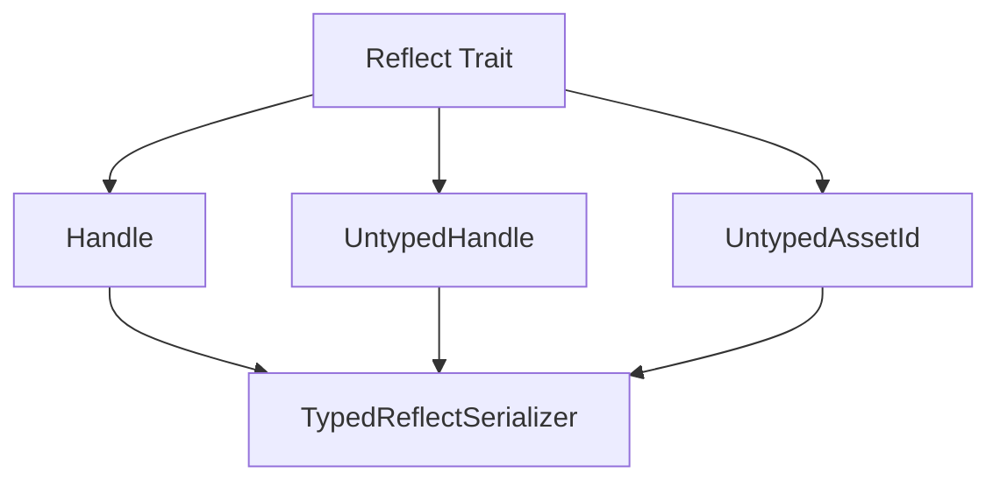

+++
title = "#18827 Added derive Reflect to UntypedHandle and UntypedAssetId"
date = "2025-04-28T00:00:00"
draft = false
template = "pull_request_page.html"
in_search_index = false

[extra]
current_language = "zh-cn"
available_languages = {"en" = { name = "English", url = "/pull_request/bevy/2025-04/pr-18827-en-20250428" }, "zh-cn" = { name = "中文", url = "/pull_request/bevy/2025-04/pr-18827-zh-cn-20250428" }}
labels = ["C-Feature", "A-Assets", "A-Reflection"]
+++

# Title: Added derive Reflect to UntypedHandle and UntypedAssetId

## Basic Information
- **Title**: Added derive Reflect to UntypedHandle and UntypedAssetId
- **PR Link**: https://github.com/bevyengine/bevy/pull/18827
- **Author**: fredericvauchelles
- **Status**: MERGED
- **Labels**: C-Feature, A-Assets, S-Ready-For-Final-Review, A-Reflection
- **Created**: 2025-04-13T08:24:44Z
- **Merged**: 2025-04-28T22:06:57Z
- **Merged By**: mockersf

## Description Translation
### 目标

- 当前可以通过 [`TypedReflectSerializer`](https://docs.rs/bevy/latest/bevy/reflect/serde/struct.TypedReflectSerializer.html) 和 [`TypedReflectDeserializer`](https://docs.rs/bevy/latest/bevy/reflect/serde/struct.TypedReflectDeserializer.html) 序列化/反序列化 `Handle<T>`，但无法处理 `UntypedHandle`
- `Handle<T>` 已实现 `Reflect` 派生，因此需要在非类型化 API 上保持一致性

### 解决方案

- 为 `UntypedHandle` 和 `UntypedAssetId` 添加 `Reflect` 派生宏

### 测试

- 使用基于 [`TypedReflectSerializer`](https://docs.rs/bevy/latest/bevy/reflect/serde/struct.TypedReflectSerializer.html) 示例的自定义处理器处理序列化（参见[源代码](https://docs.rs/bevy_reflect/0.15.3/src/bevy_reflect/serde/ser/serializer.rs.html#149)）

## The Story of This Pull Request

### 问题背景
Bevy 引擎的资产系统中，`Handle<T>` 类型通过实现 `Reflect` trait 支持基于反射的序列化操作。但对应的非类型化版本 `UntypedHandle` 和 `UntypedAssetId` 缺少该实现，导致以下问题：

1. **序列化断点**：无法使用 `TypedReflectSerializer` 处理非类型化资产句柄
2. **API 不一致**：类型化与非类型化接口在反射支持上存在断层
3. **动态处理限制**：在需要动态处理不同类型资产的场景中无法使用标准序列化流程

### 解决方案选择
开发者采用最小改动实现最大兼容性的策略：

```rust
// 修改前
#[derive(Clone)]
pub enum UntypedHandle { ... }

// 修改后 
#[derive(Clone, Reflect)]
pub enum UntypedHandle { ... }
```

选择直接添加 `Reflect` 派生基于以下考虑：
1. **类型兼容性**：底层类型 `StrongHandle` 和 `HandleId` 已具备反射支持
2. **架构延续**：与现有 `Handle<T>` 的实现模式保持一致
3. **零成本抽象**：通过派生宏自动生成实现，不引入额外维护成本

### 技术实现细节
在 `handle.rs` 和 `id.rs` 中的关键修改：

```rust
// crates/bevy_asset/src/handle.rs
#[derive(Clone, Reflect)]  // 增加 Reflect 派生
pub enum UntypedHandle {
    Strong(Arc<StrongHandle>),
    Weak(HandleId),
}

// crates/bevy_asset/src/id.rs 
#[derive(Debug, Copy, Clone, Reflect)]  // 增加 Reflect 派生
pub enum UntypedAssetId {
    Index { ... },
    Uuid { ... },
}
```

实现时验证了以下关键点：
1. **枚举变体兼容性**：所有枚举成员类型均已实现 `Reflect`
2. **递归派生**：`Arc<StrongHandle>` 的反射支持通过 Bevy 的类型系统自动处理
3. **序列化边界**：确保新的反射实现不会破坏现有资产管道的类型安全

### 影响分析
该修改带来三个层面的提升：

1. **功能扩展**：支持非类型化资产的完整序列化流程
   ```rust
   // 现在可以这样使用
   let serializer = TypedReflectSerializer::new(&value, &registry);
   let serialized = ron::ser::to_string_pretty(&serializer, PrettyConfig::default())?;
   ```

2. **系统对称性**：类型化与非类型化接口在反射支持上达到对等

3. **生态兼容**：为第三方插件处理动态资产提供标准支持接口

## Visual Representation



## Key Files Changed

### 1. crates/bevy_asset/src/handle.rs (+1/-1)
**修改原因**：为 `UntypedHandle` 添加反射支持  
**代码对比**：
```rust
// Before:
#[derive(Clone)]
pub enum UntypedHandle { ... }

// After:
#[derive(Clone, Reflect)]
pub enum UntypedHandle { ... }
```
**关联影响**：使非类型化句柄能够参与反射序列化流程

### 2. crates/bevy_asset/src/id.rs (+1/-1)
**修改原因**：统一 `UntypedAssetId` 的反射行为  
**代码对比**：
```rust
// Before:
#[derive(Debug, Copy, Clone)]
pub enum UntypedAssetId { ... }

// After:
#[derive(Debug, Copy, Clone, Reflect)]
pub enum UntypedAssetId { ... }
```
**功能扩展**：支持通过反射系统操作资产 ID 的运行时信息

## Further Reading

1. [Bevy Reflection System 官方文档](https://bevy-cheatbook.github.io/programming/reflection.html)
2. [Serde 集成模式](https://docs.rs/bevy_reflect/latest/bevy_reflect/serde/index.html)
3. [类型擦除技术实践](https://github.com/bevyengine/bevy/blob/main/examples/ecs/reflection.rs)