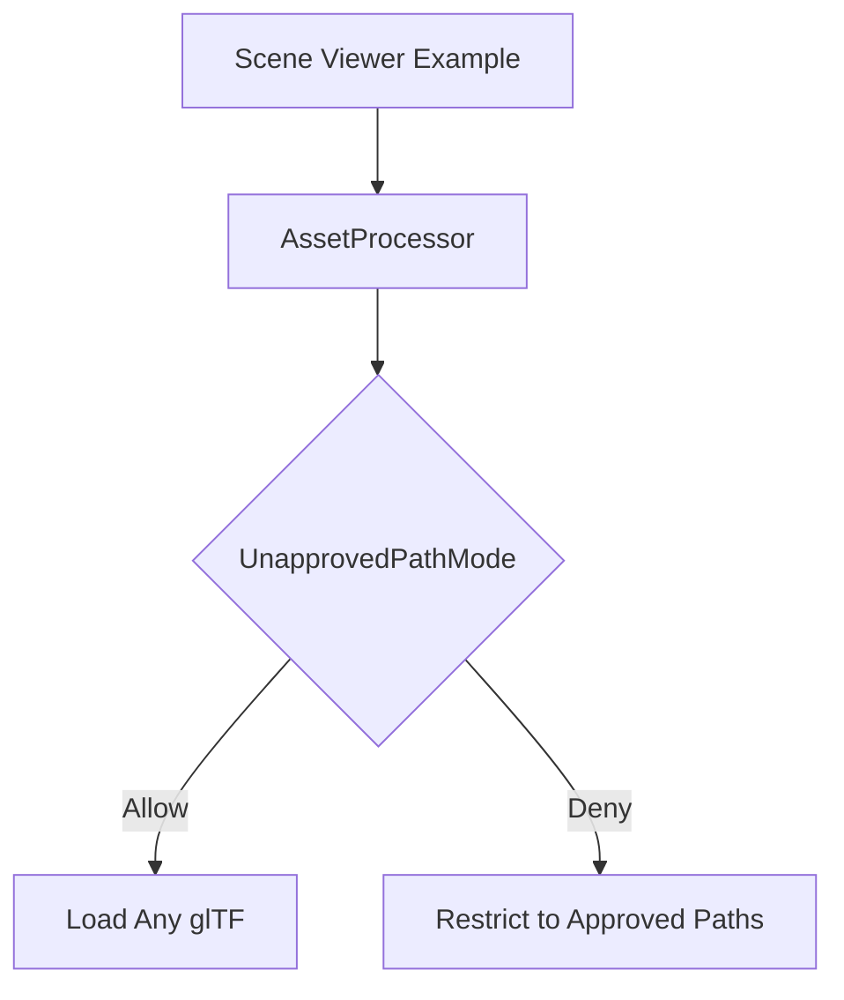

+++
title = "#18828 Don't restrict the scene viewer to loading assets from approved paths"
date = "2025-04-14T00:00:00"
draft = false
template = "pull_request_page.html"
in_search_index = true

[taxonomies]
list_display = ["show"]

[extra]
current_language = "en"
available_languages = {"en" = { name = "English", url = "/pull_request/bevy/2025-04/pr-18828-en-20250414" }, "zh-cn" = { name = "中文", url = "/pull_request/bevy/2025-04/pr-18828-zh-cn-20250414" }}
labels = ["C-Examples", "A-Assets"]
+++

# Title: Don't restrict the scene viewer to loading assets from approved paths

## Basic Information
- **Title**: Don't restrict the scene viewer to loading assets from approved paths
- **PR Link**: https://github.com/bevyengine/bevy/pull/18828
- **Author**: pcwalton
- **Status**: MERGED
- **Labels**: C-Examples, A-Assets, S-Needs-Review
- **Created**: 2025-04-13T08:54:48Z
- **Merged**: 2025-04-14T20:40:45Z
- **Merged By**: mockersf

## Description Translation
The purpose of the scene viewer is to load arbitrary glTF scenes, so it's inconvenient if they have to be moved into the Bevy assets directory first. Thus this patch switches the scene viewer to use `UnapprovedPathMode::Allow`.

## The Story of This Pull Request

The scene viewer example in Bevy faced a usability limitation due to security measures in the asset system. By default, Bevy's asset server restricts loading assets from unapproved paths to prevent arbitrary file system access. While this is a sensible security precaution for general use, it conflicted with the scene viewer's primary purpose of quickly loading and inspecting arbitrary glTF files.

The core issue manifested when users tried to load scene files outside Bevy's designated assets directory. The asset system would block these requests, forcing users to first copy files into approved directories - an unnecessary step for a development tool meant for rapid experimentation. This friction reduced the utility of the scene viewer for its intended use case.

The solution focused on configuring the asset processor's security settings specifically for the scene viewer example. By adding a single line to the example's setup:

```rust
asset_processor.set_unapproved_path_mode(UnapprovedPathMode::Allow);
```

This change tells Bevy's asset system to bypass path approval checks while maintaining other security features. The implementation leverages existing configuration options in Bevy's `AssetProcessor`, demonstrating how to adapt engine components for specific use cases.

The choice of `UnapprovedPathMode::Allow` represents a deliberate trade-off between security and usability appropriate for an example tool. While production applications should generally maintain strict path restrictions, development tools like the scene viewer benefit from relaxed constraints. This change preserves the default security behavior for most Bevy applications while making the scene viewer more flexible for its intended purpose.

## Visual Representation



## Key Files Changed

### `examples/tools/scene_viewer/main.rs` (+3/-0)
**Purpose**: Configure asset processing to allow loading from any path

Key addition:
```rust
// Configure the asset processor to allow unapproved paths
let asset_processor = app.world.resource::<AssetProcessor>();
asset_processor.set_unapproved_path_mode(UnapprovedPathMode::Allow);
```

This change:
1. Retrieves the `AssetProcessor` instance
2. Sets its unapproved path handling mode to `Allow`
3. Affects only the scene viewer example's behavior
4. Maintains default security settings for other Bevy applications

## Further Reading
- [Bevy Asset System Documentation](https://bevyengine.org/learn/book/assets/)
- [Asset Path Security RFC](https://github.com/bevyengine/rfcs/blob/main/rfcs/45-asset-system.md#security)
- [glTF Loading in Bevy](https://bevyengine.org/examples/3D%20Rendering/gltf/)