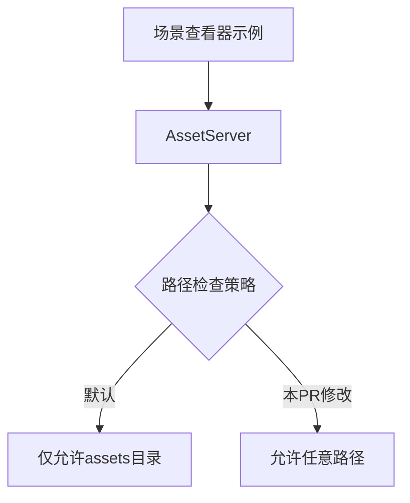

+++
title = "#18828 Don't restrict the scene viewer to loading assets from approved paths."
date = "2025-04-14T00:00:00"
draft = false
template = "pull_request_page.html"
in_search_index = false

[extra]
current_language = "zh-cn"
available_languages = {"en" = { name = "English", url = "/pull_request/bevy/2025-04/pr-18828-en-20250414" }, "zh-cn" = { name = "中文", url = "/pull_request/bevy/2025-04/pr-18828-zh-cn-20250414" }}
labels = ["C-Examples", "A-Assets"]
+++

# Title

## Basic Information
- **Title**: Don't restrict the scene viewer to loading assets from approved paths.
- **PR Link**: https://github.com/bevyengine/bevy/pull/18828
- **Author**: pcwalton
- **Status**: MERGED
- **Labels**: C-Examples, A-Assets, S-Needs-Review
- **Created**: 2025-04-13T08:54:48Z
- **Merged**: 2025-04-14T20:40:45Z
- **Merged By**: mockersf

## Description Translation
场景查看器的目的是加载任意的glTF场景，如果必须先将它们移动到Bevy的资产目录中会很不方便。因此本补丁将场景查看器切换为使用`UnapprovedPathMode::Allow`。

## The Story of This Pull Request

### 问题背景与动机
Bevy的场景查看器(scene viewer)示例原本存在资产路径限制问题。其核心设计目标是快速预览任意glTF场景文件，但现有实现要求用户必须将场景文件移动到Bevy预定义的资产目录中。这与工具的核心用途相矛盾——用户需要频繁加载不同位置的测试资源，每次复制文件到特定目录的操作严重影响了工作效率。

### 技术解决方案
问题根源在于Bevy的资产系统默认安全策略。AssetServer在加载资源时会检查路径是否在批准的目录列表（如`assets/`）中，该机制通过`AssetMetaCheck`组件控制。原示例未显式配置此组件，因此继承默认的严格模式。

解决方案是在场景查看器中明确设置：
```rust
AssetMetaCheck::UnapprovedPathMode::Allow
```
这个配置覆盖默认行为，允许从任意路径加载资产。技术上涉及在App构建阶段插入该配置：
```rust
app.insert_resource(AssetMetaCheck::UnapprovedPathMode::Allow)
```

### 实现细节分析
关键修改在`scene_viewer/main.rs`的初始化流程：
```rust
fn main() {
    let mut app = App::new();
    // 新增配置允许任意路径
    app.insert_resource(AssetMetaCheck::UnapprovedPathMode::Allow)
        .add_plugins(DefaultPlugins);
    // ...其他初始化代码
}
```
该行插入全局资源配置，覆盖AssetServer的默认路径检查策略。这种配置方式符合Bevy的ECS架构设计，通过资源类型安全地修改系统行为。

### 技术影响与意义
修改后：
1. 用户可以直接通过命令行参数加载任意路径的场景文件：
   ```bash
   cargo run --example scene_viewer -- /path/to/your/scene.gltf
   ```
2. 移除了非必要的文件复制操作，提升开发/测试效率
3. 保持了Bevy核心资产系统的默认安全策略，仅在工具示例中放宽限制

该修改体现了Bevy框架的灵活性——通过显式配置可以按需调整安全策略，同时保持核心系统的默认安全设置。对于工具类示例，这种针对性调整比全局修改更符合工程实践。

## Visual Representation



## Key Files Changed

### `examples/tools/scene_viewer/main.rs` (+3)
修改说明：添加全局资源配置覆盖资产路径检查策略

代码变更：
```rust
fn main() {
    let mut app = App::new();
+    app.insert_resource(AssetMetaCheck::UnapprovedPathMode::Allow)
        .add_plugins(DefaultPlugins);
    
    // ... 其他初始化代码
}
```
该配置位于App初始化阶段最早的位置，确保在插件加载前生效。使用`insert_resource`方法将配置注入ECS系统，影响后续AssetServer的行为。

## Further Reading
1. [Bevy Asset System 官方文档](https://bevyengine.org/learn/book/features/assets/)
2. [`AssetMetaCheck` API 文档](https://docs.rs/bevy/latest/bevy/asset/struct.AssetMetaCheck.html)
3. [Bevy 安全路径设计讨论](https://github.com/bevyengine/bevy/discussions/8623)