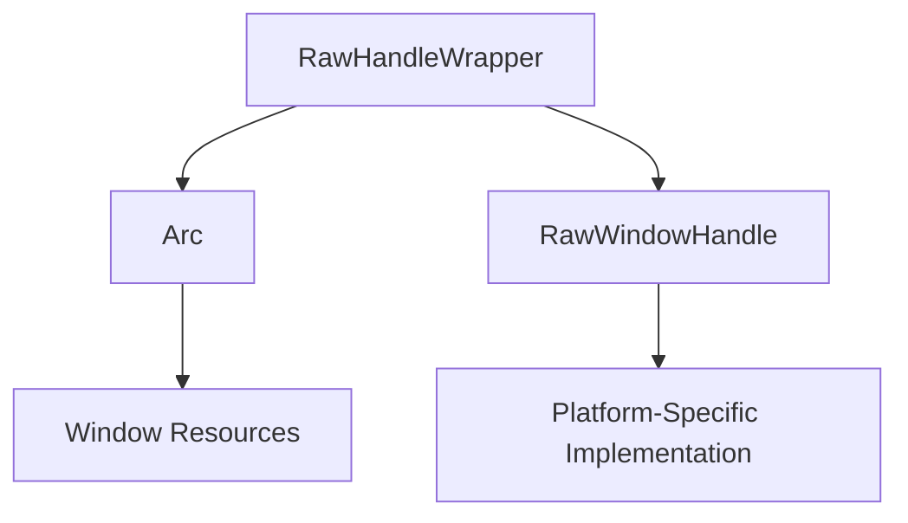

+++
title = "#18832 Fixes #15389, added docs to RawHandleWrapper::_window field"
date = "2025-04-28T00:00:00"
draft = false
template = "pull_request_page.html"
in_search_index = true

[taxonomies]
list_display = ["show"]

[extra]
current_language = "en"
available_languages = {"en" = { name = "English", url = "/pull_request/bevy/2025-04/pr-18832-en-20250428" }, "zh-cn" = { name = "中文", url = "/pull_request/bevy/2025-04/pr-18832-zh-cn-20250428" }}
labels = ["C-Docs", "A-Windowing"]
+++

# Fixes #15389, added docs to RawHandleWrapper::_window field

## Basic Information
- **Title**: Fixes #15389, added docs to RawHandleWrapper::_window field
- **PR Link**: https://github.com/bevyengine/bevy/pull/18832
- **Author**: mhsalem36
- **Status**: MERGED
- **Labels**: C-Docs, A-Windowing, S-Ready-For-Final-Review
- **Created**: 2025-04-13T20:12:41Z
- **Merged**: 2025-04-28T22:06:04Z
- **Merged By**: mockersf

## Description Translation
# Objective

- Fixes https://github.com/bevyengine/bevy/issues/15389.
- Add documentation for RawHandleWrapper::_window field since It's needed to drop the window at the correct time.

## Solution

- Added documentation to RawHandleWrapper::_window field as same as WindowWrapper documentation.

## Testing

- No testing needed since it is documentation. 

---

## The Story of This Pull Request

The PR addresses a documentation gap in Bevy's window handling system. The core issue (#15389) stemmed from missing documentation for the `RawHandleWrapper::_window` field, which could lead to maintenance challenges and potential misuse of the API.

In Bevy's architecture, `RawHandleWrapper` serves as a critical bridge between platform-specific window handles and Bevy's cross-platform rendering system. The `_window` field uses an `Arc<dyn Any + Send + Sync>` to maintain a reference-counted pointer to the underlying window object. This ensures the window remains alive while any rendering frames might still be using it, particularly important in pipelined rendering scenarios where multiple frames can be in flight simultaneously.

Before this change, the field's purpose was unclear:

```rust
pub struct RawHandleWrapper {
    _window: Arc<dyn Any + Send + Sync>,
    // ...
}
```

The lack of documentation created several risks:
1. Developers might remove the field thinking it's unused
2. Future modifications could break implicit lifetime dependencies
3. New contributors would lack context about its role in resource management

The solution adopted the documentation pattern from the related `WindowWrapper` struct, ensuring consistency across similar components. The added comments explicitly state:
- The field's purpose in lifetime management
- Its critical role in pipelined rendering
- The consequences of premature window dropping

```rust
pub struct RawHandleWrapper {
    /// A shared reference to the window.
    /// This allows us to extend the lifetime of the window,
    /// so it doesn’t get eagerly dropped while a pipelined
    /// renderer still has frames in flight that need to draw to it.
    _window: Arc<dyn Any + Send + Sync>,
    // ...
}
```

This change improves the codebase by:
1. Making implicit lifetime management explicit
2. Documenting thread safety considerations (Send + Sync)
3. Clarifying the relationship between window handles and rendering pipelines

The choice to mirror `WindowWrapper`'s documentation ensures architectural consistency and reduces cognitive load for developers working with both components.

## Visual Representation



## Key Files Changed

### `crates/bevy_window/src/raw_handle.rs` (+4/-0)
**Change:** Added documentation to `_window` field in `RawHandleWrapper` struct

Before:
```rust
pub struct RawHandleWrapper {
    _window: Arc<dyn Any + Send + Sync>,
    window_handle: RawWindowHandle,
    // ...
}
```

After:
```rust
pub struct RawHandleWrapper {
    /// A shared reference to the window.
    /// This allows us to extend the lifetime of the window,
    /// so it doesn’t get eagerly dropped while a pipelined
    /// renderer still has frames in flight that need to draw to it.
    _window: Arc<dyn Any + Send + Sync>,
    window_handle: RawWindowHandle,
    // ...
}
```

This change directly addresses the documentation gap while maintaining existing functionality. The comments explain:
- The use of `Arc` for lifetime management
- Coordination with the rendering pipeline
- Safety implications of the `Send + Sync` bounds

## Further Reading
1. [Rust Arc Documentation](https://doc.rust-lang.org/std/sync/struct.Arc.html)
2. [Bevy Pipelined Rendering RFC](https://github.com/bevyengine/rfcs/blob/main/rfcs/45-rendering-pipelines.md)
3. [Cross-Platform Window Handling in Game Engines](https://gamedev.stackexchange.com/questions/200279/windowing-abstraction-layer-design)