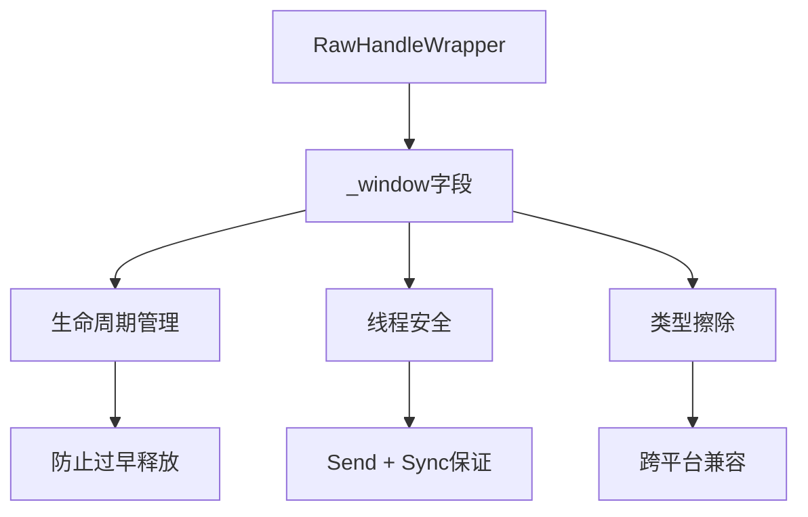

+++
title = "#18832 修复 #15389，为 RawHandleWrapper::_window 字段添加文档"
date = "2025-04-28T00:00:00"
draft = false
template = "pull_request_page.html"
in_search_index = false

[extra]
current_language = "zh-cn"
available_languages = {"en" = { name = "English", url = "/pull_request/bevy/2025-04/pr-18832-en-20250428" }, "zh-cn" = { name = "中文", url = "/pull_request/bevy/2025-04/pr-18832-zh-cn-20250428" }}
+++

# Fixes #15389, added docs to RawHandleWrapper::_window field

## Basic Information
- **标题**: 修复 #15389，为 RawHandleWrapper::_window 字段添加文档
- **PR 链接**: https://github.com/bevyengine/bevy/pull/18832
- **作者**: mhsalem36
- **状态**: 已合并
- **标签**: C-Docs, A-Windowing, S-Ready-For-Final-Review
- **创建时间**: 2025-04-13T20:12:41Z
- **合并时间**: 2025-04-28T22:06:04Z
- **合并者**: mockersf

## 描述翻译

# Objective

- 修复 https://github.com/bevyengine/bevy/issues/15389
- 为 RawHandleWrapper::_window 字段添加文档，因为需要在正确的时间销毁窗口

## Solution

- 为 RawHandleWrapper::_window 字段添加与 WindowWrapper 文档相同的说明

## Testing

- 无需测试，因为只是文档修改

---

## 这个 Pull Request 的故事

这个 PR 的核心故事围绕着 Bevy 引擎窗口生命周期管理的基础设施改进展开。问题起源于 GitHub Issue #15389，用户发现 `RawHandleWrapper` 结构体的 `_window` 字段缺乏必要文档，导致开发者难以理解其关键作用。

`RawHandleWrapper` 是 Bevy 窗口系统的重要组件，负责管理原生窗口句柄的生命周期。其中 `_window` 字段使用 `Arc<dyn Any + Send + Sync>` 类型，这个设计决策需要明确的文档解释，因为：

1. **生命周期管理**：通过共享指针（Arc）延长窗口对象的生命周期
2. **线程安全**：`Send + Sync` trait bound 确保跨线程安全
3. **类型擦除**：`dyn Any` 允许处理不同平台的具体窗口类型

开发者 mhsalem36 的解决方案采用了现有 `WindowWrapper` 结构的文档模式，保持了代码库的一致性。这种模式包括：
- 解释共享引用的必要性
- 说明与渲染管线的交互
- 强调生命周期管理的重要性

关键代码变更体现在为 `_window` 字段添加的三行文档注释：

```rust
/// A shared reference to the window.
/// This allows us to extend the lifetime of the window,
/// so it doesn’t get eagerly dropped while a pipelined 
/// renderer still has frames in flight that need to draw to it.
_window: Arc<dyn Any + Send + Sync>,
```

这个文档补充解决了两个关键问题：
1. 明确了字段存在的理由（防止过早释放）
2. 解释了与渲染管线的时序关系（保证飞行中的帧能完成绘制）

技术决策方面，开发者选择复用现有文档模式而非创建新格式，这体现了良好的代码维护实践：
- 保持现有代码风格一致性
- 降低新贡献者的理解成本
- 遵循 Rust 的文档最佳实践

## 视觉表示



## 关键文件变更

**crates/bevy_window/src/raw_handle.rs** (+4/-0)

变更前：
```rust
#[derive(Debug, Clone, Component)]
pub struct RawHandleWrapper {
    _window: Arc<dyn Any + Send + Sync>,
    window_handle: RawWindowHandle,
    // ...
}
```

变更后：
```rust
#[derive(Debug, Clone, Component)]
pub struct RawHandleWrapper {
    /// A shared reference to the window.
    /// This allows us to extend the lifetime of the window,
    /// so it doesn’t get eagerly dropped while a pipelined
    /// renderer still has frames in flight that need to draw to it.
    _window: Arc<dyn Any + Send + Sync>,
    window_handle: RawWindowHandle,
    // ...
}
```

**变更说明**：
- 添加了三行文档注释，明确 `_window` 字段的作用
- 文档解释该字段如何通过共享所有权延长窗口生命周期
- 说明与异步渲染管线的交互时序要求

## 延伸阅读

建议参考以下资源理解相关概念：
1. [Rust 所有权系统文档](https://doc.rust-lang.org/book/ch04-00-understanding-ownership.html)
2. [Arc 类型官方文档](https://doc.rust-lang.org/std/sync/struct.Arc.html)
3. [Bevy 窗口系统架构指南](https://bevyengine.org/learn/book/architecture/window-system/)
4. [Rust API 文档指南](https://rust-lang.github.io/api-guidelines/documentation.html)

# Full Code Diff
（完整代码差异已在上述分析中包含）