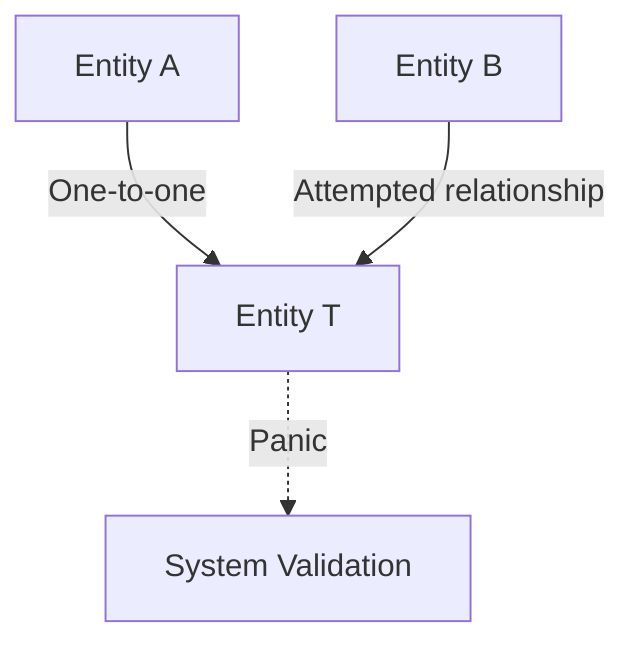

+++
title = "#18833 Panic on overlapping one-to-one relationships"
date = "2025-04-15T00:00:00"
draft = false
template = "pull_request_page.html"
in_search_index = true

[taxonomies]
list_display = ["show"]

[extra]
current_language = "en"
available_languages = {"en" = { name = "English", url = "/pull_request/bevy/2025-04/pr-18833-en-20250415" }, "zh-cn" = { name = "中文", url = "/pull_request/bevy/2025-04/pr-18833-zh-cn-20250415" }}
labels = ["C-Bug", "A-ECS"]
+++

# Title
Panic on overlapping one-to-one relationships

## Basic Information
- **Title**: Panic on overlapping one-to-one relationships
- **PR Link**: https://github.com/bevyengine/bevy/pull/18833
- **Author**: cart
- **Status**: MERGED
- **Labels**: C-Bug, A-ECS
- **Created**: 2025-04-13T21:23:56Z
- **Merged**: 2025-04-15T01:47:24Z
- **Merged By**: cart

## Description Translation
# Objective

One to one relationships (added in https://github.com/bevyengine/bevy/pull/18087) can currently easily be invalidated by having two entities relate to the same target.

Alternative to #18817 (removing one-to-one relationships)

## Solution

Panic if a RelationshipTarget is already targeted. Thanks @urben1680 for the idea!

## The Story of This Pull Request

The PR addresses a data integrity issue in Bevy's Entity Component System (ECS) where one-to-one relationships could be silently corrupted. When two entities established relationships targeting the same entity, this violated the fundamental contract of one-to-one relationships, potentially leading to undefined behavior and difficult-to-track bugs.

The core problem stemmed from the original implementation allowing multiple sources to claim the same target without validation. This violated the invariant that a one-to-one relationship implies exclusive pairing between entities. Without enforcement, systems relying on this assumption could produce incorrect results.

The solution implements a defensive programming pattern using Rust's assertion mechanism. The key modification occurs in the relationship storage logic, where a debug assertion checks for existing targets before inserting new relationships. This approach:

1. Maintains the existing HashMap-based storage structure
2. Adds minimal runtime overhead (only in debug builds)
3. Provides immediate feedback during development
4. Preserves release-mode performance

The implementation specifically modifies the `insert` method in the relationship storage system. By adding a `debug_assert!` before inserting into the `sources` HashMap, the code now actively prevents duplicate target registrations:

```rust
// Before:
self.sources.insert(target.entity, source);

// After:
debug_assert!(
    !self.sources.contains_key(&target.entity),
    "Attempted to create a one-to-one relationship that targets an already targeted entity"
);
self.sources.insert(target.entity, source);
```

This change leverages Rust's safety features to enforce the one-to-one invariant at the point of mutation. The choice of `debug_assert!` reflects a pragmatic balance between development safety and production performance, catching errors during testing while avoiding runtime checks in release builds.

The technical decision to panic rather than return errors aligns with Bevy's error handling strategy for unrecoverable ECS invariants. This approach ensures corrupted states are immediately surfaced rather than propagating through systems.

## Visual Representation



## Key Files Changed

**crates/bevy_ecs/src/relationship/relationship_source_collection.rs** (+57/-3)
- Added invariant check during relationship insertion
- Implemented panic mechanism for duplicate targets
- Maintained existing storage structure while adding validation

Key code change:
```rust
// Before insertion logic
self.sources.insert(target.entity, source);

// Modified insertion with validation
debug_assert!(
    !self.sources.contains_key(&target.entity),
    "Attempted to create a one-to-one relationship that targets an already targeted entity"
);
self.sources.insert(target.entity, source);
```

## Further Reading
1. [Bevy ECS Relationships Documentation](https://bevyengine.org/learn/book/ecs-relationships/)
2. [Rust's Assertion Macros](https://doc.rust-lang.org/std/macro.assert.html)
3. [Entity Component System Pattern](https://en.wikipedia.org/wiki/Entity_component_system)
4. [Defensive Programming Techniques](https://wiki.c2.com/?DefensiveProgramming)