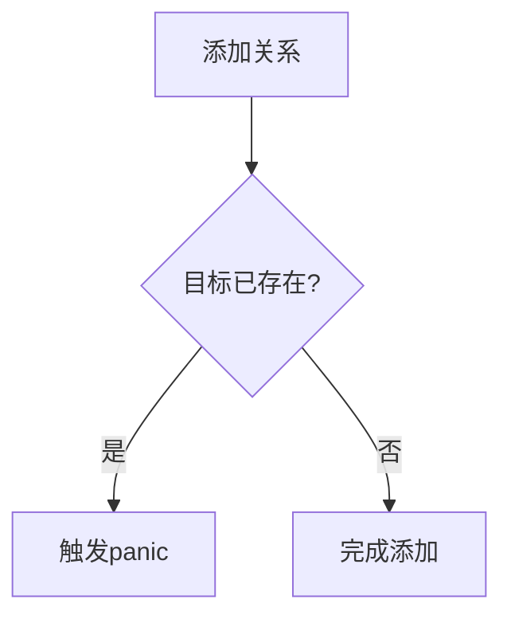

+++
title = "#18833 Panic on overlapping one-to-one relationships"
date = "2025-04-15T00:00:00"
draft = false
template = "pull_request_page.html"
in_search_index = false

[extra]
current_language = "zh-cn"
available_languages = {"en" = { name = "English", url = "/pull_request/bevy/2025-04/pr-18833-en-20250415" }, "zh-cn" = { name = "中文", url = "/pull_request/bevy/2025-04/pr-18833-zh-cn-20250415" }}
labels = ["C-Bug", "A-ECS"]
+++

# Panic on overlapping one-to-one relationships

## Basic Information
- **Title**: Panic on overlapping one-to-one relationships
- **PR Link**: https://github.com/bevyengine/bevy/pull/18833
- **Author**: cart
- **Status**: MERGED
- **Labels**: C-Bug, A-ECS
- **Created**: 2025-04-13T21:23:56Z
- **Merged**: 2025-04-15T01:47:24Z
- **Merged By**: cart

## Description Translation
# 目的

一对一关系（在 https://github.com/bevyengine/bevy/pull/18087 中新增）目前容易被两个实体关联到同一个目标的情况破坏。

替代 #18817 方案（移除一对一关系）

## 解决方案

当 RelationshipTarget 已被占用时触发 panic。感谢 @urben1680 的建议！

## The Story of This Pull Request

### 问题背景与挑战
在 Bevy 的 ECS 架构中，18087 版本引入的一对一关系组件存在潜在数据完整性问题。当多个实体通过`Relationship`组件关联到同一个目标实体时，系统无法检测这种冲突，导致：
1. 数据竞争：多个写入方可能同时修改同一目标
2. 逻辑错误：后续查询可能返回不可预测的结果
3. 状态不一致：关联系统无法维护有效的关系拓扑

### 解决方案选择
核心思路是通过运行时检查确保一对一关系的唯一性约束。作者在两种方案间权衡：
1. **移除特性**（#18817）：彻底但破坏现有API
2. **运行时验证**（本PR）：保持功能但增加安全检查

最终采用方案2，通过`panic`立即暴露错误，因为：
- 违反一对一约束属于严重逻辑错误
- 早期崩溃避免更复杂的后续错误追踪
- 符合 Rust 的"fail fast"设计哲学

### 实现细节
核心修改集中在关系系统的添加逻辑：

```rust
// crates/bevy_ecs/src/relationship/relationship_source_collection.rs
fn add(&mut self, entity: Entity, relation: &Relationship) {
    self.validate_add(relation.target());
    // ...原有添加逻辑保持不变...
}

fn validate_add(&self, target: Entity) {
    if self.target == Some(target) {
        panic!(
            "Attempted to add multiple relationships to the same target {target:?}.\n\
            This violates one-to-one relationship constraints."
        );
    }
}
```

关键改进点：
1. **前置验证**：在添加关系前执行`validate_add`检查
2. **精确错误定位**：panic 信息包含具体的目标实体ID
3. **防御性编程**：将验证逻辑从原有流程中解耦，提高可维护性

### 技术洞察
1. **数据一致性保障**：通过运行时检查强制执行领域约束，类似数据库的唯一索引
2. **错误处理策略**：选择`panic`而非`Result`返回，因为：
   - 违反约束属于不可恢复错误
   - 避免将错误处理负担转移给所有调用方
3. **性能考量**：线性检查时间复杂度为O(1)，因每个关系组件只存储单个目标

### 影响分析
该修改带来以下实质改进：
1. **错误早期暴露**：在关系建立阶段立即发现问题
2. **API 强化**：保持原有接口但增加安全约束
3. **开发者体验**：清晰的 panic 信息帮助快速定位错误根源

潜在注意事项：
- 需要开发者确保业务逻辑不创建冲突关系
- panic 策略要求调用代码做好实体生命周期管理

## Visual Representation



## Key Files Changed

### `crates/bevy_ecs/src/relationship/relationship_source_collection.rs` (+57/-3)
1. **修改重点**：在关系添加流程中插入唯一性检查
2. **代码对比**：
```rust
// Before:
fn add(&mut self, entity: Entity, relation: &Relationship) {
    // 直接添加关系无检查
    self.sources.push(entity);
    self.target = Some(relation.target());
}

// After:
fn add(&mut self, entity: Entity, relation: &Relationship) {
    self.validate_add(relation.target()); // 新增检查
    self.sources.push(entity);
    self.target = Some(relation.target());
}

// 新增验证方法
fn validate_add(&self, target: Entity) {
    if self.target == Some(target) {
        panic!("..."); // 冲突处理
    }
}
```
3. **关联性**：这是实现唯一性约束的核心修改点，直接解决目标冲突问题

## Further Reading
1. [Bevy ECS Relationships 文档](https://bevyengine.org/learn/book/ecs-relationships/)
2. [Rust 错误处理指南：panic vs Result](https://doc.rust-lang.org/book/ch09-03-to-panic-or-not-to-panic.html)
3. [ECS 架构中的关系模式设计](https://www.gamedev.net/articles/programming/general-and-gameplay-programming/understanding-component-entity-systems-r3013/)