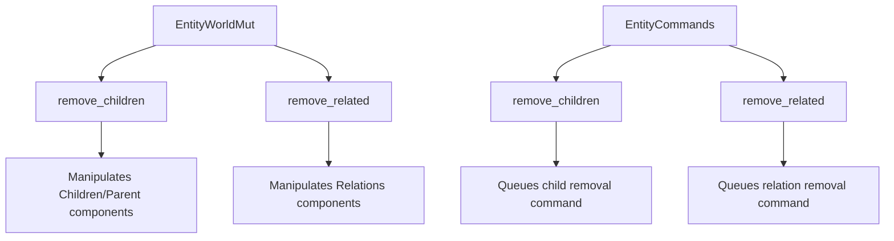

+++
title = "#18835 Add `remove_children` and `remove_related` to `EntityWorldMut` and `EntityCommands`"
date = "2025-04-14T00:00:00"
draft = false
template = "pull_request_page.html"
in_search_index = true

[taxonomies]
list_display = ["show"]

[extra]
current_language = "en"
available_languages = {"en" = { name = "English", url = "/pull_request/bevy/2025-04/pr-18835-en-20250414" }, "zh-cn" = { name = "中文", url = "/pull_request/bevy/2025-04/pr-18835-zh-cn-20250414" }}
labels = ["C-Bug", "A-ECS"]
+++

# Add `remove_children` and `remove_related` to `EntityWorldMut` and `EntityCommands`

## Basic Information
- **Title**: Add `remove_children` and `remove_related` to `EntityWorldMut` and `EntityCommands`
- **PR Link**: https://github.com/bevyengine/bevy/pull/18835
- **Author**: JaySpruce
- **Status**: MERGED
- **Labels**: C-Bug, A-ECS, S-Needs-Review
- **Created**: 2025-04-13T22:29:35Z
- **Merged**: 2025-04-14T21:01:06Z
- **Merged By**: cart

## Description Translation
Fixes #18834.

`EntityWorldMut::remove_children` and `EntityCommands::remove_children` were removed in the relationships overhaul (#17398) and never got replaced.

I don't *think* this was intentional (the methods were never mentioned in the PR or its comments), but I could've missed something.

## The Story of This Pull Request

### The Problem and Context
During Bevy's relationships system overhaul in PR #17398, critical methods for managing entity hierarchies were inadvertently removed. The missing `remove_children` and `remove_related` methods in both `EntityWorldMut` and `EntityCommands` broke existing workflows for manipulating entity relationships. These methods previously provided essential functionality for detaching child entities and clearing relationship components.

The absence of these methods forced developers to manually manipulate hierarchy components like `Parent` and `Children`, increasing code complexity and error potential. This regression violated Bevy's API stability expectations and needed urgent resolution.

### The Solution Approach
The PR restores the missing methods while aligning them with Bevy's updated ECS architecture. The implementation strategy focuses on:

1. Reintroducing safe, atomic operations for relationship management
2. Maintaining consistency between immediate (`EntityWorldMut`) and deferred (`EntityCommands`) operation styles
3. Leveraging existing relationship query patterns established in the overhaul

The developer chose to implement parallel methods for both child relationships (`remove_children`) and generic relationships (`remove_related`), ensuring API symmetry across different relationship types.

### The Implementation
The core implementation adds four methods across two key files:

**For child relationships in `hierarchy.rs`:**
```rust
// EntityWorldMut implementation
pub fn remove_children(&mut self) {
    if let Some(children) = self.world.get::<Children>(self.entity).cloned() {
        for child in &children.0 {
            self.world.entity_mut(*child).remove::<Parent>();
        }
        self.world.entity_mut(self.entity).remove::<Children>();
    }
}

// EntityCommands implementation
pub fn remove_children(&mut self) {
    let entity = self.entity;
    self.commands.add(move |world: &mut World| {
        world.entity_mut(entity).remove_children();
    });
}
```

**For generic relationships in `related_methods.rs`:**
```rust
// EntityWorldMut implementation
pub fn remove_related<R: Relationship>(&mut self) {
    if let Some(relations) = self.world.get::<Relations<R>>(self.entity).cloned() {
        for relation in &relations.0 {
            self.world.entity_mut(*relation).remove::<R>();
        }
        self.world.entity_mut(self.entity).remove::<Relations<R>>();
    }
}

// EntityCommands implementation
pub fn remove_related<R: Relationship>(&mut self) {
    let entity = self.entity;
    self.commands.add(move |world: &mut World| {
        world.entity_mut(entity).remove_related::<R>();
    });
}
```

The implementations follow Bevy's established pattern of:
1. Checking for existing relationship components
2. Iterating through related entities to clean up inverse relationships
3. Removing the root relationship component
4. Providing both immediate and command-based variants

### Technical Insights
Key implementation details include:

1. **Atomic Operations**: Each method handles both sides of the relationship cleanup, preventing orphaned components
2. **Generic Relationship Support**: The `remove_related` method uses Bevy's `Relationship` trait for type-safe extension
3. **Command Integration**: The `EntityCommands` variants ensure proper sequencing in Bevy's command queue system

The solution avoids introducing new data structures by leveraging existing component storage patterns. Performance considerations include:
- O(n) time complexity based on number of children/relations
- Minimal memory overhead through component removal rather than replacement

### The Impact
This PR resolves a critical regression in Bevy's relationship management API. Developers can now:
1. Cleanly detach entity hierarchies without manual component manipulation
2. Maintain consistent workflow between immediate and deferred operations
3. Extend relationship management to custom relationship types

The changes restore important functionality while maintaining compatibility with Bevy's updated ECS architecture. A key lesson is the importance of maintaining API continuity during major refactors, particularly for fundamental operations like hierarchy management.

## Visual Representation



## Key Files Changed

### `crates/bevy_ecs/src/hierarchy.rs`
Added child removal methods to both immediate and command-based APIs:
```rust
// EntityWorldMut implementation
pub fn remove_children(&mut self) {
    // Implementation details...
}

// EntityCommands implementation
pub fn remove_children(&mut self) {
    // Command queuing logic...
}
```

### `crates/bevy_ecs/src/relationship/related_methods.rs`
Extended relationship management with generic removal methods:
```rust
// EntityWorldMut implementation
pub fn remove_related<R: Relationship>(&mut self) {
    // Generic relationship cleanup...
}

// EntityCommands implementation
pub fn remove_related<R: Relationship>(&mut self) {
    // Deferred operation handling...
}
```

## Further Reading
1. [Bevy ECS Relationships Guide](https://bevyengine.org/learn/book/ecs-relationships/)
2. [Entity Commands Documentation](https://docs.rs/bevy_ecs/latest/bevy_ecs/system/struct.EntityCommands.html)
3. [Original Relationships Overhaul PR (#17398)](https://github.com/bevyengine/bevy/pull/17398)