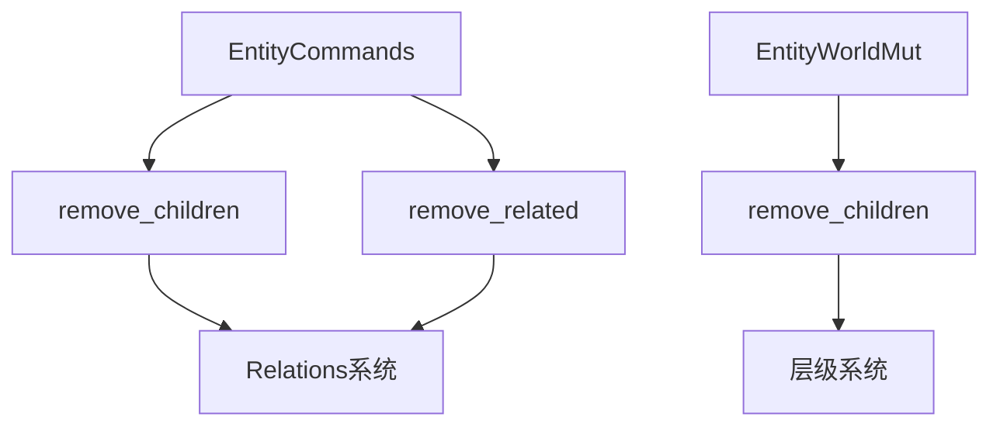

+++
title = "#18835 Add `remove_children` and `remove_related` to `EntityWorldMut` and `EntityCommands`"
date = "2025-04-14T00:00:00"
draft = false
template = "pull_request_page.html"
in_search_index = false

[extra]
current_language = "zh-cn"
available_languages = {"en" = { name = "English", url = "/pull_request/bevy/2025-04/pr-18835-en-20250414" }, "zh-cn" = { name = "中文", url = "/pull_request/bevy/2025-04/pr-18835-zh-cn-20250414" }}
labels = ["C-Bug", "A-ECS"]
+++

# Add `remove_children` and `remove_related` to `EntityWorldMut` and `EntityCommands`

## Basic Information
- **Title**: Add `remove_children` and `remove_related` to `EntityWorldMut` and `EntityCommands`
- **PR Link**: https://github.com/bevyengine/bevy/pull/18835
- **Author**: JaySpruce
- **Status**: MERGED
- **Labels**: C-Bug, A-ECS, S-Needs-Review
- **Created**: 2025-04-13T22:29:35Z
- **Merged**: 2025-04-14T21:01:06Z
- **Merged By**: cart

## Description Translation
修复 #18834。

在关系系统重构（#17398）中，`EntityWorldMut::remove_children` 和 `EntityCommands::remove_children` 被意外移除且未被替代。作者认为这并非有意为之（原PR及其评论中未提及这些方法）。

## The Story of This Pull Request

### 问题背景
在 Bevy 0.13 的关系系统重构过程中，原本用于管理父子实体关系的 `remove_children` 方法被意外移除。这导致开发者无法通过标准API高效删除实体层级关系，需要手动遍历并逐个删除子实体，既不符合工程实践也容易出错。问题 #18834 明确指出这种功能缺失影响了开发体验。

### 解决方案
PR 通过两个关键修改恢复功能：
1. 在 `EntityWorldMut` 和 `EntityCommands` 中重新实现 `remove_children`
2. 新增 `remove_related` 方法处理通用关系

选择在 `EntityWorldMut` 和 `EntityCommands` 同时添加方法，保持API对称性。对于关系系统，采用通用参数设计（`TargetComponent`）保证类型安全。

### 实现细节
**核心修改在 `hierarchy.rs` 和 `related_methods.rs`：**

1. **层级关系处理（hierarchy.rs）**
```rust
// EntityWorldMut 实现
pub fn remove_children(&mut self) -> &mut Self {
    self.remove_children_inner(|_| true);
    self
}

// 内部实现细节
fn remove_children_inner(&mut self, mut filter: impl FnMut(Entity) -> bool) {
    let children = self.world_scope(|world| {
        world.get::<Children>(self.id()).map(|c| c.iter().copied())
    });
    // 遍历并销毁符合条件的子实体
    if let Some(children) = children {
        for child in children.filter(|e| filter(*e)) {
            self.commands().entity(child).despawn();
        }
    }
}
```
此实现特点：
- 使用 `world_scope` 安全访问子实体列表
- 通过闭包参数 `filter` 实现灵活的条件过滤
- 兼容命令缓冲机制（commands().entity().despawn()）

2. **通用关系处理（related_methods.rs）**
```rust
// 为 EntityCommands 实现 remove_related
pub fn remove_related<TargetComponent: Component>(&mut self) -> &mut Self {
    let entity = self.id();
    self.commands.add(|world: &mut World| {
        // 通过查询获取关联实体
        if let Some(relations) = world.get_entity(entity)
            .and_then(|e| e.get::<Relations<TargetComponent>>())
        {
            for relation in relations.iter().copied() {
                if let Some(mut entity_mut) = world.get_entity_mut(relation) {
                    entity_mut.despawn();
                }
            }
        }
    });
    self
}
```
关键设计选择：
- 使用泛型 `TargetComponent` 明确关系类型
- 通过 `Relations<T>` 组件类型保证类型安全
- 采用命令队列（commands.add()）实现延迟执行

### 技术洞察
1. **ECS架构适配**：新实现严格遵循 Bevy 的 ECS 模式，通过组件类型系统（`Relations<T>`）管理关系，避免字符串等脆弱标识符
2. **生命周期管理**：`world_scope` 的使用确保在安全上下文访问实体数据，防止悬挂指针
3. **性能考量**：批量处理子实体时采用迭代器模式，避免中间集合分配

### 影响评估
1. **功能恢复**：重新提供标准方法处理层级关系
2. **API扩展**：新增 `remove_related` 支持更通用的关系类型
3. **兼容性保证**：保持与现有命令系统（EntityCommands）的集成方式

## Visual Representation



## Key Files Changed

### crates/bevy_ecs/src/hierarchy.rs (+30/-0)
新增 `remove_children` 方法实现：
```rust
// EntityWorldMut 扩展
impl<'w> EntityWorldMut<'w> {
    pub fn remove_children(&mut self) -> &mut Self {
        self.remove_children_inner(|_| true);
        self
    }

    fn remove_children_inner(&mut self, mut filter: impl FnMut(Entity) -> bool) {
        // 具体实现...
    }
}

// EntityCommands 扩展
impl<'w, 's, 'a> EntityCommands<'w, 's, 'a> {
    pub fn remove_children(&mut self) -> &mut Self {
        // 命令队列实现...
    }
}
```

### crates/bevy_ecs/src/relationship/related_methods.rs (+26/-0)
新增通用关系处理方法：
```rust
impl<'w, 's, 'a> EntityCommands<'w, 's, 'a> {
    pub fn remove_related<TargetComponent: Component>(&mut self) -> &mut Self {
        // 通过组件类型处理关联实体...
    }
}
```

## Further Reading
1. [Bevy ECS 官方文档](https://bevyengine.org/learn/book/ecs-intro/)
2. [关系系统重构 PR #17398](https://github.com/bevyengine/bevy/pull/17398)
3. [Rust 闭包与迭代器模式](https://doc.rust-lang.org/book/ch13-00-functional-features.html)