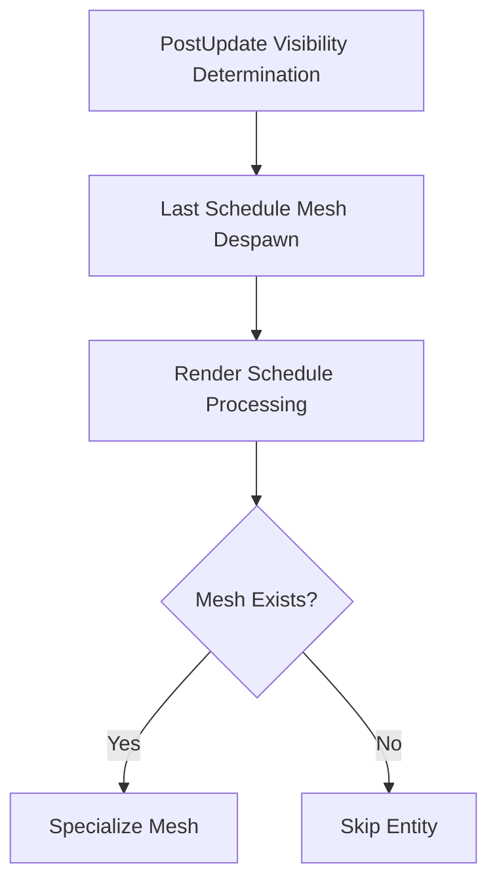

+++
title = "#18836 Make sure the mesh actually exists before we try to specialize"
date = "2025-04-14T00:00:00"
draft = false
template = "pull_request_page.html"
in_search_index = true

[taxonomies]
list_display = ["show"]

[extra]
current_language = "en"
available_languages = {"en" = { name = "English", url = "/pull_request/bevy/2025-04/pr-18836-en-20250414" }, "zh-cn" = { name = "中文", url = "/pull_request/bevy/2025-04/pr-18836-zh-cn-20250414" }}
labels = ["C-Bug", "A-Rendering"]
+++

# Title: Make sure the mesh actually exists before we try to specialize

## Basic Information
- **Title**: Make sure the mesh actually exists before we try to specialize.
- **PR Link**: https://github.com/bevyengine/bevy/pull/18836
- **Author**: tychedelia
- **Status**: MERGED
- **Labels**: C-Bug, A-Rendering, S-Ready-For-Final-Review
- **Created**: 2025-04-13T22:47:03Z
- **Merged**: 2025-04-14T19:26:38Z
- **Merged By**: superdump

## Description Translation
Fixes #18809
Fixes #18823

Meshes despawned in `Last` can still be in visible entities if they were visible as of `PostUpdate`. Sanity check that the mesh actually exists before we specialize. We still want to unconditionally assume that the entity is in `EntitySpecializationTicks` as its absence from that cache would likely suggest another bug.

## The Story of This Pull Request

### The Problem and Context
The rendering system faced race conditions when handling mesh assets that were scheduled for removal. Entities marked as visible during `PostUpdate` could still reference meshes that were despawned in the `Last` schedule. This led to panics when specialization systems attempted to process non-existent meshes, as seen in issues #18809 and #18823.

The core challenge stemmed from the temporal gap between visibility determination and mesh specialization. Visibility states from `PostUpdate` could reference meshes that were removed before rendering commands were prepared, creating a window where invalid mesh handles could be processed.

### The Solution Approach
The fix introduces a defensive check before mesh specialization. Rather than assuming mesh existence based on visibility state alone, the implementation now verifies actual mesh availability through the asset system. This approach maintains the existing specialization tick checks while adding a crucial existence verification layer.

Key engineering decisions:
1. Perform asset existence check after tick comparison to maintain optimization
2. Preserve original error handling for missing specialization data
3. Apply consistent pattern across all material specialization systems

### The Implementation
The solution modifies mesh specialization flows across multiple rendering systems. Each affected system now follows this pattern:

1. Retrieve mesh handle from entity
2. Check if mesh exists in asset system
3. Only proceed with specialization if mesh is available

Example from `light.rs`:
```rust
// Before:
let mesh_handle = mesh_query.get(item.entity).unwrap();
let Some(mesh) = render_meshes.get(mesh_handle) else {
    continue;
};

// After:
let Ok(mesh_handle) = mesh_query.get(item.entity) else {
    continue;
};
if let Some(mesh) = render_meshes.get(mesh_handle) {
    // Specialization logic remains here
}
```

This change appears consistently across:
- PBR material handling
- Light systems
- Prepass pipelines
- Wireframe rendering
- 2D sprite materials

### Technical Insights
The implementation leverages Bevy's asset system as a source of truth for resource availability. Key technical points:

1. **Asset Validation**: Uses `Assets::get` check for mesh existence
2. **Error Handling**: Maintains `continue` pattern for early exit
3. **System Ordering**: Respects Bevy's schedule ordering where:
   - Visibility runs in `PostUpdate`
   - Mesh removal happens in `Last`
   - Rendering systems run in `Render` schedule

The check acts as a guard clause against stale visibility state references, preventing attempts to specialize using destroyed mesh assets.

### The Impact
These changes:
1. Prevent crashes from null mesh references
2. Maintain rendering system stability during asset hot-reloading
3. Add minimal performance overhead (single hashmap lookup)
4. Fix race conditions between asset removal and rendering prep

The solution demonstrates effective defensive programming in ECS systems, particularly important when dealing with frame-delayed visibility states and asset lifecycle management.

## Visual Representation



## Key Files Changed

1. **crates/bevy_pbr/src/render/light.rs** (+5/-5)
```rust
// Key change:
if let Some(mesh) = meshes.get(mesh_handle) {
    // Specialization logic moved inside this block
}
```
Adds mesh existence check before light mesh specialization

2. **crates/bevy_pbr/src/material.rs** (+4/-4)
```rust
let Ok(mesh_handle) = mesh_query.get(entity) else { continue };
if let Some(mesh) = render_meshes.get(mesh_handle) {
    // Moved material specialization inside
}
```
Guards PBR material specialization with mesh check

3. **crates/bevy_pbr/src/prepass/mod.rs** (+4/-4)
```rust
let Ok(mesh_handle) = mesh_query.get(entity) else { continue };
if let Some(mesh) = render_meshes.get(mesh_handle) {
    // Prepass specialization now nested
}
```
Applies same pattern to prepass rendering

4. **crates/bevy_sprite/src/mesh2d/material.rs** (+3/-3)
```rust
let Ok(mesh_handle) = mesh_query.get(entity) else { continue };
if let Some(mesh) = meshes.get(mesh_handle) {
    // 2D material specialization protected
}
```
Extends fix to 2D rendering systems

## Further Reading
1. [Bevy ECS Schedules](https://bevyengine.org/learn/book/getting-started/ecs/#system-schedule)
2. [Asset Handling in Bevy](https://bevyengine.org/learn/book/assets/)
3. [Render Preparation Architecture](https://github.com/bevyengine/bevy/blob/main/crates/bevy_pbr/src/render/mod.rs#L49-L67)