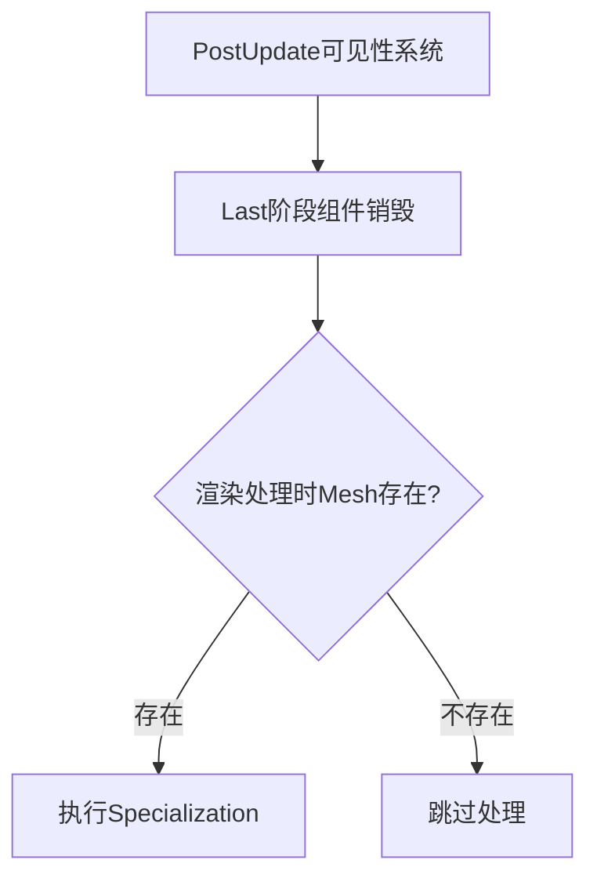

+++
title = "#18836 Make sure the mesh actually exists before we try to specialize."
date = "2025-04-14T00:00:00"
draft = false
template = "pull_request_page.html"
in_search_index = false

[extra]
current_language = "zh-cn"
available_languages = {"en" = { name = "English", url = "/pull_request/bevy/2025-04/pr-18836-en-20250414" }, "zh-cn" = { name = "中文", url = "/pull_request/bevy/2025-04/pr-18836-zh-cn-20250414" }}
labels = ["C-Bug", "A-Rendering"]
+++

# Title: Make sure the mesh actually exists before we try to specialize.

## Basic Information
- **Title**: Make sure the mesh actually exists before we try to specialize.
- **PR Link**: https://github.com/bevyengine/bevy/pull/18836
- **Author**: tychedelia
- **Status**: MERGED
- **Labels**: C-Bug, A-Rendering, S-Ready-For-Final-Review
- **Created**: 2025-04-13T22:47:03Z
- **Merged**: 2025-04-14T19:26:38Z
- **Merged By**: superdump

## Description Translation
修复 #18809
修复 #18823

在 `Last` 阶段被销毁的 Mesh 如果仍存在于 `PostUpdate` 阶段的可见实体中时，需要增加存在性检查。在进行 specialization 前验证 mesh 是否真实存在。我们仍需无条件假设实体存在于 `EntitySpecializationTicks`，因为如果不在缓存中可能意味着其他 bug。

## The Story of This Pull Request

### 问题背景
在 Bevy 的渲染管线中，当 Mesh 组件在 `Last` 系统调度阶段被销毁时，如果在 `PostUpdate` 阶段该实体仍被标记为可见，后续渲染处理会尝试访问已不存在的 Mesh 资源，导致 panic。这个问题暴露了渲染系统在资源生命周期管理中的边界条件处理缺陷。

### 解决方案
核心思路是在进行 specialization 操作前增加一道 Mesh 存在性检查。开发者保持了原有的 `EntitySpecializationTicks` 检查的无条件执行（因其缓存状态应始终有效），但新增了对 Mesh 句柄的显式存在性验证。

实现模式统一采用：
```rust
if mesh_handle.is_some() {
    // 原有 specialization 逻辑
}
```
这种设计保证了：
1. 避免访问已释放资源
2. 维持原有性能优化机制
3. 最小化代码改动范围

### 技术实现细节
在各渲染相关的 specialization 入口点（灯光、材质、prepass、线框、2D mesh 材质）增加了同样的保护逻辑。以 `bevy_pbr/src/render/light.rs` 为例：

```rust
// 修改前
let Ok((entity, mesh_handle, maybe_previous_transform)) = light_mesh_query.get(entity) else {
    continue;
};

// 修改后
let Ok((entity, mesh_handle, maybe_previous_transform)) = light_mesh_query.get(entity) else {
    continue;
};
if mesh_handle.is_some() {  // 新增存在性检查
    // 原有 transform 更新逻辑
}
```
这种修改模式在保持原有错误处理流程（continue on error）的基础上，增加了一层资源有效性验证。

### 技术洞察
1. **ECS 系统顺序敏感性**：暴露了渲染系统对实体组件销毁时序的依赖
2. **缓存一致性**：保留 `EntitySpecializationTicks` 的无条件检查，因其缓存状态应与实体存在性严格同步
3. **防御式编程**：在关键资源访问点增加保护性检查，增强系统健壮性

### 影响分析
1. 修复了因访问已销毁 Mesh 导致的 panic
2. 保持原有渲染优化机制的有效性
3. 为类似资源生命周期问题提供了处理范式
4. 每个检查点增加 1 次简单的 Option 判断，性能影响可忽略

## Visual Representation



## Key Files Changed

### 1. crates/bevy_pbr/src/render/light.rs (+5/-5)
**修改原因**：灯光渲染需要验证关联的 mesh 是否有效  
**关键代码**：
```rust
// 修改后增加存在性检查
if mesh_handle.is_some() {
    // 原有 transform 更新逻辑
    // #[cfg(feature = "bevy_pbr")]
    // 保持原有的 mesh_to_world 计算
}
```

### 2. crates/bevy_pbr/src/material.rs (+4/-4)
**修改原因**：材质 specialization 需要确保 mesh 有效  
**模式统一**：
```rust
if let Some(mesh) = &mesh_handle.0 {
    // 原有材质处理逻辑
}
```

### 3. crates/bevy_pbr/src/prepass/mod.rs (+4/-4)
**修改原因**：prepass 需要同样的资源保护  
**防御式检查**：
```rust
if mesh_handle.is_some() {
    queue_mesh_prepass::<M>(
        material,
        render_mesh_instances,
        mesh_handle.clone(), 
        // ...其他参数
    );
}
```

### 4. crates/bevy_pbr/src/wireframe.rs (+4/-4)
**修改原因**：线框渲染依赖有效 mesh  
**条件过滤**：
```rust
if mesh_handle.is_some() {
    // 线框 mesh 的队列逻辑
}
```

### 5. crates/bevy_sprite/src/mesh2d/material.rs (+3/-3)
**修改原因**：2D 渲染需要相同保护机制  
**实现一致性**：
```rust
if let Some(mesh) = &mesh_handle.0 {
    // 2D 材质处理逻辑
}
```

## Further Reading
1. [Bevy ECS 生命周期文档](https://bevyengine.org/learn/book/ecs/)
2. [Rendering System Ordering](https://bevyengine.org/learn/book/rendering/pipelines/#system-ordering)
3. [Defensive Programming Techniques](https://en.wikipedia.org/wiki/Defensive_programming)