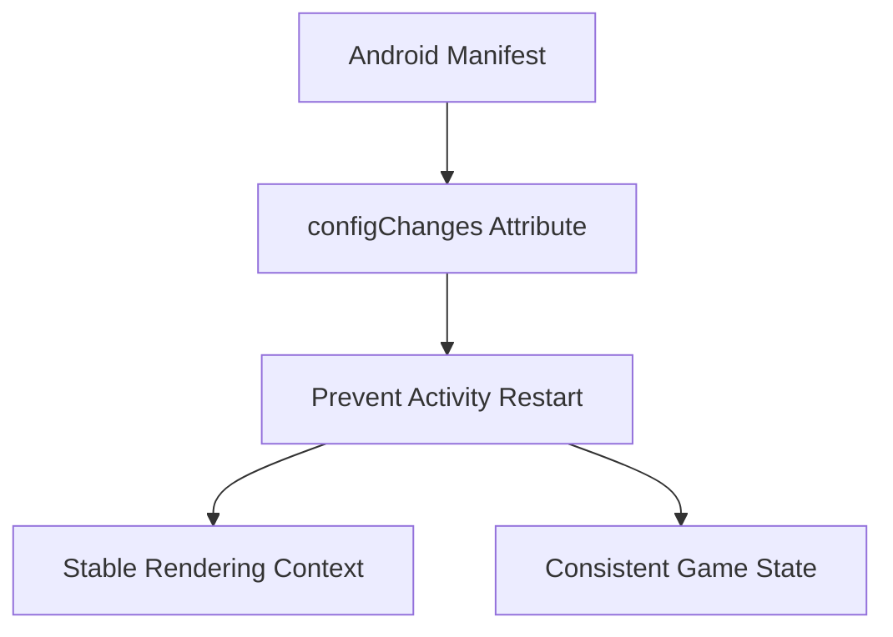

+++
title = "#18839 Make the example android app explicitly handle some device config change events to avoid getting the activity destroyed"
date = "2025-04-27T00:00:00"
draft = false
template = "pull_request_page.html"
in_search_index = true

[taxonomies]
list_display = ["show"]

[extra]
current_language = "en"
available_languages = {"en" = { name = "English", url = "/pull_request/bevy/2025-04/pr-18839-en-20250427" }, "zh-cn" = { name = "中文", url = "/pull_request/bevy/2025-04/pr-18839-zh-cn-20250427" }}
labels = ["C-Bug", "C-Examples", "O-Android"]
+++

# Make the example android app explicitly handle some device config change events to avoid getting the activity destroyed

## Basic Information
- **Title**: Make the example android app explicitly handle some device config change events to avoid getting the activity destroyed
- **PR Link**: https://github.com/bevyengine/bevy/pull/18839
- **Author**: RabadanDotDev
- **Status**: MERGED
- **Labels**: C-Bug, C-Examples, O-Android, S-Ready-For-Final-Review
- **Created**: 2025-04-14T11:09:43Z
- **Merged**: 2025-04-26T21:42:03Z
- **Merged By**: mockersf

## Description Translation
# Objective

Fixes #18316

## Solution

Add android:configChanges="orientation|screenSize" to the AndroidManifest.xml as indicated in https://stackoverflow.com/a/3329486 to avoid the GameActivity from getting destroyed, making the app stuck/crash.

## Testing

I checked the results in my phone and after adding the config change the issue went away. The change is relatively trivial, so there shouldn't be the need to make a lot more testing.

## The Story of This Pull Request

The problem stemmed from Android's default behavior when handling device configuration changes like screen rotation. When users rotated their devices, the Android system would destroy and recreate the Activity by default. For the Bevy Android example, this caused application instability manifested in crashes or freezes, as tracked in issue #18316.

The root cause was identified as the missing configuration change handling in the Android manifest. Without explicit declaration, the Activity lifecycle would restart on configuration changes, disrupting Bevy's game loop and rendering context. This is particularly problematic for game engines where maintaining continuous state is crucial.

The solution adopted Android's standard approach for configuration change handling by modifying the AndroidManifest.xml files. The developer added the `android:configChanges` attribute with comprehensive flags:

```xml
android:configChanges="layoutDirection|locale|orientation|keyboardHidden|screenSize|smallestScreenSize|density|keyboard|navigation|screenLayout|uiMode"
```

This configuration achieves three key objectives:
1. Prevents Activity destruction/recreation for specified changes
2. Allows Bevy to handle orientation/screen size changes internally
3. Covers multiple configuration types beyond just orientation (screenLayout, density, etc.) for broader stability

The implementation affected two nearly identical manifest files in Bevy's Android example projects. The symmetry of changes across both `android_example` and `android_example_native` ensures consistent behavior across different Android integration approaches.

Notably, the solution goes beyond the minimal `orientation|screenSize` fix suggested in the Stack Overflow reference. This proactive approach addresses several other configuration changes that could similarly disrupt the Activity lifecycle, demonstrating defensive programming practices.

From an architectural perspective, this change:
- Maintains Activity persistence during common device configuration changes
- Aligns with Android best practices for game development
- Requires no changes to Bevy's core engine code
- Preserves the existing Java/Kotlin activity implementations

The technical insight here leverages Android's declarative manifest system to optimize lifecycle management. By enumerating configuration changes, developers shift from reactive Activity recreation to proactive event handling, which is particularly valuable for real-time applications like games.

## Visual Representation



## Key Files Changed

1. `examples/mobile/android_example/app/src/main/AndroidManifest.xml`
   - Added configChanges attribute to MainActivity declaration
   - Before:
   ```xml
   <activity
       android:name=".MainActivity"
       android:exported="true"
       android:theme="@style/Theme.AppCompat.NoActionBar">
   ```
   - After:
   ```xml
   <activity
       android:name=".MainActivity"
       android:exported="true"
       android:configChanges="layoutDirection|locale|orientation|keyboardHidden|screenSize|smallestScreenSize|density|keyboard|navigation|screenLayout|uiMode"
       android:theme="@style/Theme.AppCompat.NoActionBar">
   ```

2. `examples/mobile/android_example_native/app/src/main/AndroidManifest.xml`
   - Identical change as above, maintaining parity between example projects

## Further Reading

1. [Android Configuration Changes Documentation](https://developer.android.com/guide/topics/resources/runtime-changes)
2. [Handling Configuration Changes (Android Developers Blog)](https://android-developers.googleblog.com/2009/02/faster-screen-orientation-change.html)
3. [Activity Lifecycle Explained](https://developer.android.com/guide/components/activities/activity-lifecycle)