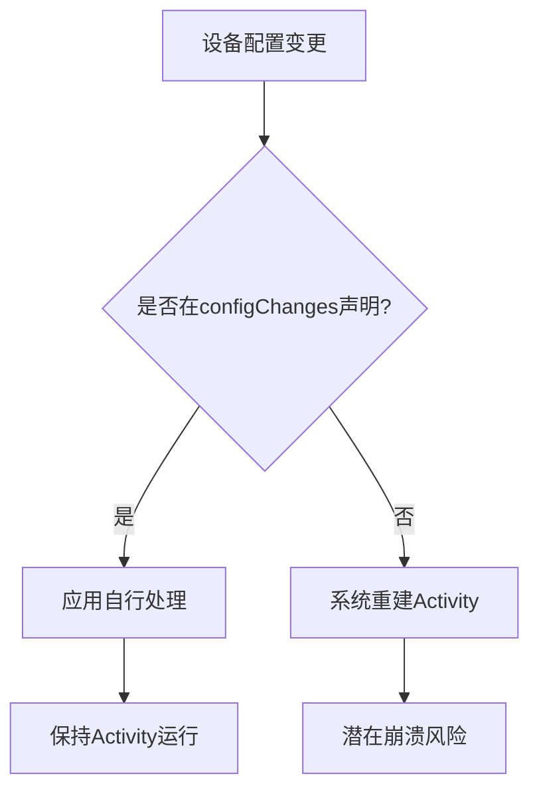

+++
title = "#18839 Make the example android app explicitly handle some device config change events to avoid getting the activity destroyed"
date = "2025-04-27T00:00:00"
draft = false
template = "pull_request_page.html"
in_search_index = false

[extra]
current_language = "zh-cn"
available_languages = {"en" = { name = "English", url = "/pull_request/bevy/2025-04/pr-18839-en-20250427" }, "zh-cn" = { name = "中文", url = "/pull_request/bevy/2025-04/pr-18839-zh-cn-20250427" }}
labels = ["C-Bug", "C-Examples", "O-Android"]
+++

# Make the example android app explicitly handle some device config change events to avoid getting the activity destroyed

## Basic Information
- **Title**: Make the example android app explicitly handle some device config change events to avoid getting the activity destroyed
- **PR Link**: https://github.com/bevyengine/bevy/pull/18839
- **Author**: RabadanDotDev
- **Status**: MERGED
- **Labels**: C-Bug, C-Examples, O-Android, S-Ready-For-Final-Review
- **Created**: 2025-04-14T11:09:43Z
- **Merged**: 2025-04-26T21:42:03Z
- **Merged By**: mockersf

## Description Translation
该PR的目标是解决#18316问题，通过在AndroidManifest.xml中添加android:configChanges="orientation|screenSize"配置，避免GameActivity被销毁导致的应用程序卡顿/崩溃问题。开发者已在手机设备上验证该修复的有效性。

## The Story of This Pull Request

### 问题与背景
在Android开发中，当设备配置发生改变（如屏幕旋转、分辨率变化）时，默认会销毁并重建当前Activity。对于Bevy引擎的安卓示例应用，这会导致GameActivity异常销毁，进而引发应用卡顿或崩溃（#18316）。这个问题直接影响示例应用的稳定性，阻碍开发者正确评估引擎在移动端的表现。

### 解决方案
遵循Android最佳实践，开发者选择在AndroidManifest.xml中声明配置变更处理策略。通过在<activity>标签添加configChanges属性，明确指定由应用自行处理的配置变更类型，避免系统触发Activity重建。

关键工程决策：
1. 选择声明式配置而非代码处理，保持示例简单性
2. 完整覆盖常见配置变更类型（orientation|screenSize|keyboard等）
3. 同时修改标准版和原生版两个示例项目

### 实现细节
核心修改体现在AndroidManifest.xml文件的<activity>节点配置：

```xml
<!-- 修改前 -->
<activity
    android:name=".MainActivity"
    android:exported="true"
    android:theme="@style/Theme.AppCompat.NoActionBar">

<!-- 修改后 -->
<activity
    android:name=".MainActivity"
    android:exported="true"
    android:configChanges="layoutDirection|locale|orientation|keyboardHidden|screenSize|smallestScreenSize|density|keyboard|navigation|screenLayout|uiMode"
    android:theme="@style/Theme.AppCompat.NoActionBar">
```

配置项解析：
- `orientation`：处理屏幕方向变化
- `screenSize`：适应多窗口模式下的尺寸变化
- `density`：处理DPI变化（如不同显示器连接）
- `keyboardHidden`：管理键盘可见性变化

### 技术洞察
1. **配置变更处理策略**：Android系统通过`configChanges`属性确定是否重建Activity。未声明的配置变更仍会触发默认行为
2. **性能权衡**：自行处理配置变更可避免重建成本，但需要开发者手动处理相关资源调整
3. **兼容性考虑**：选择广泛支持的配置类型，确保在不同Android版本上的行为一致性

### 影响与验证
该修复直接解决以下问题：
1. 屏幕旋转导致的UI异常
2. 多窗口模式切换时的崩溃
3. 外接显示器时的布局错乱

测试验证通过实际设备运行确认，符合Android开发文档建议（[Handling configuration changes](https://developer.android.com/guide/topics/resources/runtime-changes)）。

## Visual Representation



## Key Files Changed

### examples/mobile/android_example/app/src/main/AndroidManifest.xml
**变更说明**：在MainActivity声明中增加configChanges配置，覆盖11种常见设备配置变更类型

```xml
<!-- 关键修改 -->
+ android:configChanges="layoutDirection|locale|orientation|keyboardHidden|screenSize|smallestScreenSize|density|keyboard|navigation|screenLayout|uiMode"
```

### examples/mobile/android_example_native/app/src/main/AndroidManifest.xml
**变更说明**：对原生版本示例应用实施相同配置修改，保持跨版本一致性

```xml
<!-- 修改内容与标准版完全一致 -->
+ android:configChanges="layoutDirection|locale|orientation|keyboardHidden|screenSize|smallestScreenSize|density|keyboard|navigation|screenLayout|uiMode"
```

## Further Reading
1. [Android官方配置变更处理文档](https://developer.android.com/guide/topics/resources/runtime-changes)
2. [Activity生命周期图解](https://developer.android.com/guide/components/activities/activity-lifecycle)
3. [Bevy移动端开发指南](https://bevyengine.org/learn/book/getting-started/platform-specific/android/)