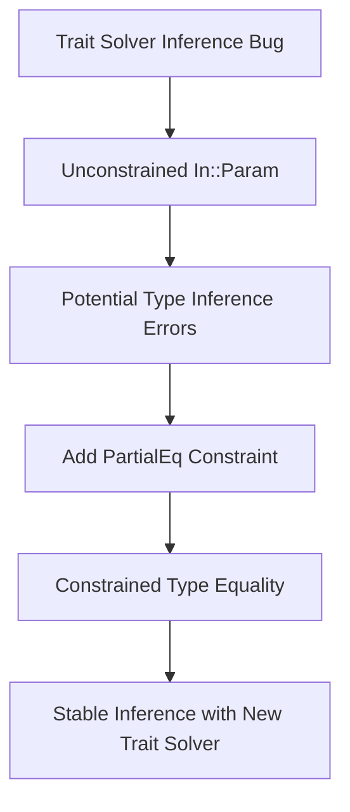

+++
title = "#18840 Remove Reliance on a Trait Solver Inference Bug"
date = "2025-04-14T00:00:00"
draft = false
template = "pull_request_page.html"
in_search_index = true

[taxonomies]
list_display = ["show"]

[extra]
current_language = "en"
available_languages = {"en" = { name = "English", url = "/pull_request/bevy/2025-04/pr-18840-en-20250414" }, "zh-cn" = { name = "中文", url = "/pull_request/bevy/2025-04/pr-18840-zh-cn-20250414" }}
+++

# Title: Remove Reliance on a Trait Solver Inference Bug

## Basic Information
- **Title**: remove reliance on a trait solver inference bug
- **PR Link**: https://github.com/bevyengine/bevy/pull/18840
- **Author**: lcnr
- **Status**: MERGED
- **Labels**: None
- **Created**: 2025-04-14T13:45:42Z
- **Merged**: 2025-04-14T20:39:11Z
- **Merged By**: cart

## Description Translation
The parameter `In` of `call_inner` is completely unconstrained by its arguments and return type. We are only able to infer it by assuming that the only associated type equal to `In::Param<'_>` is `In::Param<'_>` itself. It could just as well be some other associated type which only normalizes to `In::Param<'_>`. This will change with the next-generation trait solver and was encountered by a crater run https://github.com/rust-lang/rust/pull/133502-

cc https://github.com/rust-lang/trait-system-refactor-initiative/issues/168

I couldn't think of a cleaner alternative here. I first tried to just provide `In` as an explicit type parameter. This is also kinda ugly as I need to provide a variable number of them and `${ignore(..)}` is currently still unstable https://github.com/rust-lang/rust/issues/83527.

Sorry for the inconvenience. Also fun that this function exists to avoid a separate solver bug in the first place :sweat_smile:

## The Story of This Pull Request

### The Problem and Context
The PR addresses a subtle type inference issue in Bevy's ECS system related to Rust's trait solver. The `call_inner` method in both regular and exclusive function systems had an unconstrained generic parameter `In` that relied on compiler behavior that was technically undefined. This worked accidentally due to current trait solver implementation details, but would break with Rust's upcoming next-generation trait solver.

The core issue stemmed from how the compiler inferred associated types. The code assumed `In::Param<'_>` could only equal itself, but theoretically another type could satisfy this condition through normalization. This violates Rust's trait resolution rules and was flagged in compiler development (rust-lang/rust#133502).

### The Solution Approach
The author considered two approaches:
1. Making `In` an explicit type parameter (rejected due to unstable `${ignore(..)}` syntax)
2. Adding a trait bound to constrain type inference

The chosen solution adds a `PartialEq` bound to enforce that `In::Param<'_>` must equal itself, providing the necessary constraint without API changes. This works because:
- `PartialEq<Self>` is automatically implemented for all types
- The bound gives the compiler concrete evidence for type equality
- Maintains backward compatibility with existing code

### The Implementation
The key change adds a where clause to the `call_inner` method in both function system implementations:

```rust
where In::Param<'_>: PartialEq<In::Param<'_>>
```

This seemingly redundant bound ("type must equal itself") provides crucial type information to the compiler. The implementation affects:

1. **Regular Function Systems** (`function_system.rs`):
```rust
fn call_inner(...) -> In::Out
where
    In::Param<'_>: PartialEq<In::Param<'_>>, // Added constraint
    // ...
```

2. **Exclusive Function Systems** (`exclusive_function_system.rs`):
```rust
fn call_inner(...) -> In::Out
where
    In::Param<'_>: PartialEq<In::Param<'_>>, // Added constraint
    // ...
```

The constraint guides Rust's type inference without changing method signatures or requiring unstable features. Both modified files received identical treatments since they share the same system architecture.

### Technical Insights
This fix demonstrates several important Rust concepts:
1. **Associated Type Projection**: Working with `In::Param<'_>` requires careful handling of generic types
2. **Trait Bounds as Constraints**: Using `PartialEq` as a zero-cost abstraction to guide type inference
3. **Forward Compatibility**: Proactively addressing issues before compiler updates break existing code

The solution leverages Rust's trait system mechanics to:
- Avoid unstable syntax
- Maintain API stability
- Prevent future breakage with new trait solvers

### The Impact
These changes:
- Ensure compatibility with Rust's upcoming trait solver changes
- Remove undefined behavior from type inference
- Preserve existing system APIs unchanged
- Add negligible compile-time overhead

The PR demonstrates the importance of writing trait-constrained code that doesn't rely on compiler implementation details. It also highlights proactive maintenance in anticipation of language changes.

## Visual Representation



## Key Files Changed

### 1. crates/bevy_ecs/src/system/function_system.rs
**Change**: Added trait bound to `call_inner`
```rust
// Before:
fn call_inner(...) -> In::Out {
// ...
}

// After:
fn call_inner(...) -> In::Out
where
    In::Param<'_>: PartialEq<In::Param<'_>>,
{
// ...
}
```
**Purpose**: Constrains type inference for regular function systems

### 2. crates/bevy_ecs/src/system/exclusive_function_system.rs
**Change**: Added identical trait bound
```rust
// Before:
fn call_inner(...) -> In::Out {
// ...
}

// After:
fn call_inner(...) -> In::Out
where
    In::Param<'_>: PartialEq<In::Param<'_>>,
{
// ...
}
```
**Purpose**: Applies same fix to exclusive function systems

## Further Reading
1. [Rust Trait System Refactor Initiative](https://github.com/rust-lang/trait-system-refactor-initiative)
2. [Associated Types in Rust Book](https://doc.rust-lang.org/book/ch19-03-advanced-traits.html)
3. [PartialEq Tralet Documentation](https://doc.rust-lang.org/std/cmp/trait.PartialEq.html)
4. [Next-Gen Trait Solver Overview](https://blog.rust-lang.org/inside-rust/2023/07/27/trait-solver-1.html)