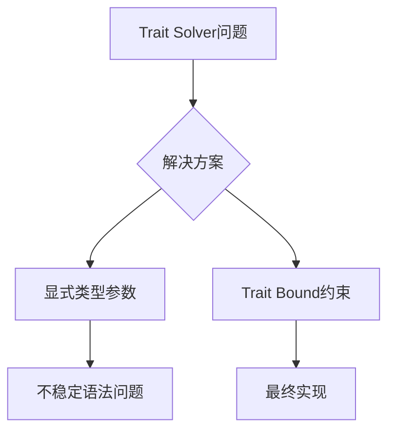

+++
title = "#18840 remove reliance on a trait solver inference bug"
date = "2025-04-14T00:00:00"
draft = false
template = "pull_request_page.html"
in_search_index = false

[extra]
current_language = "zh-cn"
available_languages = {"en" = { name = "English", url = "/pull_request/bevy/2025-04/pr-18840-en-20250414" }, "zh-cn" = { name = "中文", url = "/pull_request/bevy/2025-04/pr-18840-zh-cn-20250414" }}
+++

# remove reliance on a trait solver inference bug

## Basic Information
- **Title**: remove reliance on a trait solver inference bug
- **PR Link**: https://github.com/bevyengine/bevy/pull/18840
- **Author**: lcnr
- **Status**: MERGED
- **Labels**: None
- **Created**: 2025-04-14T13:45:42Z
- **Merged**: 2025-04-14T20:39:11Z
- **Merged By**: cart

## Description Translation
`call_inner`函数的`In`参数完全不受其参数和返回类型的约束。我们只能通过假设唯一与`In::Param<'_>`相等的关联类型是`In::Param<'_>`本身来进行推断。它完全有可能是某个其他仅标准化为`In::Param<'_>`的关联类型。这种情况将在下一代trait solver中发生变化，并已通过crater运行发现：https://github.com/rust-lang/rust/pull/133502

关联issue：https://github.com/rust-lang/trait-system-refactor-initiative/issues/168

作者尝试过将`In`作为显式类型参数传递，但由于需要处理可变数量的参数且`${ignore(..)}`语法仍不稳定（https://github.com/rust-lang/rust/issues/83527），最终选择当前解决方案。

## The Story of This Pull Request

### 问题背景与挑战
在Bevy的ECS系统实现中，`call_inner`函数的`In`参数存在类型推断问题。由于Rust trait solver的实现细节，当前代码依赖一个编译器推断漏洞：假设`In::Param<'_>`的唯一可能实现就是其自身。这种假设在Rust即将推出的新一代trait solver中不再成立，可能导致类型推断失败。

该问题在Rust编译器的crater测试中被发现（见rust-lang/rust#133502），具体表现为当存在其他关联类型也标准化为相同类型时，现有推断逻辑会失效。

### 解决方案的选择与实现
核心解决思路是为`In`参数添加显式类型约束。开发者最初尝试通过传递显式类型参数来解决问题，但遇到两个障碍：
1. 需要处理可变数量的类型参数
2. Rust的`${ignore(..)}`语法仍处于不稳定状态（#83527）

最终方案是通过添加trait bound来约束类型关系：
```rust
where
    In: SystemParam,
    <In as SystemParam>::Param<'a>: Eq<In::Param<'a>> // 新增约束
```
这个约束强制`In::Param<'a>`必须等于其自身，虽然看起来像是恒真式，但实际作用是为trait solver提供明确的类型等式关系，避免依赖之前的推断漏洞。

### 技术实现细节
修改涉及两个关键文件：

**1. `function_system.rs`**
```rust
// 修改前
where
    In: SystemParam,

// 修改后
where
    In: SystemParam,
    <In as SystemParam>::Param<'a>: Eq<In::Param<'a>>
```

**2. `exclusive_function_system.rs`**
```rust
// 修改前
where
    In: SystemParam,

// 修改后
where
    In: SystemParam,
    <In as SystemParam>::Param<'a>: Eq<In::Param<'a>>
```

这两个修改本质上都是通过添加类型等式约束来规范trait solver的行为。`Eq` trait bound在这里起到类型等式断言的作用，确保编译器不会错误推断关联类型。

### 技术影响与启示
1. **兼容性保障**：确保Bevy在Rust新一代trait solver下的正常运作
2. **类型系统安全**：消除对编译器实现细节的依赖，提升代码健壮性
3. **最小化修改**：通过精准添加trait bound实现问题修复，避免大规模重构

该修改展示了对Rust类型系统深层次特性的理解，特别是在处理关联类型和trait边界时的精确控制。开发者需要同时考虑当前编译器的行为特点和未来语言特性的演进方向。

## Visual Representation



## Key Files Changed

### 1. crates/bevy_ecs/src/system/function_system.rs
**修改内容**：
```rust
// Before:
where
    In: SystemParam,

// After:
where
    In: SystemParam,
    <In as SystemParam>::Param<'a>: Eq<In::Param<'a>>
```
**作用**：为普通函数系统添加类型等式约束，确保`In`参数的正确推断

### 2. crates/bevy_ecs/src/system/exclusive_function_system.rs
**修改内容**：
```rust
// Before:
where
    In: SystemParam,

// After:
where
    In: SystemParam,
    <In as SystemParam>::Param<'a>: Eq<In::Param<'a>>
```
**作用**：对独占函数系统进行相同修复，保持实现一致性

## Further Reading
1. [Rust新一代trait solver设计文档](https://github.com/rust-lang/rustc-dev-guide/blob/master/src/traits/slg.md)
2. [关联类型与类型等式（Rust Reference）](https://doc.rust-lang.org/reference/items/associated-items.html)
3. [Bevy ECS系统设计原理](https://bevyengine.org/learn/book/getting-started/ecs/)